# BuyNow — 设计文档 (Design Document)

> 仓库：https://github.com/Chuan-Qiu/buynowdotcom
> 基线 commit：`1b7b2e6`
> 范围：本文档描述 **`backend/` 后端服务**。React 客户端（`frontend/`）仅在 §2.1 上下文图中作为外部参与者出现，
> 其架构说明见 [frontend/README.md](frontend/README.md)。

---

## 1. 概览

### 1.1 项目定位

BuyNow 是一个前后端分离的电商平台后端，提供商品目录、分类、图片、用户、购物车与订单的 RESTful API。设计目标不是功能覆盖面，而是 **可演进的边界**：

- 客户端只依赖 **DTO + 统一响应外壳** 构成的契约，不感知持久层结构；
- 业务逻辑通过 **接口 + 实现** 暴露，可脱离 Spring Web 层独立测试；
- 认证在 **过滤器链** 统一声明，不散落到各 Controller。

### 1.2 技术栈

| 层次 | 选型 | 版本 |
|---|---|---|
| 语言 / 运行时 | Java | 21 |
| 框架 | Spring Boot | 4.0.5 |
| Web | Spring Web MVC (`spring-boot-starter-webmvc`) | — |
| 持久化 | Spring Data JPA + Hibernate | — |
| 数据库 | MySQL (`mysql-connector-j`) | 8/9 |
| 安全 | Spring Security + jjwt (api/impl/jackson) | 0.12.3 |
| 对象映射 | ModelMapper | 3.2.0 |
| 样板消除 | Lombok | — |
| 构建 | Maven (`mvnw` wrapper) | — |

### 1.3 关键配置

| 配置项 | 值 | 说明 |
|---|---|---|
| `server.port` | `9090` | 显式声明，避免与前端硬编码不一致 |
| `api.prefix` | `/api/v1` | 所有 Controller 通过 `${api.prefix}` 注入，版本前缀单点可改 |
| `spring.jpa.hibernate.ddl-auto` | `update` | 开发期由 Hibernate 维护 schema |
| `auth.token.accessExpirationInMils` | `120000`（2 分钟） | access token |
| `auth.token.refreshExpirationInMils` | `300000`（5 分钟） | refresh token |
| `app.useSecureCookie` | `false` | 本地 HTTP 开发；生产置 `true`（Secure + SameSite=None） |
| `spring.servlet.multipart.max-file-size` | `10MB` | 商品图片上传 |

---

## 2. 架构

### 2.1 系统上下文

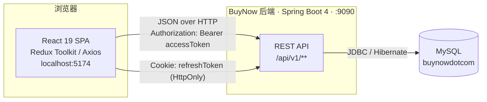

### 2.2 分层架构

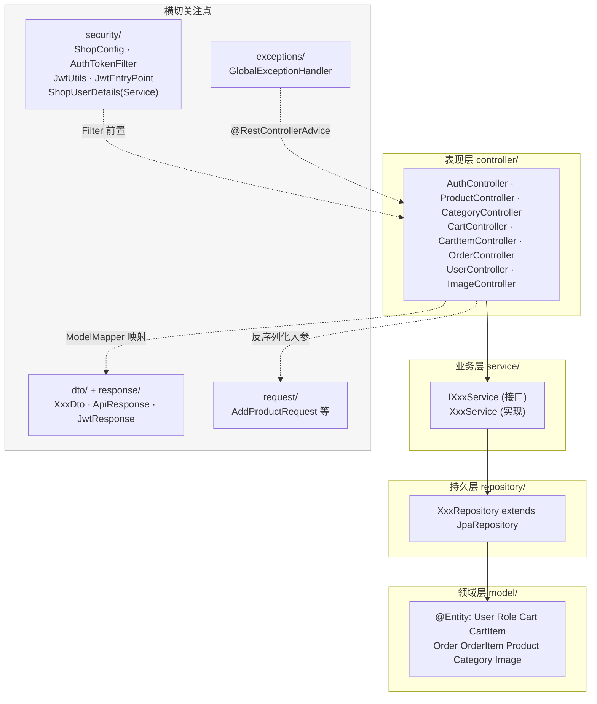

**分层规则（强约束）**

1. Controller 注入 **接口**（`IProductService`），不注入实现类。
2. Controller **永不返回 `@Entity`** —— 一律经 ModelMapper 映射为 DTO。
3. 所有成功响应包在 `ApiResponse(message, data)` 中；例外：`/auth/**` 返回裸 token map，`/images/{id}/download` 返回二进制流。
4. Service 直接抛 JPA 标准异常（`EntityNotFoundException` / `EntityExistsException`），由 `GlobalExceptionHandler` 统一映射状态码。

### 2.3 请求处理链路

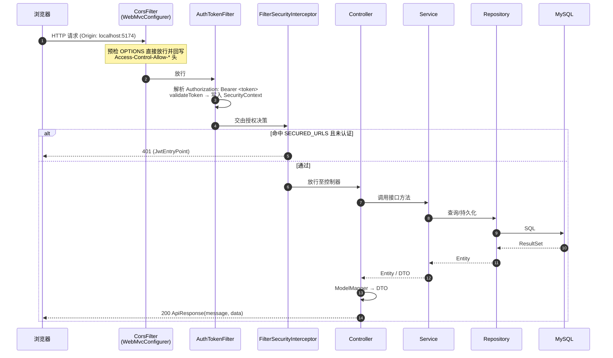

---

## 3. 领域模型

### 3.1 UML 类图 — 实体


### 3.2 关系语义

| 关系 | 类型 | 拥有端 | 级联 | 设计意图 |
|---|---|---|---|---|
| User → Cart | OneToOne | Cart 持有 `user_id` | `ALL` + orphanRemoval | 用户注册时自动建空购物车，生命周期绑定用户 |
| User → Order | OneToMany | Order 持有 `user_id` | `ALL` + orphanRemoval | 订单历史归属用户 |
| User ↔ Role | ManyToMany (EAGER) | `user_roles` 中间表 | `DETACH/MERGE/PERSIST/REFRESH`（**无 REMOVE**） | 删用户不删角色定义；EAGER 是因为鉴权时必须立刻拿到权限 |
| Cart → CartItem | OneToMany | CartItem 持有 `cart_id` | `ALL` + orphanRemoval | 组合关系：购物车没了条目也没意义 |
| Order → OrderItem | OneToMany | OrderItem 持有 `order_id` | `ALL` + orphanRemoval | 同上，且 OrderItem **快照下单时的 price**，与 Product 当前价解耦 |
| Product → Category | ManyToOne | Product 持有 `category_id` | `ALL` ⚠️ | 见 §9 已知问题 |
| Product → Image | OneToMany | Image 持有 `product_id` | `ALL` + orphanRemoval | 图片随商品删除 |
| Category → Product | 反向 OneToMany | — | 无 | 加 `@JsonIgnore` 阻断双向序列化死循环 |

### 3.3 ER 图（数据库表）

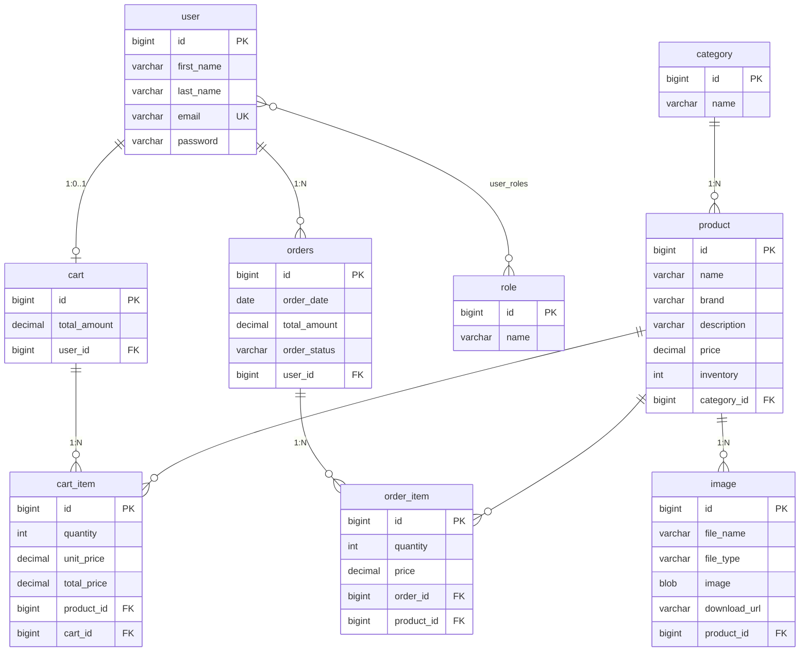

> 表名说明：`Order` 显式映射为 `@Table(name = "orders")`，因为 `ORDER` 是 SQL 保留字。

### 3.4 订单状态机

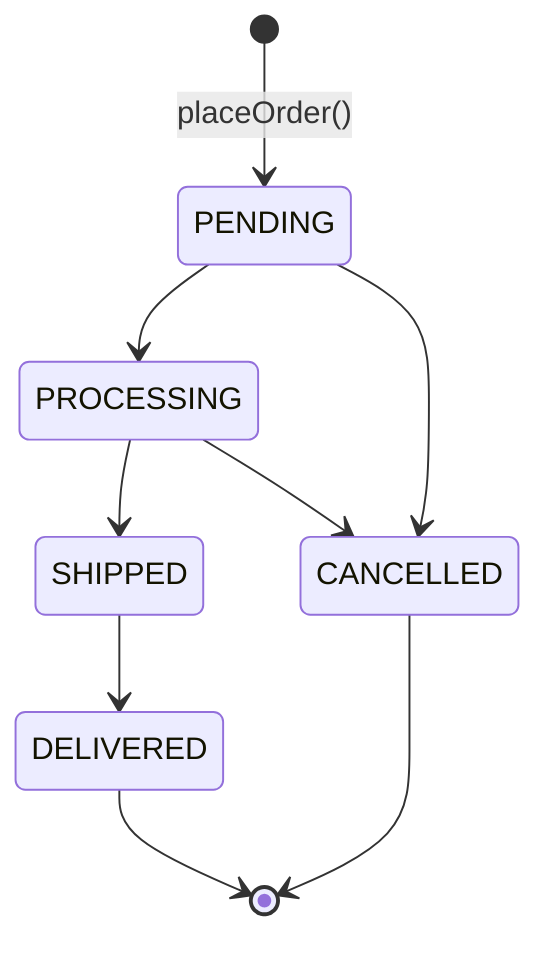

> 当前实现只写入 `PENDING`，其余状态已在 `OrderStatus` 枚举中定义但尚无迁移逻辑（见 §10 路线图）。

---

## 4. API 契约层

### 4.1 DTO 类图（客户端可见的唯一数据形状）


**DTO 相比 Entity 的裁剪**

| 裁剪 | 原因 |
|---|---|
| `UserDto` 无 `password`、无 `roles` | 凭据与权限不外泄 |
| `CategoryDto` 无 `products` | 切断 Product ↔ Category 双向环 |
| `ImageDto` 无 `Blob image`、无 `fileType` | 图片走 `downloadUrl` 二次请求，避免 JSON 里塞 base64 |
| `OrderItemDto` 摊平为 `productName/productBrand` | 前端渲染订单行不需要完整 Product 图 |
| `CartItemDto` / `OrderItemDto` 不含反向引用 | 避免 Cart→Item→Cart 环 |

### 4.2 请求对象（入参）

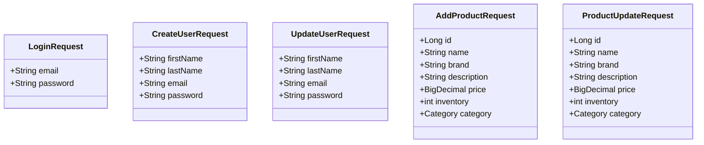

> `UpdateProductRequest` 与 `ProductUpdateRequest` 字段完全重复，前者**无任何引用**，属死代码（见 §9）。

### 4.3 统一响应约定

| 场景 | HTTP | Body |
|---|---|---|
| 成功 | 200 | `{ "message": "Success", "data": <DTO 或 DTO 列表> }` |
| 资源不存在 | 404 | `{ "message": "<异常消息>", "data": null }` |
| 资源冲突（邮箱/商品重复） | 409 | `{ "message": "<异常消息>", "data": null }` |
| 未认证访问受保护路径 | 401 | `JwtEntryPoint` 输出 |
| 其它未捕获异常 | 500 | `{ "message": "Something went wrong: ...", "data": null }` |
| 登录 / 刷新 | 200 | `{ "accessToken": "<JWT>" }`（**不套 ApiResponse**） |
| 图片下载 | 200 | `ByteArrayResource`（二进制流） |

---

## 5. 服务层设计

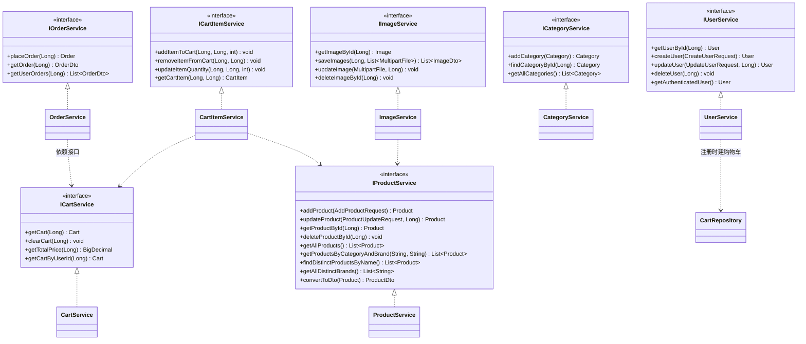

**服务间依赖同样走接口**（`OrderService` 依赖 `ICartService` 而非 `CartService`），使任一服务可在单测中被 mock 替换。

### 5.1 自定义查询

`ProductRepository` 大部分依赖 Spring Data 方法名派生查询；两处例外体现了取舍：

```java
// 模糊搜索：方法名派生无法表达 LOWER + LIKE，改用 JPQL
@Query("SELECT p FROM Product p WHERE LOWER(p.name) LIKE LOWER(CONCAT('%', :name, '%'))")
List<Product> findByName(String name);
```

```java
// 按名称去重取每组最小 id —— 首页"每款商品只展示一张卡片"
@Query("SELECT p FROM Product p WHERE p.id IN (SELECT MIN(p2.id) FROM Product p2 GROUP BY p2.name)")
List<Product> findDistinctByName();
```

选用 JPQL 而非 native SQL：面向实体，方言无关，换数据库不需重写。

---

## 6. 安全设计

### 6.1 组件类图


### 6.2 双 Token 策略

| Token | 有效期 | 存放位置 | 理由 |
|---|---|---|---|
| **access token** | 2 分钟 | 响应体返回，前端持有在内存 | 短命 → 泄漏窗口小；不落 `localStorage`，规避 XSS 窃取 |
| **refresh token** | 5 分钟 | `Set-Cookie: refreshToken; HttpOnly; Path=/; SameSite; [Secure]` | `HttpOnly` 使前端 JS 无法读取；由浏览器自动携带 |

Cookie 属性随环境切换：`app.useSecureCookie=true` → `Secure; SameSite=None`（跨站 HTTPS）；`false` → `SameSite=Lax`（本地 HTTP 开发）。

### 6.3 登录与刷新序列图

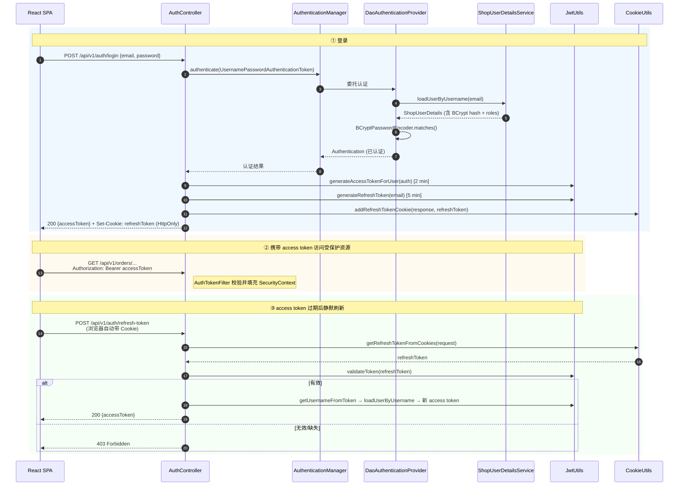

### 6.4 授权矩阵（当前实现）

| 路径 | 保护状态 |
|---|---|
| `/api/v1/carts/**` | 需认证 |
| `/api/v1/cartItems/**` | 需认证 |
| `/api/v1/orders/**` | 需认证 |
| **其余全部**（`/products/**`、`/categories/**`、`/users/**`、`/images/**`、`/auth/**`） | `permitAll()` |

规则在 `ShopConfig.filterChain` 中集中声明一次，新增 Controller 不需要逐方法加注解。⚠️ 当前粒度只有"认证/不认证"，无角色授权与资源归属校验 —— 见 §9。

---

## 7. 核心业务流程

### 7.1 用户注册（自动建购物车）

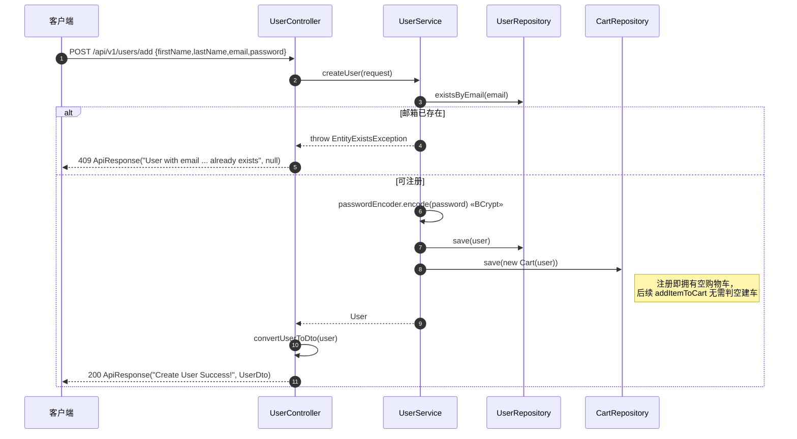

### 7.2 加入购物车（幂等合并）

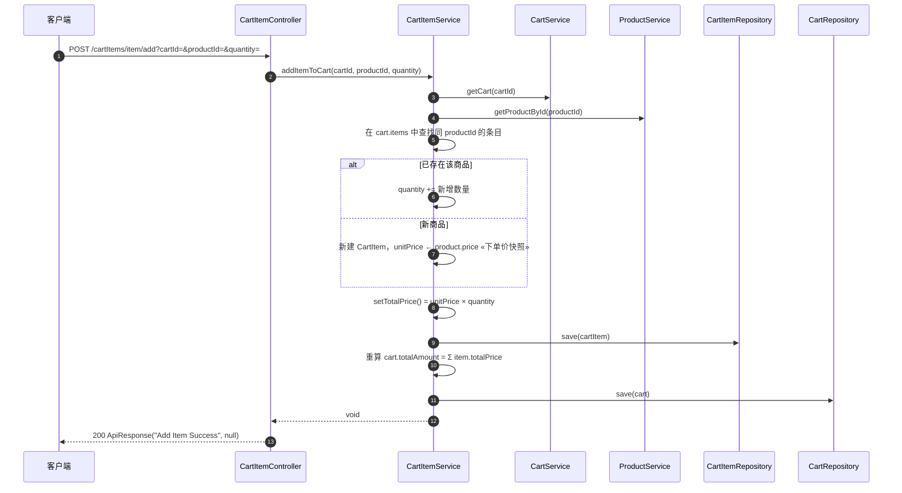

**设计要点**：同一商品重复添加走 **数量累加** 而非新增行，购物车内 `(cart_id, product_id)` 保持唯一语义；`unitPrice` 在加入时从 Product 快照，之后商品调价不影响已在车内的条目。

### 7.3 下单（事务边界）

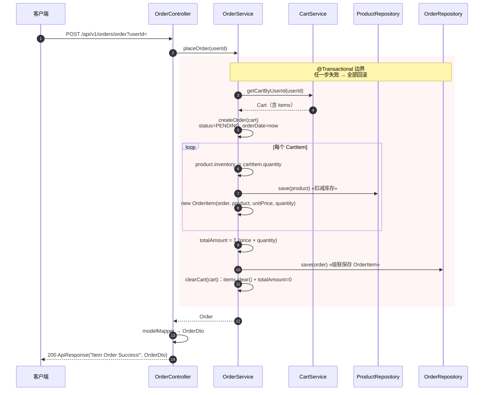

**设计要点**：

- `@Transactional` 保证「扣库存 + 建订单 + 清购物车」三件事原子完成，避免"库存扣了但订单没建"的中间态；
- `OrderItem.price` 从 `CartItem.unitPrice` 复制，形成**第二次价格快照**，订单金额永久可复算；
- `Order` 对 `OrderItem` 是 `cascade = ALL`，只需 `save(order)` 一次即可持久化整棵对象树。

---

## 8. API 端点清单

前缀统一为 `/api/v1`（由 `${api.prefix}` 注入）。

### Auth
| 方法 | 路径 | 说明 |
|---|---|---|
| POST | `/auth/login` | 登录，返回 accessToken + 写 refreshToken Cookie |
| POST | `/auth/refresh-token` | 用 Cookie 中 refreshToken 换新 accessToken |

### Products
| 方法 | 路径 | 说明 |
|---|---|---|
| GET | `/products/all` | 全部商品 |
| GET | `/products/product/{productId}/product` | 按 ID 查商品 |
| POST | `/products/add` | 新增商品 |
| PUT | `/products/product/{productId}/update` | 更新商品 |
| DELETE | `/products/product/{productId}/delete` | 删除商品 |
| GET | `/products/products/by/brand-and-name?brandName=&productName=` | 品牌 + 名称 |
| GET | `/products/products/by/category-and-brand?category=&brand=` | 分类 + 品牌 |
| GET | `/products/products/{name}/products` | 按名称模糊搜索 |
| GET | `/products/product/by-brand?brand=` | 按品牌 |
| GET | `/products/{category}/products` | 按分类名 |
| GET | `/products/category/{categoryId}/products` | 按分类 ID |
| GET | `/products/distinct/products` | 按名称去重（首页展示用） |
| GET | `/products/distinct/brands` | 全部去重品牌（侧边栏筛选用） |

### Categories
| 方法 | 路径 |
|---|---|
| GET | `/categories` · `/categories/all` |
| GET | `/categories/{categoryId}` · `/categories/by/name?name=` |
| POST | `/categories/add` |
| PUT | `/categories/{categoryId}/update` |
| DELETE | `/categories/{categoryId}/delete` |

### Images
| 方法 | 路径 | 说明 |
|---|---|---|
| POST | `/images/upload?productId=` | multipart 批量上传，返回 ImageDto 列表 |
| GET | `/images/{imageId}/download` | 二进制流下载 |
| PUT | `/images/{imageId}/update` | 替换图片 |
| DELETE | `/images/{imageId}/delete` | 删除 |

### Cart / CartItem 🔒
| 方法 | 路径 |
|---|---|
| GET | `/carts/{cartId}` · `/carts/{cartId}/total-price` |
| DELETE | `/carts/{cartId}/clear` |
| POST | `/cartItems/item/add?cartId=&productId=&quantity=` |
| PUT | `/cartItems/cart/{cartId}/item/{productId}/update` |
| DELETE | `/cartItems/cart/{cartId}/item/{productId}/remove` |

### Orders 🔒
| 方法 | 路径 |
|---|---|
| POST | `/orders/order?userId=` |
| GET | `/orders/{orderId}/order` · `/orders/user/{userId}/order` |

### Users
| 方法 | 路径 |
|---|---|
| GET | `/users/{userId}` |
| POST | `/users/add` |
| PUT | `/users/{userId}/update` |
| DELETE | `/users/{userId}/delete` |

> 🔒 = 命中 `SECURED_URLS`，需 `Authorization: Bearer <accessToken>`。

---

## 9. 关键设计决策与已知问题

### 9.1 设计决策（ADR 摘要）

| # | 决策 | 备选方案 | 选择理由 |
|---|---|---|---|
| 1 | Controller 返回 DTO，实体不出边界 | 直接返回 `@Entity` | Product↔Category 双向关联直接序列化会无限递归；且实体字段变更会直接破坏前端契约 |
| 2 | 每个 Service 拆 `接口 + 实现` | 只写实现类 | Controller 与服务间依赖接口，业务逻辑可脱离 Spring Web 层做单测；服务间依赖也走接口，便于 mock |
| 3 | 统一 `ApiResponse(message, data)` | 各接口自定义结构 | 前端只需一套解析逻辑 |
| 4 | `@RestControllerAdvice` 集中异常映射 | 每方法 try/catch | 避免"有的返 400、有的漏成 500、错误体格式各异"的漂移 |
| 5 | 过滤器链声明受保护路径 | 每个方法 `@PreAuthorize` | 新增端点不会因忘记加注解而裸奔 |
| 6 | access token 内存 + refresh token HttpOnly Cookie | 两个都塞 `localStorage` | localStorage 可被 XSS 读取；HttpOnly Cookie 对 JS 不可见 |
| 7 | CORS 在 Spring Security 感知的层级配置 | 仅在 Controller 加 `@CrossOrigin` | 有 Security 时，MVC 层单独配的 CORS 会被过滤器链先行拦截而失效 |
| 8 | 价格两次快照（Product→CartItem→OrderItem） | 订单只存 productId，展示时反查当前价 | 商品调价不应改写历史订单金额 |
| 9 | JPQL 而非 native SQL | `nativeQuery = true` | 面向实体、方言无关，可移植 |
| 10 | `Order` 表名显式设为 `orders` | 用默认表名 `order` | `ORDER` 是 SQL 保留字 |

### 9.2 已知问题（按严重度排序）

| 严重度 | 问题 | 位置 | 影响 |
|---|---|---|---|
| 🔴 高 | **越权访问（IDOR）**：受保护端点只校验"是否登录"，不校验资源归属。已登录用户 A 可用 `GET /carts/{任意 cartId}`、`GET /orders/user/{任意 userId}/order`、`POST /orders/order?userId={他人}` 访问他人数据 | `ShopConfig` + Cart/Order Controller | 任意用户可读写他人购物车与订单 |
| 🔴 高 | **写操作完全无鉴权**：`/products/add`、`/update`、`/delete`、`/categories/*`、`/images/*`、`/users/{id}/delete` 全部 `permitAll()`；`Role` 实体已建但从未参与授权 | `ShopConfig.SECURED_URLS` | 匿名请求即可增删商品、删除任意用户 |
| 🔴 高 | **refresh token 被打进标准输出**：`cookieUtils.logCookies(request)` 用 `System.out.println` 打印所有 Cookie 名与值 | `CookieUtils.logCookies` / `AuthController.refreshAccessToken` | 凭据泄漏到日志 |
| 🟠 中 | **库存可为负、无并发控制**：`createOrderItems` 直接 `inventory -= quantity`，既不校验库存是否充足，也无 `@Version` 乐观锁 | `OrderService` | 超卖；并发下单丢失更新 |
| 🟠 中 | **`Product → Category` 用 `cascade = ALL`**：删除商品会级联删除其分类，进而影响该分类下其它商品 | `Product.category` | 数据意外丢失。应改为不级联或仅 `PERSIST/MERGE` |
| 🟠 中 | **JWT 密钥与数据库口令硬编码在配置文件** | `application.properties` | 应走环境变量 / Secret Manager |
| 🟠 中 | **图片以 `@Lob Blob` 存 MySQL** | `Image.image` | 数据库体积膨胀、备份变慢；应改为对象存储 + 存 URL |
| 🟡 低 | **无服务端分页**：`/products/all` 全量返回，分页在前端 `slice()` 完成 | `ProductController` | 商品量增长后首屏负载线性上升 |
| 🟡 低 | **`CartService.getCart` 中的空操作**：`getTotalAmount()` 取出后原样 `setTotalAmount()` 再 `save()`，无实际效果却触发一次写库 | `CartService.getCart` | 多余的 UPDATE |
| 🟡 低 | **死代码**：`UpdateProductRequest` 无任何引用，与 `ProductUpdateRequest` 完全重复 | `request/` | 维护混淆 |
| 🟡 低 | **重复端点**：`GET /categories` 与 `GET /categories/all` 行为相同（后者为兼容前端既有调用而加） | `CategoryController` | 契约冗余 |
| 🟡 低 | **错误文案与实际不符**：`/auth/refresh-token` 失败时返回 `"Invalid or expired access token"`，实际失效的是 refresh token | `AuthController` | 排障误导 |
| 🟡 低 | **测试仅有上下文加载**：`BuynowdotcomApplicationTests` 一个空壳 | `src/test/` | 无回归保护 |
| 🟡 低 | **`CLAUDE.md` 文档已过期**：写的是端口 909、`ddl-auto=create`、受保护路径含 `/users/**`，与当前代码不符 | `CLAUDE.md` | 误导后续开发 |

---

## 10. 演进路线

**P0 — 安全（上线前必须）**
1. 受保护端点改为从 `SecurityContext` 取当前用户（`userService.getAuthenticatedUser()`），不再信任 URL 里的 `cartId` / `userId`；或在 Service 层加归属校验。
2. 启用 `Role` 授权：`/products`、`/categories`、`/images` 的写操作要求 `ROLE_ADMIN`（`@PreAuthorize` 或加入过滤器链规则）。
3. 删除 `logCookies` 调用；引入 SLF4J 并对凭据脱敏。
4. JWT secret / DB 口令外置为环境变量。

**P1 — 正确性**
5. 下单前校验库存充足，不足抛业务异常；`Product` 加 `@Version` 乐观锁。
6. `Product.category` 去掉 `cascade = ALL`。
7. 引入 `@Valid` + Bean Validation 校验入参（邮箱格式、价格非负、数量 > 0）。
8. 补测试：`@DataJpaTest` 覆盖自定义查询，`@WebMvcTest` 覆盖 Controller 契约，`placeOrder` 的事务回滚用例。

**P2 — 可扩展性**
9. `/products/all` 改为 `Pageable` 服务端分页 + 排序。
10. 图片迁移至对象存储（S3/MinIO），`Image` 仅保留元数据与 URL。
11. 订单状态机落地（`PENDING → PROCESSING → SHIPPED → DELIVERED`）+ 状态迁移接口。
12. 引入 Flyway/Liquibase 管理 schema，替代 `ddl-auto=update`。
13. 接入 springdoc-openapi 自动生成 API 文档，替代手写端点清单。

**P3 — 清理**
14. 删除 `UpdateProductRequest`；合并 `/categories` 与 `/categories/all`。
15. 修正 `CartService.getCart` 的空操作与 refresh 错误文案。
16. 更新 `CLAUDE.md` 与 `README.md` 至当前实现。

---

*文档生成于 2026-09-05，基于 commit `1b7b2e6`。*
