# BuyNow — Design Document

> Repository: https://github.com/Chuan-Qiu/buynowdotcom
> Scope: **full stack** — `backend/` (Spring Boot REST API), `frontend/` (React SPA), and the contract between them.

---

## 1. Overview

### 1.1 What This Is

BuyNow is a decoupled e-commerce platform. The React SPA handles browsing, search, filtering and pagination; the Spring Boot REST API owns the product catalog, categories, images, users, carts and orders.

The goal was never breadth of features — it was **boundaries that can absorb change**. Each side maintains one clear direction of dependency, and an explicit contract joins them:

| Boundary | Constraint |
|---|---|
| Front-end components ↔ state | Presentational components take props only; page-level components are the ones that read the store |
| Front-end state ↔ network | Every request goes through one Axios instance; components never call `fetch`/`axios` directly |
| Front end ↔ back end | The client depends on DTO shapes and one response envelope, never on persistence details |
| Controller ↔ business logic | Controllers depend on the `IXxxService` interface, not the implementation |
| Business logic ↔ API | Entities never cross the API boundary; everything is mapped to a DTO |

Because of these boundaries, the client's filtering, search and pagination were built without touching the server, and the server can be refactored without breaking the client — as long as the DTO shapes and the envelope hold.

### 1.2 Stack

| Layer | Front end `frontend/` | Back end `backend/` |
|---|---|---|
| Language / runtime | JavaScript (ESM) · Node 18+ | Java 21 |
| Framework | React 19.2 | Spring Boot 4.0.5 |
| Routing | React Router 7.14 | Spring Web MVC |
| State / business logic | Redux Toolkit 2.11 · React-Redux 9.2 | Service interface + implementation |
| Network / persistence | Axios 1.16 | Spring Data JPA + Hibernate |
| Security | — | Spring Security + jjwt 0.12.3 |
| Object mapping | — | ModelMapper 3.2 |
| UI | React-Bootstrap 2.10 · Bootstrap 5.3 · react-icons · react-slick · react-toastify · react-medium-image-zoom | — |
| Database | — | MySQL |
| Build | Vite 8 | Maven (`mvnw` wrapper) |
| Code quality | ESLint 10 | Lombok |

### 1.3 Repository Layout

```
buynowdotcom/
├── README.md          Full-stack overview and quick start
├── DESIGN.md          This document
├── CLAUDE.md          Conventions for AI-assisted development
├── .gitignore         Both toolchains merged
├── backend/           Spring Boot REST API (Maven project root)
│   ├── pom.xml
│   └── src/main/java/com/dailycodework/buynowdotcom/
└── frontend/          React SPA (Vite project root)
    ├── package.json
    └── src/
```

The two sides share **no build tooling**; each builds from its own directory (`./mvnw` / `npm`). That is deliberate — the Java and JS toolchains stay unaware of each other, which avoids paying for workspace orchestration to manage two components.

### 1.4 Key Configuration

**Back end** (`backend/src/main/resources/application.properties`, git-ignored)

| Setting | Value | Why |
|---|---|---|
| `server.port` | `9090` | Declared explicitly so it cannot silently disagree with the client |
| `api.prefix` | `/api/v1` | Injected into every controller via `${api.prefix}`; the version prefix has one home |
| `spring.jpa.hibernate.ddl-auto` | `update` | Hibernate maintains the schema during development |
| `auth.token.accessExpirationInMils` | `120000` (2 min) | Access token |
| `auth.token.refreshExpirationInMils` | `300000` (5 min) | Refresh token |
| `app.useSecureCookie` | `false` | Local HTTP development; set `true` in production (adds Secure + SameSite=None) |
| `spring.servlet.multipart.max-file-size` | `10MB` | Product image upload |

**Front end**

| Setting | Value | Location |
|---|---|---|
| Dev port | `5174` | `package.json` → `vite --port 5174` |
| API base URL | `http://localhost:9090/api/v1` | `src/component/services/api.js` (hardcoded, not an env var) |
| Allowed origins | `5173` / `5174` / `5175` | `ShopConfig.corsConfigurationSource()` |

> ⚠️ The API base URL is hardcoded rather than read from `import.meta.env`. Deploying anywhere other than this machine requires a code change — see §12.

---

## 2. System Architecture

### 2.1 System Context

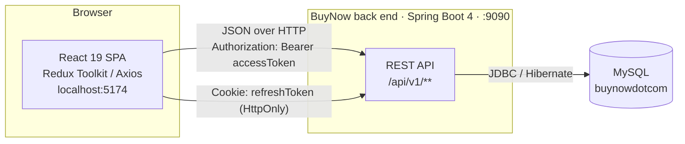
```mermaid
flowchart LR
    subgraph Client["Browser"]
        React["React 19 SPA<br/>Redux Toolkit / Axios<br/>localhost:5174"]
    end

    subgraph Server["BuyNow back end · Spring Boot 4 · :9090"]
        API["REST API<br/>/api/v1/**"]
    end

    DB[("MySQL<br/>buynowdotcom")]

    React -- "JSON over HTTP<br/>Authorization: Bearer accessToken" --> API
    React -- "Cookie: refreshToken (HttpOnly)" --> API
    API -- "JDBC / Hibernate" --> DB
```

### 2.2 End-to-End Layering

One diagram for how many layers a single user action crosses, and which way each dependency points:

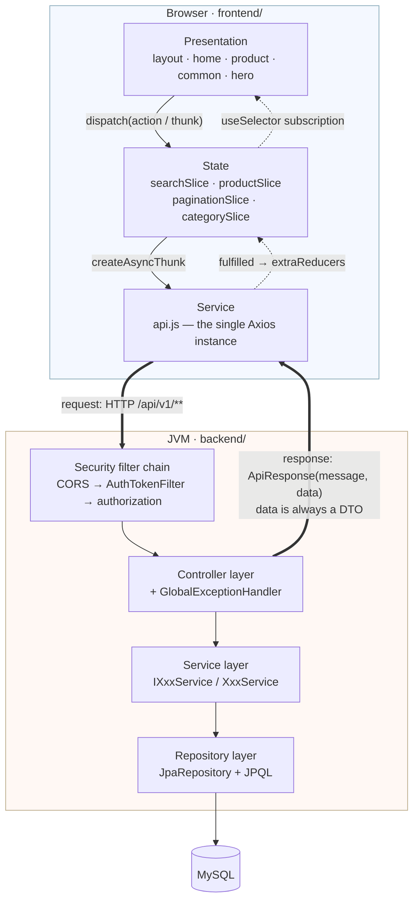
```mermaid
flowchart TB
    subgraph BROWSER["Browser · frontend/"]
        direction TB
        UI["Presentation<br/>layout · home · product · common · hero"]
        STATE["State<br/>searchSlice · productSlice<br/>paginationSlice · categorySlice"]
        SEAM["Service<br/>api.js — the single Axios instance"]
        UI -->|"dispatch(action / thunk)"| STATE
        STATE -->|"createAsyncThunk"| SEAM
        SEAM -.->|"fulfilled → extraReducers"| STATE
        STATE -.->|"useSelector subscription"| UI
    end

    subgraph SERVER["JVM · backend/"]
        direction TB
        FILTER["Security filter chain<br/>CORS → AuthTokenFilter → authorization"]
        CTRL["Controller layer<br/>+ GlobalExceptionHandler"]
        SVC["Service layer<br/>IXxxService / XxxService"]
        REPO["Repository layer<br/>JpaRepository + JPQL"]
        FILTER --> CTRL
        CTRL --> SVC
        SVC --> REPO
    end

    DB[("MySQL")]

    SEAM ==>|"request: HTTP /api/v1/**"| FILTER
    CTRL ==>|"response: ApiResponse(message, data)<br/>data is always a DTO"| SEAM
    REPO --> DB

    style BROWSER fill:#f4f8ff,stroke:#8ab
    style SERVER fill:#fff8f4,stroke:#ba8
```

**Dependencies point one way.** Presentation depends on state, state depends on the service layer, the service layer depends on the HTTP contract; the reverse happens only through subscriptions (`useSelector`) and callbacks (`extraReducers`). The back end is the same — Controller → Service → Repository never doubles back.

### 2.3 Back-End Layering

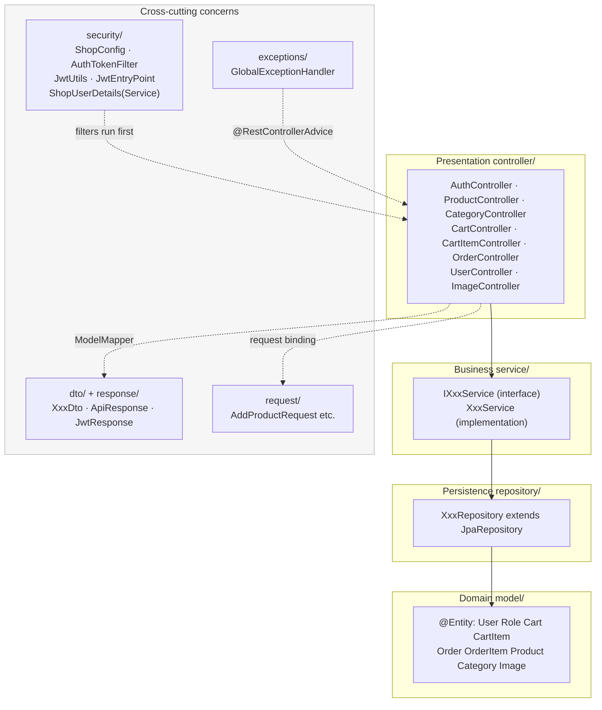
```mermaid
flowchart TB
    subgraph L1["Presentation controller/"]
        C["AuthController · ProductController · CategoryController<br/>CartController · CartItemController · OrderController<br/>UserController · ImageController"]
    end
    subgraph L2["Business service/"]
        S["IXxxService (interface)<br/>XxxService (implementation)"]
    end
    subgraph L3["Persistence repository/"]
        R["XxxRepository extends JpaRepository"]
    end
    subgraph L4["Domain model/"]
        M["@Entity: User Role Cart CartItem<br/>Order OrderItem Product Category Image"]
    end

    subgraph Cross["Cross-cutting concerns"]
        SEC["security/<br/>ShopConfig · AuthTokenFilter<br/>JwtUtils · JwtEntryPoint<br/>ShopUserDetails(Service)"]
        EX["exceptions/<br/>GlobalExceptionHandler"]
        DTO["dto/ + response/<br/>XxxDto · ApiResponse · JwtResponse"]
        REQ["request/<br/>AddProductRequest etc."]
    end

    C --> S
    S --> R
    R --> M
    C -.->|ModelMapper| DTO
    C -.->|request binding| REQ
    SEC -.->|filters run first| C
    EX -.->|"@RestControllerAdvice"| C

    style Cross fill:#f6f6f6,stroke:#bbb
```

**Layering rules (hard constraints)**

1. Controllers inject the **interface** (`IProductService`), never the implementation.
2. Controllers **never return an `@Entity`** — everything is mapped to a DTO by ModelMapper.
3. Every successful response is wrapped in `ApiResponse(message, data)`. Two exceptions: `/auth/**` returns a bare token map, and `/images/{id}/download` returns bytes.
4. Services throw the standard JPA exceptions (`EntityNotFoundException` / `EntityExistsException`); `GlobalExceptionHandler` maps them to status codes in one place.

### 2.4 Front-End Layering

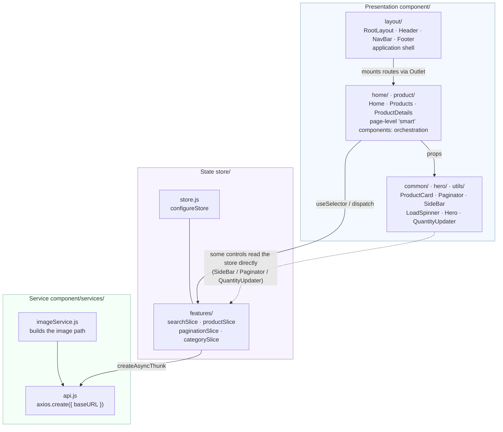
```mermaid
flowchart TB
    subgraph P["Presentation component/"]
        LAYOUT["layout/<br/>RootLayout · Header · NavBar · Footer<br/>application shell"]
        SMART["home/ · product/<br/>Home · Products · ProductDetails<br/>page-level 'smart' components: orchestration"]
        DUMB["common/ · hero/ · utils/<br/>ProductCard · Paginator · SideBar<br/>LoadSpinner · Hero · QuantityUpdater"]
    end

    subgraph ST["State store/"]
        STORE["store.js<br/>configureStore"]
        SLICES["features/<br/>searchSlice · productSlice<br/>paginationSlice · categorySlice"]
        STORE --- SLICES
    end

    subgraph SV["Service component/services/"]
        API["api.js<br/>axios.create({ baseURL })"]
        IMG["imageService.js<br/>builds the image path"]
        IMG --> API
    end

    LAYOUT -->|"mounts routes via Outlet"| SMART
    SMART -->|"props"| DUMB
    SMART -->|"useSelector / dispatch"| SLICES
    DUMB -.->|"some controls read the store directly<br/>(SideBar / Paginator / QuantityUpdater)"| SLICES
    SLICES -->|"createAsyncThunk"| API

    style P fill:#f4f8ff,stroke:#8ab
    style ST fill:#f8f4ff,stroke:#a8b
    style SV fill:#f4fff8,stroke:#8ba
```

**Split by role, not only by feature.** Page-level components (`Products.jsx`, `Home.jsx`) own *orchestration*: read from the store, filter, slice a page out, hand the result down. Presentational components (`ProductCard.jsx`) take plain props and render — they know nothing about Redux, routing or the API, so they stay reusable in search results, category pages, or a future "recommended for you" widget without dragging data fetching along.

**Where the implementation diverges from that model:** `SideBar`, `Paginator` and `QuantityUpdater` live under `common/` and `utils/` (which usually signals "presentational"), yet each calls `useSelector` and `dispatch` internally. That is a deliberate trade-off — they are **self-contained controls**, each owning one slice of state and needing no configuration from a parent, rather than reusable rendering units. The genuinely presentational components are `ProductCard`, `LoadSpinner` and `NoProductsAvailable`. The directory names do not express that distinction, which is a naming flaw.

### 2.5 Back-End Request Pipeline

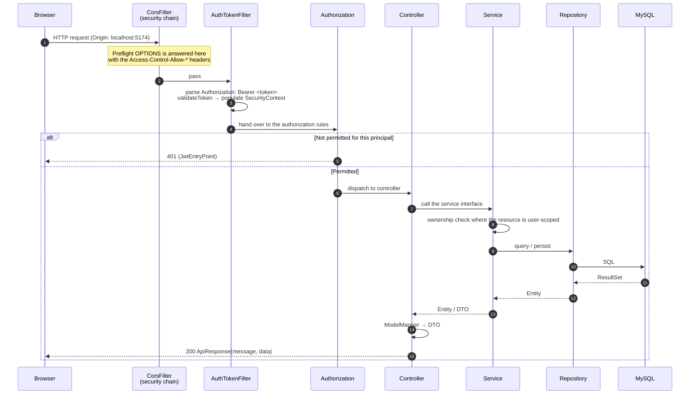
```mermaid
sequenceDiagram
    autonumber
    participant B as Browser
    participant CORS as CorsFilter<br/>(security chain)
    participant JWT as AuthTokenFilter
    participant SEC as Authorization
    participant C as Controller
    participant S as Service
    participant R as Repository
    participant DB as MySQL

    B->>CORS: HTTP request (Origin: localhost:5174)
    Note over CORS: Preflight OPTIONS is answered here<br/>with the Access-Control-Allow-* headers
    CORS->>JWT: pass
    JWT->>JWT: parse Authorization: Bearer <token><br/>validateToken → populate SecurityContext
    JWT->>SEC: hand over to the authorization rules
    alt Not permitted for this principal
        SEC-->>B: 401 (JwtEntryPoint)
    else Permitted
        SEC->>C: dispatch to controller
        C->>S: call the service interface
        S->>S: ownership check where the resource is user-scoped
        S->>R: query / persist
        R->>DB: SQL
        DB-->>R: ResultSet
        R-->>S: Entity
        S-->>C: Entity / DTO
        C->>C: ModelMapper → DTO
        C-->>B: 200 ApiResponse(message, data)
    end
```

---
## 3. The Front-End / Back-End Contract

The two sides agree on a *contract*, not on implementation details. As long as the contract holds, either side can be refactored without disturbing the other — which is precisely why the client's filtering, pagination and search were built without touching the server.

### 3.1 What the Contract Consists Of

| # | Part | Content | Enforced by |
|---|---|---|---|
| ① | **Addressing** | A versioned `/api/v1` prefix plus REST resource paths | Back end injects `${api.prefix}`; front end sets `baseURL` in `api.js` |
| ② | **Envelope** | Every successful response is `{ message, data }`, so the client parses one shape | Controllers wrap everything in `ApiResponse` |
| ③ | **Payload** | `data` is always a DTO or an array of DTOs; entities never appear | ModelMapper; DTO trimming in §6.1 |

Everything outside those three — table structure, lazy loading, cascades, how services are split — is each side's own business.

**Where the envelope is unwrapped** is worth stating explicitly:

```js
// store/features/productSlice.js
export const getAllProducts = createAsyncThunk("product/getAllProducts", async () => {
  const response = await api.get("/products/all");
  return response.data.data;   // response.data is the ApiResponse; .data is the DTO array
});
```

Unwrapping happens **in the thunk**, not in components. Everything downstream of `extraReducers` therefore sees DTOs only and is unaware the envelope exists — so if the envelope gains a field later (a `traceId`, say), the change lands in one layer.

### 3.2 End-to-End Sequence: Loading the Home Page

The longest path in the system, crossing three front-end layers, four back-end layers and the database:

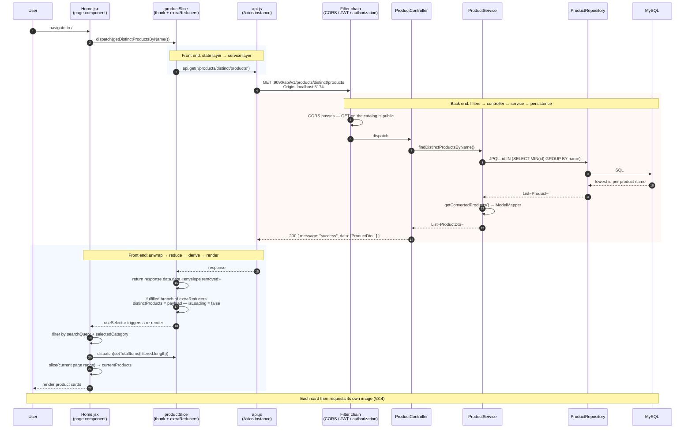
```mermaid
sequenceDiagram
    autonumber
    participant U as User
    participant H as Home.jsx<br/>(page component)
    participant SL as productSlice<br/>(thunk + extraReducers)
    participant AX as api.js<br/>(Axios instance)
    participant F as Filter chain<br/>(CORS / JWT / authorization)
    participant PC as ProductController
    participant PS as ProductService
    participant PR as ProductRepository
    participant DB as MySQL

    U->>H: navigate to /
    H->>SL: dispatch(getDistinctProductsByName())

    rect rgb(244, 248, 255)
    Note over SL,AX: Front end: state layer → service layer
    SL->>AX: api.get("/products/distinct/products")
    end

    AX->>F: GET :9090/api/v1/products/distinct/products<br/>Origin: localhost:5174

    rect rgb(255, 248, 244)
    Note over F,DB: Back end: filters → controller → service → persistence
    F->>F: CORS passes — GET on the catalog is public
    F->>PC: dispatch
    PC->>PS: findDistinctProductsByName()
    PS->>PR: JPQL: id IN (SELECT MIN(id) GROUP BY name)
    PR->>DB: SQL
    DB-->>PR: lowest id per product name
    PR-->>PS: List~Product~
    PS->>PS: getConvertedProducts() → ModelMapper
    PS-->>PC: List~ProductDto~
    PC-->>AX: 200 { message: "success", data: [ProductDto...] }
    end

    rect rgb(244, 248, 255)
    Note over AX,H: Front end: unwrap → reduce → derive → render
    AX-->>SL: response
    SL->>SL: return response.data.data «envelope removed»
    SL->>SL: fulfilled branch of extraReducers<br/>distinctProducts = payload — isLoading = false
    SL-->>H: useSelector triggers a re-render
    H->>H: filter by searchQuery + selectedCategory
    H->>SL: dispatch(setTotalItems(filtered.length))
    H->>H: slice(current page range) → currentProducts
    H-->>U: render product cards
    end

    Note over U,DB: Each card then requests its own image (§3.4)
```

**Three things worth noting about this path**

1. **Filtering and pagination happen on the client.** The server returns the full de-duplicated catalog; filtering, counting and slicing all happen inside `Home.jsx`'s effects. Changing a filter costs zero network round-trips and feels instant; the price is that first-load payload grows linearly with catalog size (§12).
2. **`setTotalItems` is a write-back.** The page component computes how many results survived filtering and writes that number back into `paginationSlice`, which is the only way `Paginator` can know how many page buttons to draw. It is the sole indirect coupling between the four slices.
3. **Images are not on this path.** A product DTO carries only `ImageDto{ id, fileName, downloadUrl }`; the bytes are fetched separately by each card — deliberately, to keep base64 out of the list JSON.

### 3.3 Contract Drift: A Post-Mortem

A contract only proves its worth when something breaks it. Three incidents during development, all the same shape — the two sides assuming different things about one detail:

| # | Symptom | Root cause | Decision |
|---|---|---|---|
| ① | Every request `ERR_CONNECTION_REFUSED` | `application.properties` had no `server.port`, so the server fell back to 8080 while the client hardcoded 9090 | Declare `server.port=9090` **explicitly**. Load-bearing configuration should not rely on framework defaults or IDE settings, or behaviour changes with how you start the app |
| ② | `/categories/all` and `/products/distinct/products` returned 404 | The client called paths from the course material; the server had registered different ones (`/categories` with no `/all`; the de-duplication endpoint did not exist at all) | **Add the endpoints to the server rather than changing both sides.** The already-written caller is the de facto contract, and changing one side has a smaller regression surface. This is where the JPQL de-duplication query came from (§7.1) |
| ③ | `blocked by CORS policy` | Same-origin policy; the server never wrote `Access-Control-Allow-Origin` | Configure CORS **inside the security filter chain**. With Spring Security present, configuring it only at the MVC layer is useless — the filter chain rejects the request first |

> A reusable triage order came out of this: if `curl` succeeds but the browser fails, it is CORS or auth, never routing. If `curl` also fails, confirm the real listening port with `lsof -iTCP -sTCP:LISTEN | grep java` before checking whether the `@GetMapping` path exists.

### 3.4 The Image Sub-Contract

Images travel over their own sub-contract: the product DTO carries only a reference, and the bytes are fetched separately. That is deliberate — it keeps base64 out of the product list JSON.

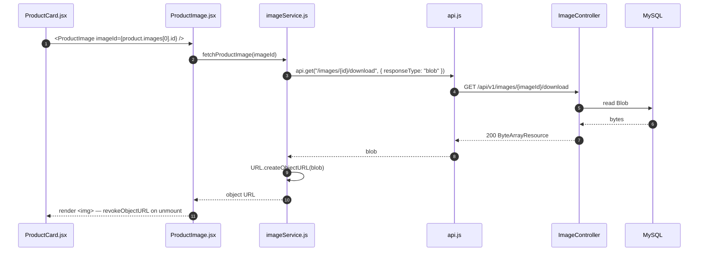
```mermaid
sequenceDiagram
    autonumber
    participant PC as ProductCard.jsx
    participant PI as ProductImage.jsx
    participant IS as imageService.js
    participant AX as api.js
    participant IC as ImageController
    participant DB as MySQL

    PC->>PI: <ProductImage imageId={product.images[0].id} />
    PI->>IS: fetchProductImage(imageId)
    IS->>AX: api.get("/images/{id}/download", { responseType: "blob" })
    AX->>IC: GET /api/v1/images/{imageId}/download
    IC->>DB: read Blob
    DB-->>IC: bytes
    IC-->>AX: 200 ByteArrayResource
    AX-->>IS: blob
    IS->>IS: URL.createObjectURL(blob)
    IS-->>PI: object URL
    PI-->>PC: render <img> — revokeObjectURL on unmount
```

**This path used to be broken, and why is worth recording.** An earlier implementation had `ProductImage.jsx` and `ImageZoomify.jsx` each build `/images/image/download/{id}` with a raw `fetch`, while the server registers `/images/{imageId}/download` — every product image 404'd. Three factors combined to keep it hidden:

1. **The path was wrong**, and each of the two components had its own copy of it.
2. **They bypassed the service seam** — a raw `fetch` with a hardcoded `http://localhost:9090`, so the single-`baseURL` constraint in `api.js` never had a chance to catch the mistake.
3. **The failure was swallowed** — `catch` logged to the console and the component returned `null`, so the UI looked like "this product has no image" rather than like a bug.

The fix collapses the path to one place: a new `services/imageService.js` builds the only image URL, through `api`, and both components pass nothing but an id. **Note that `ImageDto.downloadUrl` is deliberately not consumed directly** — that field is correct, but it already contains the `/api/v1` prefix that the Axios instance also supplies via `baseURL`, so handing it to `api.get` would double the prefix.

A naming error was corrected along the way: both components declared a `productId` prop while actually receiving an **image id**. It is now `imageId`.

---

## 4. Front-End Design

### 4.1 Component Hierarchy and Roles

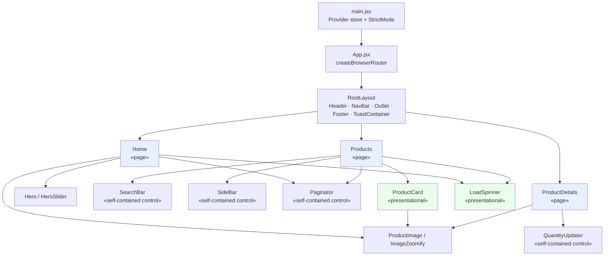
```mermaid
flowchart TB
    MAIN["main.jsx<br/>Provider store + StrictMode"]
    APP["App.jsx<br/>createBrowserRouter"]
    ROOT["RootLayout<br/>Header · NavBar · Outlet · Footer · ToastContainer"]

    HOME["Home<br/>«page»"]
    PRODUCTS["Products<br/>«page»"]
    DETAILS["ProductDetails<br/>«page»"]

    HERO["Hero / HeroSlider"]
    SEARCH["SearchBar<br/>«self-contained control»"]
    SIDEBAR["SideBar<br/>«self-contained control»"]
    PAGER["Paginator<br/>«self-contained control»"]
    QTY["QuantityUpdater<br/>«self-contained control»"]

    CARD["ProductCard<br/>«presentational»"]
    SPIN["LoadSpinner<br/>«presentational»"]
    IMG["ProductImage / ImageZoomify"]

    MAIN --> APP --> ROOT
    ROOT --> HOME
    ROOT --> PRODUCTS
    ROOT --> DETAILS

    HOME --> HERO
    HOME --> PAGER
    HOME --> IMG
    HOME --> SPIN

    PRODUCTS --> SEARCH
    PRODUCTS --> SIDEBAR
    PRODUCTS --> CARD
    PRODUCTS --> PAGER
    PRODUCTS --> SPIN
    CARD --> IMG

    DETAILS --> IMG
    DETAILS --> QTY

    style HOME fill:#e8f0ff
    style PRODUCTS fill:#e8f0ff
    style DETAILS fill:#e8f0ff
    style CARD fill:#eaffea
    style SPIN fill:#eaffea
```

Three roles, distinguished by **who is allowed to know where data comes from**:

| Role | Components | Touches the store | Responsibility |
|---|---|---|---|
| **Page (smart)** | `Home` · `Products` · `ProductDetails` | Reads several slices | Orchestration: fetch, filter, paginate, hand a slice of data down |
| **Self-contained control** | `SearchBar` · `SideBar` · `Paginator` · `QuantityUpdater` | Reads and writes **its own slice** | Owns one piece of state; needs no configuration to work |
| **Presentational (dumb)** | `ProductCard` · `LoadSpinner` · `NoProductsAvailable` | No | Takes props and renders |

**Why `ProductCard` must stay dumb:** if it called `useSelector` internally it would be welded to one scenario — reusing it in search results or a recommendations widget would fight its built-in data source. It takes props only; `Products.jsx` assembles and feeds it.

### 4.2 Routing

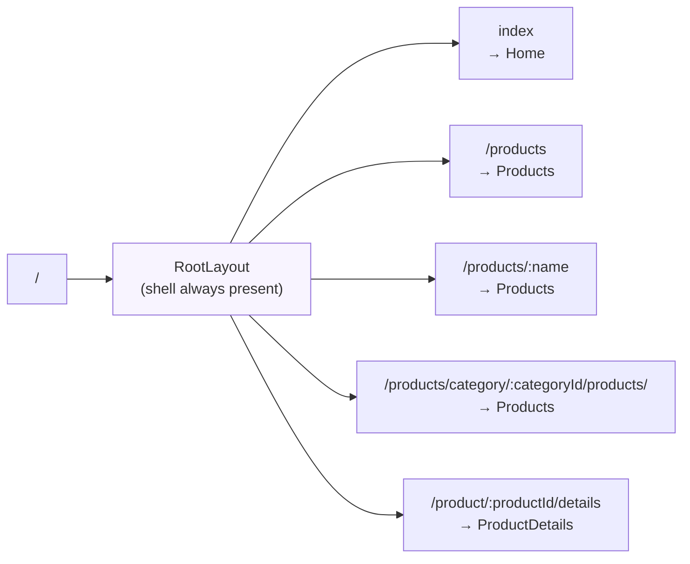
```mermaid
flowchart LR
    R["/"] --> RL["RootLayout<br/>(shell always present)"]
    RL --> I["index<br/>→ Home"]
    RL --> P1["/products<br/>→ Products"]
    RL --> P2["/products/:name<br/>→ Products"]
    RL --> P3["/products/category/:categoryId/products/<br/>→ Products"]
    RL --> D["/product/:productId/details<br/>→ ProductDetails"]

    style RL fill:#f8f4ff
```

| Path | Component | Entry point |
|---|---|---|
| `/` | `Home` | Landing page, products de-duplicated by name |
| `/products` | `Products` | Full catalog |
| `/products/:name` | `Products` | Reached from a home-page card; `name` seeds the search box |
| `/products/category/:categoryId/products/` | `Products` | Entered from a category |
| `/product/:productId/details` | `ProductDetails` | Product detail |

**`Products` is reused by three routes** and works out its own context from `useParams()` and `useLocation()`:

```js
const { name } = useParams();          // /products/:name
const { categoryId } = useParams();    // /products/category/:categoryId/products/
const queryParams = new URLSearchParams(location.search);
const initialSearchQuery = queryParams.get("search") || name || "";
```

If `categoryId` is present it fetches that category, otherwise everything; `name` or `?search=` is written into `searchSlice` as the initial query.

**Why real routing rather than one `useState` deciding which component shows:** if "what am I looking at" lives only in component state, a user cannot share a link to a product (the URL never changes) and the browser's back and forward buttons stop working. The URL itself has to carry that information.

### 4.3 Redux Store Shape

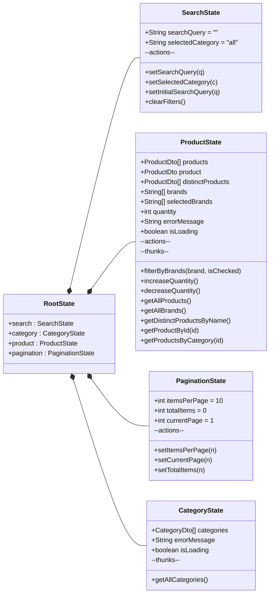
```mermaid
classDiagram
    direction LR

    class RootState {
        +search : SearchState
        +category : CategoryState
        +product : ProductState
        +pagination : PaginationState
    }

    class SearchState {
        +String searchQuery = ""
        +String selectedCategory = "all"
        --actions--
        +setSearchQuery(q)
        +setSelectedCategory(c)
        +setInitialSearchQuery(q)
        +clearFilters()
    }

    class ProductState {
        +ProductDto[] products
        +ProductDto product
        +ProductDto[] distinctProducts
        +String[] brands
        +String[] selectedBrands
        +int quantity
        +String errorMessage
        +boolean isLoading
        --actions--
        +filterByBrands(brand, isChecked)
        +increaseQuantity()
        +decreaseQuantity()
        --thunks--
        +getAllProducts()
        +getAllBrands()
        +getDistinctProductsByName()
        +getProductById(id)
        +getProductsByCategory(id)
    }

    class PaginationState {
        +int itemsPerPage = 10
        +int totalItems = 0
        +int currentPage = 1
        --actions--
        +setItemsPerPage(n)
        +setCurrentPage(n)
        +setTotalItems(n)
    }

    class CategoryState {
        +CategoryDto[] categories
        +String errorMessage
        +boolean isLoading
        --thunks--
        +getAllCategories()
    }

    RootState *-- SearchState
    RootState *-- ProductState
    RootState *-- PaginationState
    RootState *-- CategoryState
```

**Why four slices instead of one large object:** the query is updated by `SearchBar`, brand filters by `SideBar`, the page by `Paginator` — three things updated independently by three different components. Mixed into one object, any small change means hunting for the right spot in one enormous reducer. Split apart, who-changed-what is obvious, and adding a price-range filter later means **adding a slice** rather than operating on existing ones.

Each slice is **unaware the others exist**. The single exception is `paginationSlice.totalItems`, written back by the page component once filtering is done (§4.5).

### 4.4 State Flow: How Sibling Controls Converge

This is the central problem the front end solves, and the **actual reason** Redux is here:

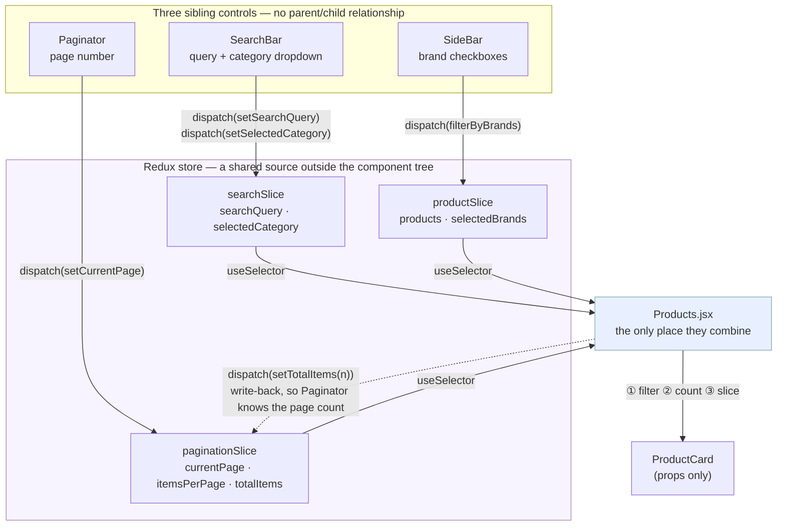
```mermaid
flowchart TB
    subgraph CTRL["Three sibling controls — no parent/child relationship"]
        SB["SearchBar<br/>query + category dropdown"]
        SD["SideBar<br/>brand checkboxes"]
        PG["Paginator<br/>page number"]
    end

    subgraph STORE["Redux store — a shared source outside the component tree"]
        S1["searchSlice<br/>searchQuery · selectedCategory"]
        S2["productSlice<br/>products · selectedBrands"]
        S3["paginationSlice<br/>currentPage · itemsPerPage · totalItems"]
    end

    PAGE["Products.jsx<br/>the only place they combine"]
    OUT["ProductCard<br/>(props only)"]

    SB -->|"dispatch(setSearchQuery)<br/>dispatch(setSelectedCategory)"| S1
    SD -->|"dispatch(filterByBrands)"| S2
    PG -->|"dispatch(setCurrentPage)"| S3

    S1 -->|useSelector| PAGE
    S2 -->|useSelector| PAGE
    S3 -->|useSelector| PAGE

    PAGE -->|"① filter ② count ③ slice"| OUT
    PAGE -.->|"dispatch(setTotalItems(n))<br/>write-back, so Paginator knows the page count"| S3

    style STORE fill:#f8f4ff,stroke:#a8b
    style PAGE fill:#e8f0ff,stroke:#8ab
```

**What happens without Redux:** the three controls are siblings, not parent and child. With props you would drill several levels down from `Products.jsx`, and `SideBar` would still need to notify *upward* when a brand changes — props only flow down, so two-way communication gets contorted. The argument is not "lots of state, therefore Redux"; it is **"unrelated components need the same data and there is no direct parent/child path between them."**

The dashed line (`setTotalItems`) is the one indirect coupling in the design: `Paginator` needs the page count, but the count is only knowable after filtering, and filtering happens in the page component.

### 4.5 Filtering and Pagination

Three effects in `Products.jsx` form a derivation chain:

```js
// ① intersect three dimensions
const results = products.filter((product) => {
  const matchesQuery    = product.name.toLowerCase().includes(searchQuery.toLowerCase());
  const matchesCategory = selectedCategory === "all"
                        || product.category.name.toLowerCase().includes(selectedCategory.toLowerCase());
  const matchesBrand    = selectedBrands.length === 0
                        || selectedBrands.some((b) => product.brand.toLowerCase().includes(b.toLowerCase()));
  return matchesQuery && matchesCategory && matchesBrand;
});
setFilteredProducts(results);

// ② write the surviving count back so Paginator can render page buttons
dispatch(setTotalItems(filteredProducts.length));

// ③ slice out the current page
const currentProducts = filteredProducts.slice(
  (currentPage - 1) * itemsPerPage,
  currentPage * itemsPerPage
);
```

All three dimensions are designed to **not filter when nothing is selected** (`selectedCategory === "all"`, `selectedBrands.length === 0`), so a fourth dimension costs one more `matchesXxx &&` and no changes to the existing conditions.

**`Home` and `Products` each implement this separately**, differing in only two ways:

| | Source | Dimensions | Has a SideBar |
|---|---|---|---|
| `Home.jsx` | `state.product.distinctProducts` | query + category | No |
| `Products.jsx` | `state.product.products` | query + category + **brand** | Yes |

About 40 nearly identical lines exist in two copies. The reasonable refactor is a `useFilteredPagedProducts(source, { withBrand })` hook — see §12.

### 4.6 Async Pattern: The createAsyncThunk Three-State Model

**Intent:** the product list, brand list, categories and product detail all fetch. If each component wrote its own `useEffect` + fetch + loading/error state, that request-wait-succeed-fail logic would be duplicated across components, probably inconsistently. With one pattern, a new endpoint follows the template.

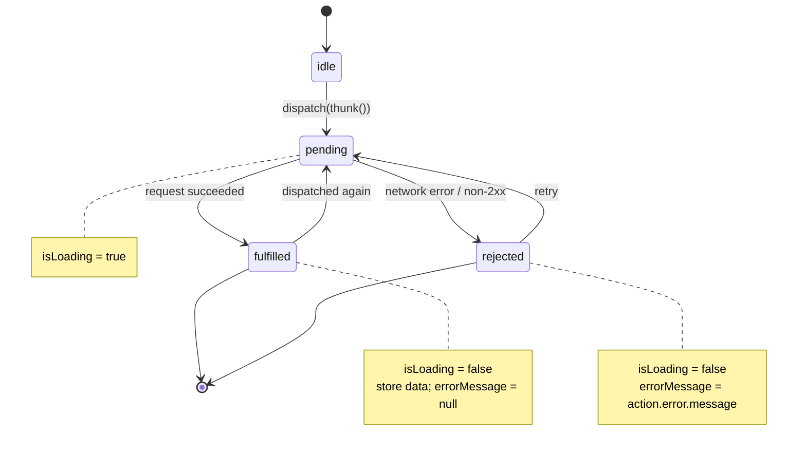
```mermaid
stateDiagram-v2
    [*] --> idle
    idle --> pending : dispatch(thunk())
    pending --> fulfilled : request succeeded
    pending --> rejected : network error / non-2xx
    fulfilled --> pending : dispatched again
    rejected --> pending : retry
    fulfilled --> [*]
    rejected --> [*]

    note right of pending
        isLoading = true
    end note
    note right of fulfilled
        isLoading = false
        store data; errorMessage = null
    end note
    note right of rejected
        isLoading = false
        errorMessage = action.error.message
    end note
```

**Coverage** (`productSlice` originally handled only `fulfilled`; now complete):

| Thunk | Slice | `pending` | `fulfilled` | `rejected` |
|---|---|---|---|---|
| `getAllCategories` | categorySlice | ✅ | ✅ | ✅ |
| `getAllProducts` | productSlice | ✅ | ✅ | ✅ |
| `getAllBrands` | productSlice | ✅ | ✅ | ✅ |
| `getDistinctProductsByName` | productSlice | ✅ | ✅ | ✅ |
| `getProductById` | productSlice | ✅ | ✅ | ✅ |
| `getProductsByCategory` | productSlice | ✅ | ✅ | ✅ |

All five thunks in `productSlice` share the same `pending` / `rejected` behaviour, so it is declared **once with a matcher** rather than repeated per case:

```js
.addMatcher(isPending(...PRODUCT_THUNKS),  (state) => { state.isLoading = true;  state.errorMessage = null; })
.addMatcher(isRejected(...PRODUCT_THUNKS), (state, action) => {
  state.isLoading = false;
  state.errorMessage = action.error?.message ?? "Request failed";
});
```

> **The failure mode this replaced is worth remembering.** `isLoading` starts as `true` and was only ever cleared by `fulfilled`. With the back end down, the request took the `rejected` branch, no handler caught it, `isLoading` stayed `true` forever, and the home page **spun on `LoadSpinner` indefinitely — no error, no timeout**. It looked like a frozen page rather than a diagnosable failure.

**How errors become visible.** The `errorMessage` written by `rejected` was read by nothing. A listener middleware on the store now handles it centrally — matching any `rejected` action and raising a toast. The side effect stays out of the reducers and covers every slice at once:

```js
errorListener.startListening({
  matcher: isRejected,
  effect: (action) => toast.error(action.error?.message ?? "Something went wrong. Please try again."),
});
```

`ToastContainer` moved from `Home.jsx` up to `RootLayout` so errors surface on any route, and `react-toastify`'s stylesheet — which had never been imported — was added.

### 4.7 The Single Network Seam

```js
// src/component/services/api.js — the whole file
import axios from "axios"

export const api = axios.create({
    baseURL: "http://localhost:9090/api/v1",
   // withCredentials: true,  // for authenticated requests
})
```

**Intent:** no component calls `fetch`/`axios` directly; every request goes through this one instance. It is a deliberate seam — if the base URL changes, or every request needs an auth header, a 401 interceptor and retries, there is exactly one file to touch.

**There used to be two violations**, and they were exactly where the bug lived — `ProductImage.jsx` and `ImageZoomify.jsx` used a raw `fetch` with a hardcoded `http://localhost:9090`. Both now go through `services/imageService.js` and `api`, and the seam is intact again (§3.4).

That is a counter-example that happens to confirm the intent: **a seam earns its keep precisely because the code that bypasses it is the code that breaks first.**

One leftover: `component/services/ProductService.js` exports a `getDistinctProductsByName` that duplicates a `productSlice` thunk and is **referenced nowhere** — dead code, slated for removal in §12.

> Note that `withCredentials: true` is commented out. The moment login is wired up, the `HttpOnly` refresh cookie will not be sent with requests and `/auth/refresh-token` will fail. It is the first thing to change when adding authentication.

---
## 5. Back-End Domain Model

### 5.1 Entity Class Diagram


```mermaid
classDiagram
    direction LR

    class User {
        -Long id
        -String firstName
        -String lastName
        -String email  (unique)
        -String password  (BCrypt hash)
    }

    class Role {
        -Long id
        -String name
    }

    class Cart {
        -Long id
        -BigDecimal totalAmount
        +removeItem(CartItem) void
    }

    class CartItem {
        -Long id
        -int quantity
        -BigDecimal unitPrice
        -BigDecimal totalPrice
        +setTotalPrice() void
    }

    class Order {
        -Long id
        -LocalDate orderDate
        -BigDecimal totalAmount
        -OrderStatus orderStatus
    }

    class OrderItem {
        -Long id
        -int quantity
        -BigDecimal price
    }

    class Product {
        -Long id
        -String name
        -String brand
        -String description
        -BigDecimal price
        -int inventory
    }

    class Category {
        -Long id
        -String name
    }

    class Image {
        -Long id
        -String fileName
        -String fileType
        -Blob image  (Lob)
        -String downloadUrl
    }

    class OrderStatus {
        <<enumeration>>
        PENDING
        PROCESSING
        SHIPPED
        DELIVERED
        CANCELLED
    }

    User "1" o-- "0..1" Cart : OneToOne (mappedBy user)
    User "1" o-- "0..*" Order : OneToMany
    User "*" -- "*" Role : ManyToMany «user_roles»
    Cart "1" *-- "0..*" CartItem : OneToMany cascade=ALL orphanRemoval
    Order "1" *-- "0..*" OrderItem : OneToMany cascade=ALL orphanRemoval
    CartItem "*" --> "1" Product : ManyToOne
    OrderItem "*" --> "1" Product : ManyToOne
    Product "*" --> "1" Category : ManyToOne cascade=ALL
    Product "1" *-- "0..*" Image : OneToMany cascade=ALL orphanRemoval
    Order ..> OrderStatus : «uses»
```

### 5.2 Relationship Semantics

| Relationship | Type | Owning side | Cascade | Intent |
|---|---|---|---|---|
| User → Cart | OneToOne | Cart holds `user_id` | `ALL` + orphanRemoval | Registration creates an empty cart; its lifetime is bound to the user |
| User → Order | OneToMany | Order holds `user_id` | `ALL` + orphanRemoval | Order history belongs to the user |
| User ↔ Role | ManyToMany (EAGER) | `user_roles` join table | `DETACH/MERGE/PERSIST/REFRESH` (**no REMOVE**) | Deleting a user must not delete the role definition. EAGER because authorization needs the authorities immediately |
| Cart → CartItem | OneToMany | CartItem holds `cart_id` | `ALL` + orphanRemoval | Composition: an item has no meaning without its cart |
| Order → OrderItem | OneToMany | OrderItem holds `order_id` | `ALL` + orphanRemoval | Same, and OrderItem **snapshots the price at checkout**, decoupling it from the product's current price |
| Product → Category | ManyToOne | Product holds `category_id` | `ALL` ⚠️ | See §11.2 |
| Product → Image | OneToMany | Image holds `product_id` | `ALL` + orphanRemoval | Images are deleted with the product |
| Category → Product | inverse OneToMany | — | none | Annotated `@JsonIgnore` to break the bidirectional serialization cycle |

### 5.3 ER Diagram

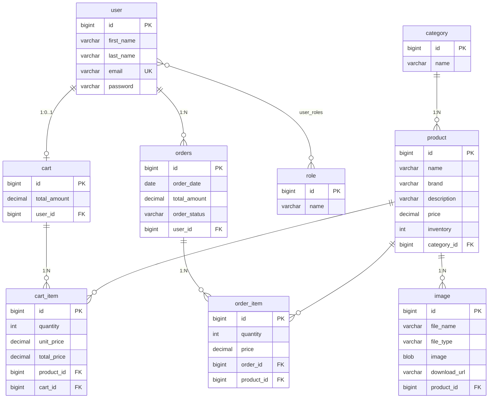
```mermaid
erDiagram
    user ||--o| cart : "1:0..1"
    user ||--o{ orders : "1:N"
    user }o--o{ role : "user_roles"
    cart ||--o{ cart_item : "1:N"
    orders ||--o{ order_item : "1:N"
    product ||--o{ cart_item : ""
    product ||--o{ order_item : ""
    category ||--o{ product : "1:N"
    product ||--o{ image : "1:N"

    user {
        bigint id PK
        varchar first_name
        varchar last_name
        varchar email UK
        varchar password
    }
    role {
        bigint id PK
        varchar name
    }
    cart {
        bigint id PK
        decimal total_amount
        bigint user_id FK
    }
    cart_item {
        bigint id PK
        int quantity
        decimal unit_price
        decimal total_price
        bigint product_id FK
        bigint cart_id FK
    }
    orders {
        bigint id PK
        date order_date
        decimal total_amount
        varchar order_status
        bigint user_id FK
    }
    order_item {
        bigint id PK
        int quantity
        decimal price
        bigint order_id FK
        bigint product_id FK
    }
    product {
        bigint id PK
        varchar name
        varchar brand
        varchar description
        decimal price
        int inventory
        bigint category_id FK
    }
    category {
        bigint id PK
        varchar name
    }
    image {
        bigint id PK
        varchar file_name
        varchar file_type
        blob image
        varchar download_url
        bigint product_id FK
    }
```

> `Order` is mapped explicitly to `@Table(name = "orders")` because `ORDER` is a SQL reserved word.

### 5.4 Order State Machine

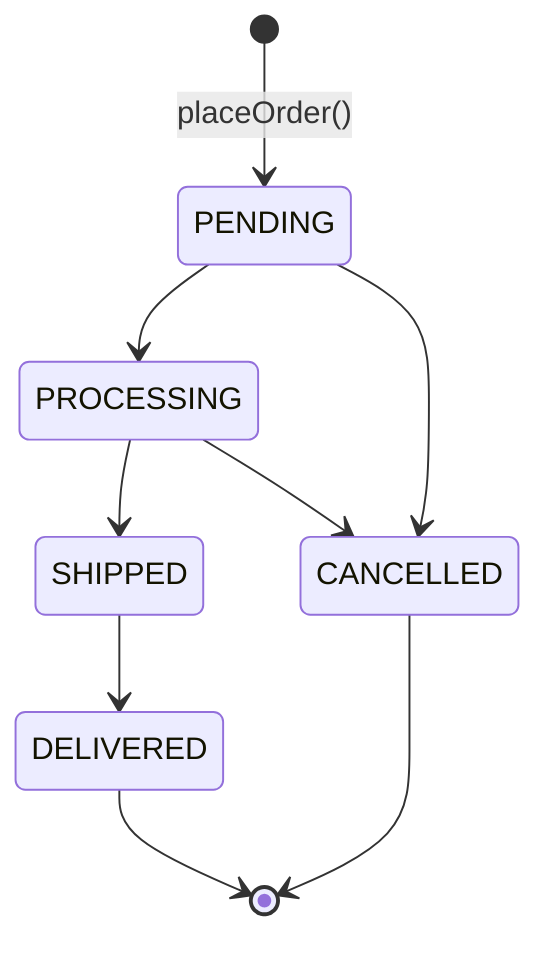
```mermaid
stateDiagram-v2
    [*] --> PENDING : placeOrder()
    PENDING --> PROCESSING
    PENDING --> CANCELLED
    PROCESSING --> SHIPPED
    PROCESSING --> CANCELLED
    SHIPPED --> DELIVERED
    DELIVERED --> [*]
    CANCELLED --> [*]
```

> Only `PENDING` is ever written today. The remaining states are defined in `OrderStatus` but no transition logic exists yet (§12).

---

## 6. API Contract Layer

### 6.1 DTO Class Diagram

The only data shapes a client ever sees:

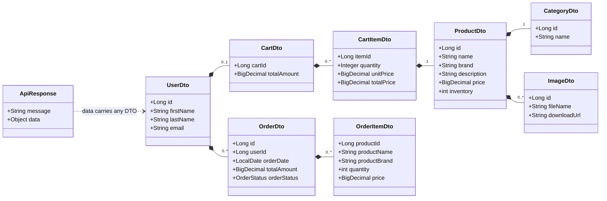
```mermaid
classDiagram
    direction LR

    class ApiResponse {
        +String message
        +Object data
    }

    class UserDto {
        +Long id
        +String firstName
        +String lastName
        +String email
    }
    class CartDto {
        +Long cartId
        +BigDecimal totalAmount
    }
    class CartItemDto {
        +Long itemId
        +Integer quantity
        +BigDecimal unitPrice
        +BigDecimal totalPrice
    }
    class OrderDto {
        +Long id
        +Long userId
        +LocalDate orderDate
        +BigDecimal totalAmount
        +OrderStatus orderStatus
    }
    class OrderItemDto {
        +Long productId
        +String productName
        +String productBrand
        +int quantity
        +BigDecimal price
    }
    class ProductDto {
        +Long id
        +String name
        +String brand
        +String description
        +BigDecimal price
        +int inventory
    }
    class CategoryDto {
        +Long id
        +String name
    }
    class ImageDto {
        +Long id
        +String fileName
        +String downloadUrl
    }

    ApiResponse ..> UserDto : data carries any DTO
    UserDto *-- "0..*" OrderDto
    UserDto *-- "0..1" CartDto
    CartDto *-- "0..*" CartItemDto
    CartItemDto *-- "1" ProductDto
    OrderDto *-- "0..*" OrderItemDto
    ProductDto *-- "1" CategoryDto
    ProductDto *-- "0..*" ImageDto
```

**What the DTOs trim, relative to the entities**

| Trimmed | Reason |
|---|---|
| `UserDto` has no `password`, no `roles` | Credentials and authorities never leave the server |
| `CategoryDto` has no `products` | Cuts the Product ↔ Category cycle |
| `ImageDto` has no `Blob image`, no `fileType` | Bytes are fetched via `downloadUrl` in a second request rather than base64'd into JSON |
| `OrderItemDto` flattens to `productName` / `productBrand` | Rendering an order line does not need the whole product graph |
| `CartItemDto` / `OrderItemDto` carry no back-references | Avoids the Cart → Item → Cart cycle |

### 6.2 Request Objects

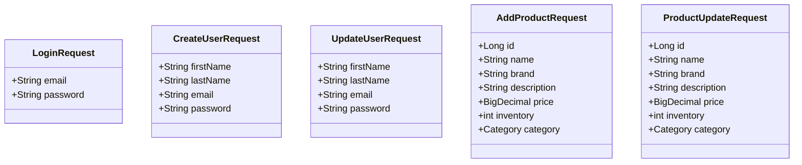
```mermaid
classDiagram
    class LoginRequest {
        +String email
        +String password
    }
    class CreateUserRequest {
        +String firstName
        +String lastName
        +String email
        +String password
    }
    class UpdateUserRequest {
        +String firstName
        +String lastName
        +String email
        +String password
    }
    class AddProductRequest {
        +Long id
        +String name
        +String brand
        +String description
        +BigDecimal price
        +int inventory
        +Category category
    }
    class ProductUpdateRequest {
        +Long id
        +String name
        +String brand
        +String description
        +BigDecimal price
        +int inventory
        +Category category
    }
```

> `UpdateProductRequest` duplicates `ProductUpdateRequest` field for field and is **referenced nowhere** — dead code (§11.2).

### 6.3 Response Conventions

| Case | HTTP | Body |
|---|---|---|
| Success | 200 | `{ "message": "Success", "data": <DTO or DTO array> }` |
| Not found | 404 | `{ "message": "<exception message>", "data": null }` |
| Conflict (duplicate email / product) | 409 | `{ "message": "<exception message>", "data": null }` |
| Not authenticated on a protected path | 401 | Written by `JwtEntryPoint` |
| Authenticated but not the owner | 403 | `{ "message": "<why>", "data": null }` |
| Anything uncaught | 500 | `{ "message": "Something went wrong: ...", "data": null }` |
| Login / refresh | 200 | `{ "accessToken": "<JWT>" }` (**not** wrapped in `ApiResponse`) |
| Image download | 200 | `ByteArrayResource` (bytes) |

---

## 7. Back-End Service Layer

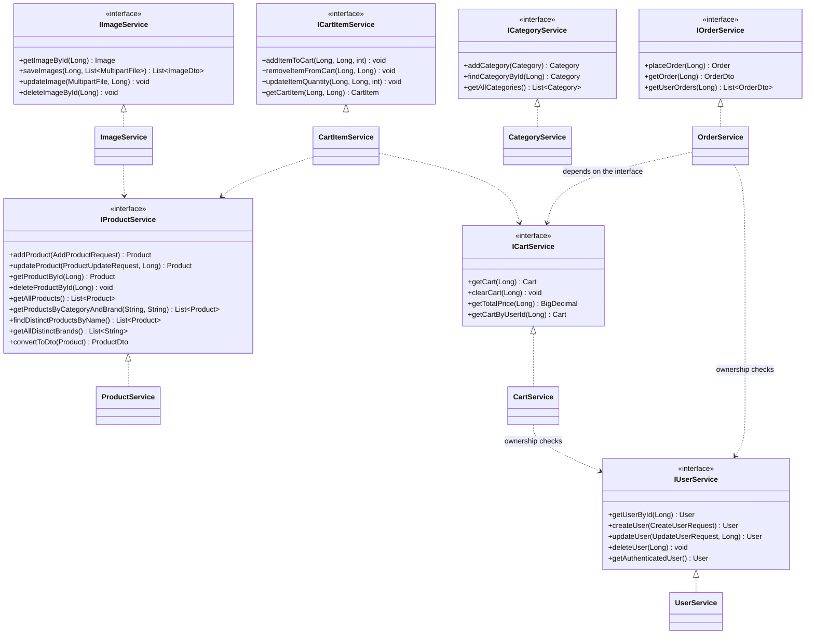
```mermaid
classDiagram
    direction TB

    class IProductService {
        <<interface>>
        +addProduct(AddProductRequest) Product
        +updateProduct(ProductUpdateRequest, Long) Product
        +getProductById(Long) Product
        +deleteProductById(Long) void
        +getAllProducts() List~Product~
        +getProductsByCategoryAndBrand(String, String) List~Product~
        +findDistinctProductsByName() List~Product~
        +getAllDistinctBrands() List~String~
        +convertToDto(Product) ProductDto
    }
    class ProductService
    class ICartService {
        <<interface>>
        +getCart(Long) Cart
        +clearCart(Long) void
        +getTotalPrice(Long) BigDecimal
        +getCartByUserId(Long) Cart
    }
    class CartService
    class ICartItemService {
        <<interface>>
        +addItemToCart(Long, Long, int) void
        +removeItemFromCart(Long, Long) void
        +updateItemQuantity(Long, Long, int) void
        +getCartItem(Long, Long) CartItem
    }
    class CartItemService
    class IOrderService {
        <<interface>>
        +placeOrder(Long) Order
        +getOrder(Long) OrderDto
        +getUserOrders(Long) List~OrderDto~
    }
    class OrderService
    class IUserService {
        <<interface>>
        +getUserById(Long) User
        +createUser(CreateUserRequest) User
        +updateUser(UpdateUserRequest, Long) User
        +deleteUser(Long) void
        +getAuthenticatedUser() User
    }
    class UserService
    class ICategoryService {
        <<interface>>
        +addCategory(Category) Category
        +findCategoryById(Long) Category
        +getAllCategories() List~Category~
    }
    class CategoryService
    class IImageService {
        <<interface>>
        +getImageById(Long) Image
        +saveImages(Long, List~MultipartFile~) List~ImageDto~
        +updateImage(MultipartFile, Long) void
        +deleteImageById(Long) void
    }
    class ImageService

    IProductService <|.. ProductService
    ICartService <|.. CartService
    ICartItemService <|.. CartItemService
    IOrderService <|.. OrderService
    IUserService <|.. UserService
    ICategoryService <|.. CategoryService
    IImageService <|.. ImageService

    OrderService ..> ICartService : depends on the interface
    OrderService ..> IUserService : ownership checks
    CartService ..> IUserService : ownership checks
    CartItemService ..> ICartService
    CartItemService ..> IProductService
    ImageService ..> IProductService
```

**Services depend on each other's interfaces too** (`OrderService` depends on `ICartService`, not `CartService`), so any of them can be swapped for a mock in a unit test.

### 7.1 Custom Queries

`ProductRepository` mostly relies on Spring Data method-name derivation. Two exceptions show the trade-off:

```java
// Fuzzy search: method-name derivation cannot express LOWER + LIKE, so JPQL it is
@Query("SELECT p FROM Product p WHERE LOWER(p.name) LIKE LOWER(CONCAT('%', :name, '%'))")
List<Product> findByName(String name);
```

```java
// De-duplicate by name, keeping the lowest id in each group —
// the home page shows one card per distinct product name
@Query("SELECT p FROM Product p WHERE p.id IN (SELECT MIN(p2.id) FROM Product p2 GROUP BY p2.name)")
List<Product> findDistinctByName();
```

JPQL rather than native SQL: it is expressed against entities, is dialect-independent, and survives a database change without a rewrite.

---
## 8. Security Design

### 8.1 Components

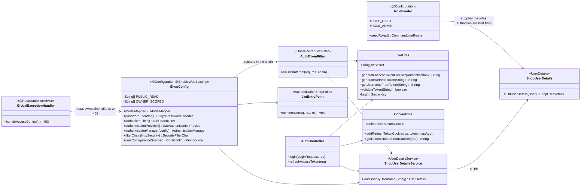
```mermaid
classDiagram
    direction LR

    class ShopConfig {
        <<@Configuration @EnableWebSecurity>>
        -String[] PUBLIC_READ
        -String[] OWNER_SCOPED
        +modelMapper() ModelMapper
        +passwordEncoder() BCryptPasswordEncoder
        +authTokenFilter() AuthTokenFilter
        +authenticationProvider() DaoAuthenticationProvider
        +authenticationManager(config) AuthenticationManager
        +filterChain(HttpSecurity) SecurityFilterChain
        +corsConfigurationSource() CorsConfigurationSource
    }
    class RoleSeeder {
        <<@Configuration>>
        +ROLE_USER
        +ROLE_ADMIN
        +seedRoles() CommandLineRunner
    }
    class AuthTokenFilter {
        <<OncePerRequestFilter>>
        +doFilterInternal(req, res, chain)
    }
    class JwtUtils {
        -String jwtSecret
        +generateAccessTokenForUser(Authentication) String
        +generateRefreshToken(String) String
        +getUsernameFromToken(String) String
        +validateToken(String) boolean
        -key() SecretKey
    }
    class JwtEntryPoint {
        <<AuthenticationEntryPoint>>
        +commence(req, res, ex) void
    }
    class ShopUserDetailsService {
        <<UserDetailsService>>
        +loadUserByUsername(String) UserDetails
    }
    class ShopUserDetails {
        <<UserDetails>>
        +buildUserDetails(User) ShopUserDetails
    }
    class CookieUtils {
        -boolean useSecureCookie
        +addRefreshTokenCookie(res, token, maxAge)
        +getRefreshTokenFromCookies(req) String
    }
    class AuthController {
        +login(LoginRequest, res)
        +refreshAccessToken(req)
    }
    class GlobalExceptionHandler {
        <<@RestControllerAdvice>>
        +handleAccessDenied(..) 403
    }

    ShopConfig --> AuthTokenFilter : registers in the chain
    ShopConfig --> JwtEntryPoint
    ShopConfig --> ShopUserDetailsService
    RoleSeeder --> ShopUserDetails : supplies the roles authorities are built from
    AuthTokenFilter --> JwtUtils
    AuthTokenFilter --> ShopUserDetailsService
    ShopUserDetailsService --> ShopUserDetails : builds
    AuthController --> JwtUtils
    AuthController --> CookieUtils
    AuthController --> ShopUserDetailsService
    GlobalExceptionHandler ..> ShopConfig : maps ownership failures to 403
```

### 8.2 The Two-Token Strategy

| Token | Lifetime | Stored | Why |
|---|---|---|---|
| **Access token** | 2 min | Returned in the response body; held in memory by the client | Short-lived, so a leak has a small window; never in `localStorage`, which is readable by XSS |
| **Refresh token** | 5 min | `Set-Cookie: refreshToken; HttpOnly; Path=/; SameSite; [Secure]` | `HttpOnly` makes it unreadable to JavaScript; the browser attaches it automatically |

Cookie attributes follow the environment: `app.useSecureCookie=true` → `Secure; SameSite=None` (cross-site over HTTPS); `false` → `SameSite=Lax` (local HTTP development).

### 8.3 Login and Refresh

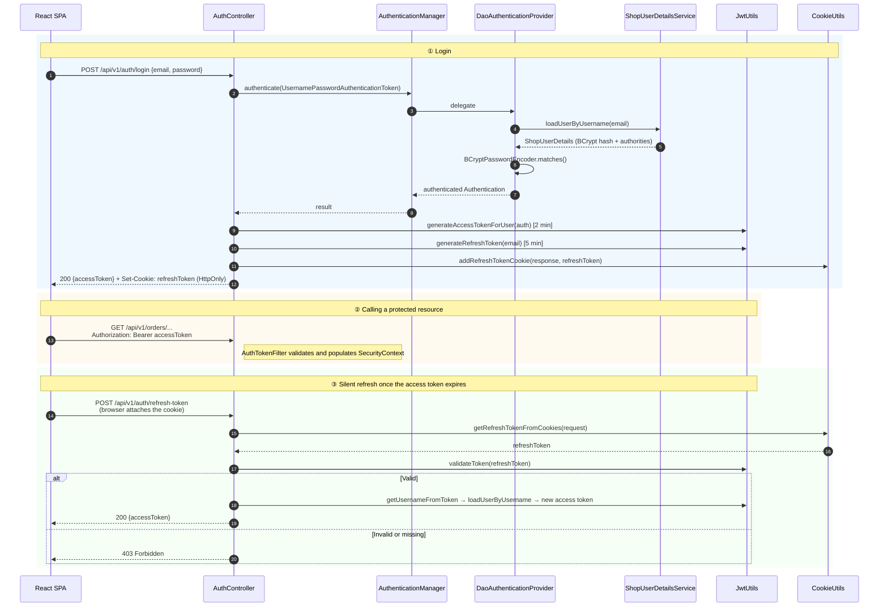
```mermaid
sequenceDiagram
    autonumber
    participant FE as React SPA
    participant AC as AuthController
    participant AM as AuthenticationManager
    participant DAO as DaoAuthenticationProvider
    participant UDS as ShopUserDetailsService
    participant JU as JwtUtils
    participant CU as CookieUtils

    rect rgb(240, 248, 255)
    Note over FE,CU: ① Login
    FE->>AC: POST /api/v1/auth/login {email, password}
    AC->>AM: authenticate(UsernamePasswordAuthenticationToken)
    AM->>DAO: delegate
    DAO->>UDS: loadUserByUsername(email)
    UDS-->>DAO: ShopUserDetails (BCrypt hash + authorities)
    DAO->>DAO: BCryptPasswordEncoder.matches()
    DAO-->>AM: authenticated Authentication
    AM-->>AC: result
    AC->>JU: generateAccessTokenForUser(auth) [2 min]
    AC->>JU: generateRefreshToken(email) [5 min]
    AC->>CU: addRefreshTokenCookie(response, refreshToken)
    AC-->>FE: 200 {accessToken} + Set-Cookie: refreshToken (HttpOnly)
    end

    rect rgb(255, 250, 240)
    Note over FE,JU: ② Calling a protected resource
    FE->>AC: GET /api/v1/orders/... <br/>Authorization: Bearer accessToken
    Note right of AC: AuthTokenFilter validates and populates SecurityContext
    end

    rect rgb(245, 255, 245)
    Note over FE,JU: ③ Silent refresh once the access token expires
    FE->>AC: POST /api/v1/auth/refresh-token<br/>(browser attaches the cookie)
    AC->>CU: getRefreshTokenFromCookies(request)
    CU-->>AC: refreshToken
    AC->>JU: validateToken(refreshToken)
    alt Valid
        AC->>JU: getUsernameFromToken → loadUserByUsername → new access token
        AC-->>FE: 200 {accessToken}
    else Invalid or missing
        AC-->>FE: 403 Forbidden
    end
    end
```

### 8.4 Authorization Matrix

The rules are declared once in `ShopConfig.filterChain`, so adding a controller does not mean remembering a per-method annotation. **The default is deny**: any path not explicitly opened requires authentication.

| Path | Methods | Requirement |
|---|---|---|
| `/api/v1/auth/**` | all | Public |
| `/api/v1/users/add` | POST | Public (registration) |
| `/api/v1/products/**` · `/categories/**` · `/images/**` | GET | Public (read-only storefront) |
| same | POST · PUT · DELETE | `ROLE_ADMIN` |
| `/api/v1/carts/**` · `/cartItems/**` · `/orders/**` · `/users/**` | all | Authenticated **+ ownership check** |
| Anything else | all | Authenticated (default deny) |

**Two lines of defence, each answering one question.** The filter chain answers *who are you*; the service layer answers *is this resource yours*.

An id in the URL — `cartId`, `userId`, `orderId` — *locates* a resource but is never *proof of entitlement*. Ownership is checked in the service layer, because that is where the entity is available:

| Check | Location | Covers |
|---|---|---|
| Cart ownership | `CartService.getCart` | All of `/carts/**`, and all of `/cartItems/**` — `CartItemService` resolves its cart through this method |
| Cart ownership by user | `CartService.getCartByUserId` | The checkout path |
| Order ownership | `OrderService.placeOrder` / `getOrder` / `getUserOrders` | All of `/orders/**` |
| Account ownership | `UserService.assertSelfOrAdmin` | Read, update and delete on `/users/{id}` (self, or an admin) |

Violations throw `AccessDeniedException`, which `GlobalExceptionHandler` maps to **403**.

**401 versus 403.** `JwtEntryPoint` answers "you are not authenticated" with 401; an explicit
`accessDeniedHandler` answers "you are authenticated but may not do this" with 403. Without
the second one, an authorization failure falls through to the entry point and the client
cannot tell *log in* apart from *you are not allowed*.

`AuthTokenFilter` is registered **once**, explicitly, in `ShopConfig#filterChain`. It carries no
`@Component` annotation on purpose — that would also auto-register it as a plain servlet filter
outside the security chain, running it twice per request.

> CORS is registered inside the security filter chain (`http.cors()` plus a `CorsConfigurationSource` bean), not only at the MVC layer. That is mandatory once the rules above are in force: otherwise the preflight `OPTIONS` request is rejected with a 401 by the authorization rules before it ever reaches a controller.

### 8.5 Role Model

The `Role` entity existed but was never assigned, so every user's authority set was empty — introducing any `hasRole` rule would have locked everyone out. The missing pieces:

```mermaid
flowchart LR
    SEED["RoleSeeder<br/>«CommandLineRunner»"] -->|ensures on startup| R1["ROLE_USER"]
    SEED -->|ensures on startup| R2["ROLE_ADMIN"]
    REG["UserService.createUser"] -->|granted at registration| R1
    R1 --> AUTH["ShopUserDetails<br/>role.name → GrantedAuthority"]
    R2 --> AUTH
    AUTH --> RULES["ShopConfig<br/>hasRole('ADMIN')"]
```

- `RoleSeeder` idempotently creates both roles at startup.
- Registration grants `ROLE_USER` automatically.
- **There is no endpoint for granting admin.** That is deliberate — an endpoint that lets a caller escalate its own privileges is equivalent to no authorization at all. Promotion is a manual database operation, documented in the backend README.
- Users registered before this change have no roles. They can still log in and reach authenticated endpoints, but not admin ones.

---

## 9. Core Business Flows

### 9.1 Registration (Cart Created Automatically)

```mermaid
sequenceDiagram
    autonumber
    participant FE as Client
    participant UC as UserController
    participant US as UserService
    participant RR as RoleRepository
    participant UR as UserRepository
    participant CR as CartRepository

    FE->>UC: POST /api/v1/users/add {firstName,lastName,email,password}
    UC->>US: createUser(request)
    US->>UR: existsByEmail(email)
    alt Email already taken
        US-->>UC: throw EntityExistsException
        UC-->>FE: 409 ApiResponse("User with email ... already exists", null)
    else Available
        US->>US: passwordEncoder.encode(password) «BCrypt»
        US->>RR: findByName("ROLE_USER")
        RR-->>US: Role
        US->>US: user.setRoles({ROLE_USER})
        US->>UR: save(user)
        US->>CR: save(new Cart(user))
        Note right of CR: Registering yields an empty cart, so<br/>addItemToCart never has to create one
        US-->>UC: User
        UC->>UC: convertUserToDto(user)
        UC-->>FE: 200 ApiResponse("User created", UserDto)
    end
```

### 9.2 Add to Cart (Idempotent Merge)

```mermaid
sequenceDiagram
    autonumber
    participant FE as Client
    participant CIC as CartItemController
    participant CIS as CartItemService
    participant CS as CartService
    participant PS as ProductService
    participant CIR as CartItemRepository
    participant CR as CartRepository

    FE->>CIC: POST /cartItems/item/add?cartId=&productId=&quantity=
    CIC->>CIS: addItemToCart(cartId, productId, quantity)
    CIS->>CS: getCart(cartId)
    CS->>CS: ownership check against the authenticated user
    CIS->>PS: getProductById(productId)
    CIS->>CIS: look for an existing line with the same productId
    alt Product already in the cart
        CIS->>CIS: quantity += the amount being added
    else New product
        CIS->>CIS: create CartItem — unitPrice ← product.price «price snapshot»
    end
    CIS->>CIS: setTotalPrice() = unitPrice × quantity
    CIS->>CIR: save(cartItem)
    CIS->>CIS: recompute cart.totalAmount = Σ item.totalPrice
    CIS->>CR: save(cart)
    CIS-->>CIC: void
    CIC-->>FE: 200 ApiResponse("Add Item Success", null)
```

**Design points.** Adding the same product twice **increments the quantity** rather than creating a second line, so `(cart_id, product_id)` stays unique in meaning. `unitPrice` snapshots the product price at the moment of adding, so a later price change does not silently rewrite what is already in the cart.

### 9.3 Checkout (Transaction Boundary)

```mermaid
sequenceDiagram
    autonumber
    participant FE as Client
    participant OC as OrderController
    participant OS as OrderService
    participant CS as CartService
    participant PR as ProductRepository
    participant OR as OrderRepository

    FE->>OC: POST /api/v1/orders/order?userId=
    OC->>OS: placeOrder(userId)
    OS->>OS: assertIsAuthenticatedUser(userId)

    rect rgb(255, 245, 245)
    Note over OS,OR: @Transactional boundary<br/>any failure rolls all of it back
    OS->>CS: getCartByUserId(userId)
    CS-->>OS: Cart (with items)
    OS->>OS: createOrder(cart)<br/>status=PENDING, orderDate=now
    loop each CartItem
        OS->>OS: product.inventory -= cartItem.quantity
        OS->>PR: save(product) «decrement stock»
        OS->>OS: new OrderItem(order, product, unitPrice, quantity)
    end
    OS->>OS: totalAmount = Σ (price × quantity)
    OS->>OR: save(order) «cascades to OrderItem»
    OS->>OS: clearCart(cart): items.clear() + totalAmount=0
    end

    OS-->>OC: Order
    OC->>OC: modelMapper → OrderDto
    OC-->>FE: 200 ApiResponse("Item Order Success!", OrderDto)
```

**Design points.**

- `@Transactional` makes "decrement stock + create order + clear cart" atomic, so there is no state where stock was taken but no order exists.
- `OrderItem.price` is copied from `CartItem.unitPrice` — a **second price snapshot** — so an order total stays reproducible forever.
- `Order` cascades to `OrderItem`, so a single `save(order)` persists the whole object graph.

---
## 10. Endpoint Reference

Everything is prefixed with `/api/v1` (injected via `${api.prefix}`). 🔒 marks paths requiring `Authorization: Bearer <accessToken>`; 🛡 marks paths requiring `ROLE_ADMIN`.

### Auth
| Method | Path | Description |
|---|---|---|
| POST | `/auth/login` | Returns `{ accessToken }` and sets the `HttpOnly` refresh cookie |
| POST | `/auth/refresh-token` | Exchanges the refresh cookie for a new access token |

### Products
| Method | Path | Access |
|---|---|---|
| GET | `/products/all` | Public |
| GET | `/products/product/{productId}/product` | Public |
| GET | `/products/products/{name}/products` | Public |
| GET | `/products/product/by-brand?brand=` | Public |
| GET | `/products/{category}/products` | Public |
| GET | `/products/category/{categoryId}/products` | Public |
| GET | `/products/products/by/brand-and-name?brandName=&productName=` | Public |
| GET | `/products/products/by/category-and-brand?category=&brand=` | Public |
| GET | `/products/distinct/products` | Public |
| GET | `/products/distinct/brands` | Public |
| POST | `/products/add` | 🛡 |
| PUT | `/products/product/{productId}/update` | 🛡 |
| DELETE | `/products/product/{productId}/delete` | 🛡 |

### Categories
| Method | Path | Access |
|---|---|---|
| GET | `/categories` · `/categories/all` | Public |
| GET | `/categories/{categoryId}` · `/categories/by/name?name=` | Public |
| POST | `/categories/add` | 🛡 |
| PUT | `/categories/{categoryId}/update` | 🛡 |
| DELETE | `/categories/{categoryId}/delete` | 🛡 |

### Images
| Method | Path | Access |
|---|---|---|
| GET | `/images/{imageId}/download` | Public (bytes) |
| POST | `/images/upload?productId=` | 🛡 (multipart) |
| PUT | `/images/{imageId}/update` | 🛡 |
| DELETE | `/images/{imageId}/delete` | 🛡 |

### Cart & Cart Items 🔒
Ownership of the cart is verified against the authenticated user.

| Method | Path |
|---|---|
| GET | `/carts/{cartId}` · `/carts/{cartId}/total-price` |
| DELETE | `/carts/{cartId}/clear` |
| POST | `/cartItems/item/add?cartId=&productId=&quantity=` |
| PUT | `/cartItems/cart/{cartId}/item/{productId}/update?quantity=` |
| DELETE | `/cartItems/cart/{cartId}/item/{productId}/remove` |

### Orders 🔒
Ownership of the order is verified against the authenticated user.

| Method | Path |
|---|---|
| POST | `/orders/order?userId=` |
| GET | `/orders/{orderId}/order` · `/orders/user/{userId}/order` |

### Users
| Method | Path | Access |
|---|---|---|
| POST | `/users/add` | Public (registration) |
| GET | `/users/{userId}` | 🔒 self or admin |
| PUT | `/users/{userId}/update` | 🔒 self or admin |
| DELETE | `/users/{userId}/delete` | 🔒 self or admin |

---

## 11. Design Decisions and Known Issues

### 11.1 Decisions (ADR Summary)

| # | Decision | Alternative | Why |
|---|---|---|---|
| 1 | Controllers return DTOs; entities stay inside | Return the `@Entity` directly | The bidirectional Product ↔ Category association recurses infinitely when serialized, and entity changes would break the client contract |
| 2 | Every service is an interface plus an implementation | Implementation class only | Controllers and other services depend on the interface, so business logic is unit-testable without Spring's web layer and mockable in tests |
| 3 | One envelope: `ApiResponse(message, data)` | Per-endpoint response shapes | The client has exactly one shape to parse |
| 4 | `@RestControllerAdvice` for error mapping | try/catch per method | Prevents drift where some paths return 400, some leak a 500, and error bodies differ |
| 5 | Protected paths declared in the filter chain | `@PreAuthorize` on every method | A new endpoint cannot ship unprotected because someone forgot an annotation |
| 6 | Access token in memory, refresh token in an `HttpOnly` cookie | Both in `localStorage` | `localStorage` is readable by XSS; an `HttpOnly` cookie is not visible to JavaScript |
| 7 | CORS configured inside the security chain | `@CrossOrigin` on controllers only | With Spring Security present, MVC-level CORS is bypassed — the filter chain rejects the request first, including preflight |
| 8 | Ownership checked in the service layer, not the filter chain | Trust the id in the URL | The filter chain knows who you are but not which rows are yours; the service layer has the entity |
| 9 | No API for granting admin | An admin-management endpoint | A self-service privilege-escalation endpoint is equivalent to no authorization |
| 10 | Price snapshotted twice (Product → CartItem → OrderItem) | Store productId only and look up the current price when displaying | A price change must not rewrite historical order totals |
| 11 | JPQL rather than native SQL | `nativeQuery = true` | Entity-oriented, dialect-independent, portable |
| 12 | `Order` mapped to table `orders` | Default table name `order` | `ORDER` is a SQL reserved word |
| 13 | Redux as a shared source outside the component tree | Prop drilling from `Products.jsx` plus callbacks | `SearchBar`/`SideBar`/`Paginator` are siblings with no parent/child path; props flow one way, so two-way communication gets contorted |
| 14 | Four independent slices | One large `uiSlice` | Three pieces of state updated by three components; a new filter means **a new slice**, not surgery on a huge reducer |
| 15 | One `createAsyncThunk` three-state pattern | Per-component `useEffect` + fetch + loading | Stops request-lifecycle logic from being duplicated inconsistently across components |
| 16 | A single Axios instance as the network seam | `axios`/`fetch` inside components | Base URL, auth headers and interceptors have one home |
| 17 | `ProductCard` stays presentational | `useSelector` inside it | Its data source is not welded in, so it is reusable anywhere |
| 18 | Real routing carries "what am I looking at" | One `useState` picking a component | Shareable URLs, working back/forward buttons |
| 19 | Filtering and pagination on the client | Hit the server on every filter change | Zero round-trips per interaction; the cost is first-load payload growing with catalog size, acceptable at this scale |

### 11.2 Known Issues — Back End

| Severity | Issue | Location | Impact |
|---|---|---|---|
| 🟠 Medium | **Inventory can go negative; no concurrency control.** `createOrderItems` decrements stock without checking sufficiency, and `Product` has no `@Version` | `OrderService` | Overselling; lost updates under concurrent checkout |
| 🟠 Medium | **`Product → Category` uses `cascade = ALL`.** Deleting a product cascades into deleting its category, affecting every other product in it | `Product.category` | Unintended data loss |
| 🟠 Medium | **JWT secret and database password sit in plaintext** in `application.properties` | `application.properties` | The file is git-ignored, so nothing is exposed in the repository, but it should come from environment variables or a secret manager |
| 🟠 Medium | **Images stored as `@Lob Blob` in MySQL** | `Image.image` | Database bloat and slow backups; belongs in object storage with only a URL in the row |
| 🟡 Low | **No server-side pagination.** `/products/all` returns everything; paging happens client-side | `ProductController` | First-load payload grows linearly with the catalog |
| 🟡 Low | **Dead code.** `UpdateProductRequest` duplicates `ProductUpdateRequest` and is referenced nowhere | `request/` | Maintenance confusion |
| 🟡 Low | **Duplicate endpoints.** `GET /categories` and `GET /categories/all` behave identically (the latter exists to match an existing client call) | `CategoryController` | Redundant contract surface |
| 🟡 Low | **Hardcoded `/api/v1` in the authorization rules** rather than `${api.prefix}` | `ShopConfig` | Changing the prefix would silently unmatch every rule |
| 🟡 Low | **Tests only load the context.** `BuynowdotcomApplicationTests` is an empty shell | `src/test/` | No regression protection, including for the new ownership checks |

### 11.3 Known Issues — Front End

| Severity | Issue | Location | Impact |
|---|---|---|---|
| 🟠 Medium | **API base URL hardcoded**, not read from `import.meta.env` | `services/api.js` | Any deployment other than this machine requires a source change |
| 🟠 Medium | **Pagination state is shared across pages and never reset.** `currentPage` is global to `Home` and `Products` | `paginationSlice.js` | Paging to 3 on the home page then opening the product list shows an empty list if fewer than three pages of results exist |
| 🟡 Low | **Filter/paginate logic duplicated.** `Home` and `Products` each carry ~40 nearly identical lines | `Home.jsx` · `Products.jsx` | Easy to fix one and forget the other |
| 🟡 Low | **`product.quantity` is a single global value** with no link to a product | `productSlice.js` | Semantically wrong; must be reworked before multi-product cart support |
| 🟡 Low | **Placeholder stub with a colliding name.** `common/SearchBar.jsx` renders `<div>SearchBar</div>` and shares its name with the real `search/SearchBar.jsx` | `common/SearchBar.jsx` | Dead code, and very easy to import the wrong one |
| 🟡 Low | **Dead code.** `services/ProductService.js` duplicates a `productSlice` thunk and is referenced nowhere | `services/` | Maintenance confusion; also the source of a lint error |
| 🟡 Low | **Add-to-cart is not wired.** `Add to cart` / `Buy now` have no `onClick` | `ProductCard.jsx` · `ProductDetails.jsx` | The backend API is ready; front-end integration is the next piece of work |
| 🟡 Low | **Navigation is placeholder.** Every `NavBar` link is `to="#"` | `NavBar.jsx` | Top navigation does nothing |
| 🟡 Low | **`withCredentials` is commented out** | `services/api.js` | Once login is wired, the `HttpOnly` refresh cookie will not be sent and `/auth/refresh-token` will fail |
| 🟡 Low | **9 outstanding lint errors**: six unused `React` imports, two `react-hooks/set-state-in-effect` in the filter derivations, one `no-useless-catch` | `frontend/src/` | `npm run lint` does not pass |
| 🟡 Low | **No tests** | `frontend/` | No regression protection |

---

## 12. Roadmap

### Completed in this round

**Back-end security**

- ✅ Ownership enforcement: `/carts/**`, `/cartItems/**`, `/orders/**` and `/users/**` no longer trust ids from the URL — every one is compared against the authenticated principal, returning 403 on mismatch (§8.4).
- ✅ Role-based authorization made real: `RoleSeeder` seeds `ROLE_USER` / `ROLE_ADMIN`, registration grants `ROLE_USER`, and every catalog mutation requires `ROLE_ADMIN` (§8.5).
- ✅ Default deny: `anyRequest().authenticated()` replaces the previous `permitAll()` fallback.
- ✅ CORS moved into the security filter chain (`http.cors()` plus a `CorsConfigurationSource` bean) — required once the rules tightened, or preflight `OPTIONS` would be rejected with a 401.
- ✅ Correct status codes: an explicit `accessDeniedHandler` returns 403 for an authenticated
  principal lacking the required authority, instead of falling through to the 401 entry point.
- ✅ `AuthTokenFilter` no longer carries `@Component`, so it is registered once in the security
  chain rather than also running as a global servlet filter.
- ✅ Credential logging removed: `CookieUtils.logCookies` and its call site are gone (it printed refresh tokens to `System.out`).
- ✅ Incidental: the no-op get→set→save in `CartService.getCart` is gone, and the `/auth/refresh-token` failure message now says *refresh* token.

**Front end**

- ✅ Image loading fixed: the path is built in `services/imageService.js` alone, and both raw `fetch` calls now go through `api` (§3.4).
- ✅ Async three-state completed: all five `productSlice` thunks handle `pending` and `rejected` (§4.6).
- ✅ Errors made visible: a listener middleware turns any `rejected` action into a toast; `ToastContainer` moved to `RootLayout`; the missing stylesheet was added.

### Back end — outstanding

**P1 — correctness**

1. Verify sufficient stock before checkout and throw a domain exception otherwise; add `@Version` to `Product` for optimistic locking.
2. Drop `cascade = ALL` from `Product.category`.
3. Add `@Valid` plus Bean Validation on request objects (email format, non-negative price, quantity > 0).
4. Add tests: `@DataJpaTest` for the custom queries, `@WebMvcTest` for controller contracts, a rollback case for `placeOrder`, and cases for the new ownership checks.
5. Move the JWT secret and database password to environment variables.

**P2 — scalability**

6. Convert `/products/all` to `Pageable` server-side pagination and sorting, and connect the client to it (see F2).
7. Move images to object storage (S3/MinIO), keeping only metadata and a URL in the row.
8. Implement the order state machine (`PENDING → PROCESSING → SHIPPED → DELIVERED`) with transition endpoints.
9. Adopt Flyway or Liquibase for schema management instead of `ddl-auto=update`.
10. Generate API docs with springdoc-openapi instead of maintaining the endpoint tables by hand.

**P3 — cleanup**

11. Delete `UpdateProductRequest`; merge `/categories` and `/categories/all`.
12. Replace the `/api/v1` literals in `ShopConfig` with the injected `${api.prefix}`.

### Front end — outstanding

**F1 — correctness**

13. Reset `currentPage` on route changes, removing the "page 3 on the home page then an empty product list" behaviour.
14. Read the base URL from `import.meta.env.VITE_API_BASE_URL` and ship a `.env.example`.
15. Enable `withCredentials: true` — a prerequisite for login, since the `HttpOnly` refresh cookie is otherwise never sent.

**F2 — structure**

16. Extract a `useFilteredPagedProducts(source, { withBrand })` hook to remove the duplication between `Home` and `Products`, deriving with `useMemo` instead of `useEffect` + `setState` — which also clears the `react-hooks/set-state-in-effect` lint errors.
17. Wire the cart: `Add to cart` → `POST /cartItems/item/add`, with a new `cartSlice`; change `quantity` from one global value to per-product.
18. Once server-side pagination lands (P2-6), replace the client-side `slice()` with pagination parameters.
19. Delete the `common/SearchBar.jsx` stub and the dead `services/ProductService.js`; move the self-contained controls out of `common/` so directory names reflect component roles.
20. Remove the six unused `React` imports.
21. Add tests with Vitest and React Testing Library, starting with the filter/pagination derivation and the slice reducers.
