# BuyNow — 设计文档 (Design Document)

> 仓库：https://github.com/Chuan-Qiu/buynowdotcom
> 基线 commit：`8e963e1`
> 范围：**全栈** —— `backend/`（Spring Boot REST API）与 `frontend/`（React SPA），以及两者之间的契约。

---

## 1. 概览

### 1.1 项目定位

BuyNow 是一个前后端分离的电商平台：React SPA 负责商品浏览、搜索、筛选与分页，Spring Boot REST API 负责商品目录、分类、图片、用户、购物车与订单。

设计目标不是功能覆盖面，而是 **可演进的边界**。两端各自维护一条清晰的依赖方向，中间靠一份显式契约连接：

| 边界 | 约束 |
|---|---|
| 前端组件 ↔ 状态 | 展示型组件只接收 props；只有页面级组件读 store |
| 前端状态 ↔ 网络 | 所有请求经由唯一的 Axios 实例，组件不直接调 `fetch`/`axios` |
| 前端 ↔ 后端 | 只依赖 DTO 形状 + 统一响应外壳，不感知持久层 |
| 后端 Controller ↔ 业务 | Controller 依赖 `IXxxService` 接口，不依赖实现类 |
| 后端业务 ↔ API | 实体永不越过 API 边界，一律映射为 DTO |

正因为这些边界，客户端的筛选、搜索、分页是完全独立于服务端实现的；反过来重构服务端也不会打断客户端 —— 只要 DTO 形状和响应外壳不变。

### 1.2 技术栈

| 层次 | 前端 `frontend/` | 后端 `backend/` |
|---|---|---|
| 语言 / 运行时 | JavaScript (ESM) · Node 18+ | Java 21 |
| 框架 | React 19.2 | Spring Boot 4.0.5 |
| 路由 | React Router 7.14 | Spring Web MVC |
| 状态 / 业务 | Redux Toolkit 2.11 · React-Redux 9.2 | Service 接口 + 实现 |
| 网络 / 持久化 | Axios 1.16 | Spring Data JPA + Hibernate |
| 安全 | — | Spring Security + jjwt 0.12.3 |
| 对象映射 | — | ModelMapper 3.2 |
| UI | React-Bootstrap 2.10 · Bootstrap 5.3 · react-icons · react-slick · react-toastify · react-medium-image-zoom | — |
| 数据库 | — | MySQL |
| 构建 | Vite 8 | Maven (`mvnw` wrapper) |
| 代码质量 | ESLint 10 | Lombok（样板消除） |

### 1.3 仓库结构

```
buynowdotcom/
├── README.md          全栈总览与快速开始
├── DESIGN.md          本文档
├── CLAUDE.md          AI 辅助开发的工程约定
├── .gitignore         两套工具链合并
├── backend/           Spring Boot REST API（Maven 工程根）
│   ├── pom.xml
│   └── src/main/java/com/dailycodework/buynowdotcom/
└── frontend/          React SPA（Vite 工程根）
    ├── package.json
    └── src/
```

两端**没有共享的构建工具**，各自在自己的目录下构建（`./mvnw` / `npm`）。这是刻意的：Java 与 JS 工具链互不感知，避免为两个组件引入 workspace 编排的复杂度。

### 1.4 关键配置

**后端**（`backend/src/main/resources/application.properties`，git 忽略）

| 配置项 | 值 | 说明 |
|---|---|---|
| `server.port` | `9090` | 显式声明，避免与前端硬编码不一致 |
| `api.prefix` | `/api/v1` | 所有 Controller 通过 `${api.prefix}` 注入，版本前缀单点可改 |
| `spring.jpa.hibernate.ddl-auto` | `update` | 开发期由 Hibernate 维护 schema |
| `auth.token.accessExpirationInMils` | `120000`（2 分钟） | access token |
| `auth.token.refreshExpirationInMils` | `300000`（5 分钟） | refresh token |
| `app.useSecureCookie` | `false` | 本地 HTTP 开发；生产置 `true`（Secure + SameSite=None） |
| `spring.servlet.multipart.max-file-size` | `10MB` | 商品图片上传 |

**前端**

| 配置项 | 值 | 位置 |
|---|---|---|
| 开发端口 | `5174` | `package.json` → `vite --port 5174` |
| API base URL | `http://localhost:9090/api/v1` | `src/component/services/api.js`（硬编码，非环境变量） |
| 允许的前端来源 | `5173` / `5174` / `5175` | 后端 `ShopConfig.corsConfigurer()` |

> ⚠️ API base URL 硬编码在源码里，没有走 Vite 的 `import.meta.env`。部署到任何非本机环境都需要改代码 —— 见 §11.3。

---

## 2. 系统架构

### 2.1 系统上下文

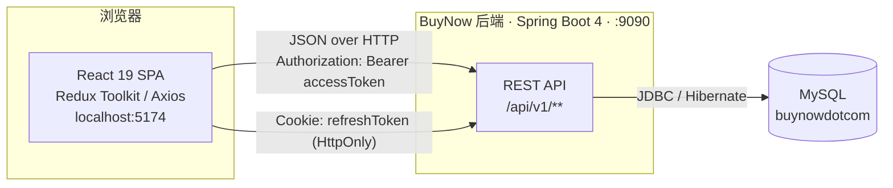
```mermaid
flowchart LR
    subgraph Client["浏览器"]
        React["React 19 SPA<br/>Redux Toolkit / Axios<br/>localhost:5174"]
    end

    subgraph Server["BuyNow 后端 · Spring Boot 4 · :9090"]
        API["REST API<br/>/api/v1/**"]
    end

    DB[("MySQL<br/>buynowdotcom")]

    React -- "JSON over HTTP<br/>Authorization: Bearer accessToken" --> API
    React -- "Cookie: refreshToken (HttpOnly)" --> API
    API -- "JDBC / Hibernate" --> DB
```

### 2.2 端到端分层全景

一张图看清一次用户操作要穿过多少层，以及每层的依赖方向：

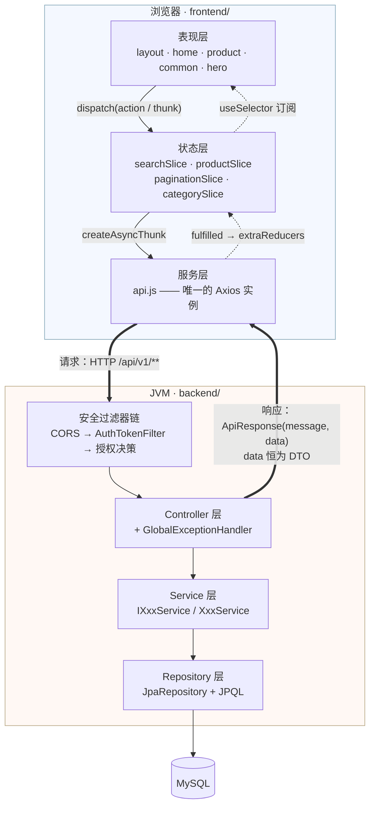
```mermaid
flowchart TB
    subgraph BROWSER["浏览器 · frontend/"]
        direction TB
        UI["表现层<br/>layout · home · product · common · hero"]
        STATE["状态层<br/>searchSlice · productSlice<br/>paginationSlice · categorySlice"]
        SEAM["服务层<br/>api.js —— 唯一的 Axios 实例"]
        UI -->|"dispatch(action / thunk)"| STATE
        STATE -->|"createAsyncThunk"| SEAM
        SEAM -.->|"fulfilled → extraReducers"| STATE
        STATE -.->|"useSelector 订阅"| UI
    end

    subgraph SERVER["JVM · backend/"]
        direction TB
        FILTER["安全过滤器链<br/>CORS → AuthTokenFilter → 授权决策"]
        CTRL["Controller 层<br/>+ GlobalExceptionHandler"]
        SVC["Service 层<br/>IXxxService / XxxService"]
        REPO["Repository 层<br/>JpaRepository + JPQL"]
        FILTER --> CTRL
        CTRL --> SVC
        SVC --> REPO
    end

    DB[("MySQL")]

    SEAM ==>|"请求：HTTP /api/v1/**"| FILTER
    CTRL ==>|"响应：ApiResponse(message, data)<br/>data 恒为 DTO"| SEAM
    REPO --> DB

    style BROWSER fill:#f4f8ff,stroke:#8ab
    style SERVER fill:#fff8f4,stroke:#ba8
```

**依赖方向是单向的**：表现层依赖状态层，状态层依赖服务层，服务层依赖 HTTP 契约；反向只通过订阅（`useSelector`）和回调（`extraReducers`）发生。后端同理，Controller → Service → Repository 从不回头。

### 2.3 后端分层

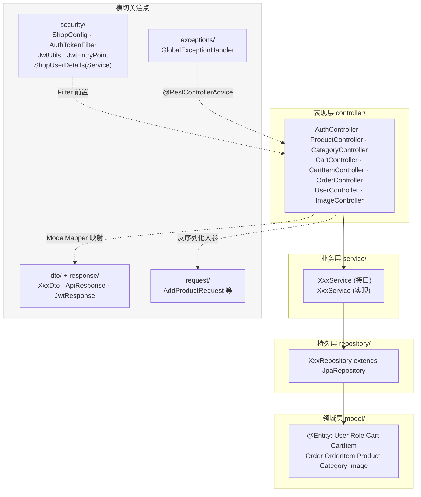
```mermaid
flowchart TB
    subgraph L1["表现层 controller/"]
        C["AuthController · ProductController · CategoryController<br/>CartController · CartItemController · OrderController<br/>UserController · ImageController"]
    end
    subgraph L2["业务层 service/"]
        S["IXxxService (接口)<br/>XxxService (实现)"]
    end
    subgraph L3["持久层 repository/"]
        R["XxxRepository extends JpaRepository"]
    end
    subgraph L4["领域层 model/"]
        M["@Entity: User Role Cart CartItem<br/>Order OrderItem Product Category Image"]
    end

    subgraph Cross["横切关注点"]
        SEC["security/<br/>ShopConfig · AuthTokenFilter<br/>JwtUtils · JwtEntryPoint<br/>ShopUserDetails(Service)"]
        EX["exceptions/<br/>GlobalExceptionHandler"]
        DTO["dto/ + response/<br/>XxxDto · ApiResponse · JwtResponse"]
        REQ["request/<br/>AddProductRequest 等"]
    end

    C --> S
    S --> R
    R --> M
    C -.->|ModelMapper 映射| DTO
    C -.->|反序列化入参| REQ
    SEC -.->|Filter 前置| C
    EX -.->|"@RestControllerAdvice"| C

    style Cross fill:#f6f6f6,stroke:#bbb
```

**分层规则（强约束）**

1. Controller 注入 **接口**（`IProductService`），不注入实现类。
2. Controller **永不返回 `@Entity`** —— 一律经 ModelMapper 映射为 DTO。
3. 所有成功响应包在 `ApiResponse(message, data)` 中；例外：`/auth/**` 返回裸 token map，`/images/{id}/download` 返回二进制流。
4. Service 直接抛 JPA 标准异常（`EntityNotFoundException` / `EntityExistsException`），由 `GlobalExceptionHandler` 统一映射状态码。

### 2.4 前端分层

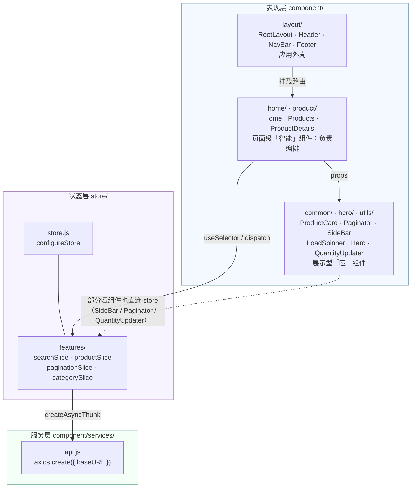
```mermaid
flowchart TB
    subgraph P["表现层 component/"]
        LAYOUT["layout/<br/>RootLayout · Header · NavBar · Footer<br/>应用外壳"]
        SMART["home/ · product/<br/>Home · Products · ProductDetails<br/>页面级「智能」组件：负责编排"]
        DUMB["common/ · hero/ · utils/<br/>ProductCard · Paginator · SideBar<br/>LoadSpinner · Hero · QuantityUpdater<br/>展示型「哑」组件"]
    end

    subgraph ST["状态层 store/"]
        STORE["store.js<br/>configureStore"]
        SLICES["features/<br/>searchSlice · productSlice<br/>paginationSlice · categorySlice"]
        STORE --- SLICES
    end

    subgraph SV["服务层 component/services/"]
        API["api.js<br/>axios.create({ baseURL })"]
    end

    LAYOUT -->|"<Outlet /> 挂载路由"| SMART
    SMART -->|"props"| DUMB
    SMART -->|"useSelector / dispatch"| SLICES
    DUMB -.->|"部分哑组件也直连 store<br/>（SideBar / Paginator / QuantityUpdater）"| SLICES
    SLICES -->|"createAsyncThunk"| API

    style P fill:#f4f8ff,stroke:#8ab
    style ST fill:#f8f4ff,stroke:#a8b
    style SV fill:#f4fff8,stroke:#8ba
```

**按角色划分，而不只按功能划分。** 页面级组件（`Products.jsx`、`Home.jsx`）拥有*编排*职责：从 store 读数据、做筛选、切分页、把处理好的一段数据往下传。展示型组件（`ProductCard.jsx`）只接收普通 props 并渲染 —— 它不知道 Redux、路由、API 的存在，因此可以在搜索结果、分类页、未来的"猜你喜欢"里复用，不会连带拖着取数逻辑。

**注意实现与理想模型的偏差**：`SideBar`、`Paginator`、`QuantityUpdater` 虽然放在 `common/` 与 `utils/`（通常意味着"哑组件"），但它们内部直接 `useSelector` + `dispatch`。这是有意的取舍 —— 它们是**自足的控件**（各自拥有一块状态且不需要外部配置），而不是可复用的纯渲染单元。真正保持哑的是 `ProductCard`、`LoadSpinner`、`NoProductsAvailable`。目录名没有把这个区别表达出来，是命名上的一个瑕疵。

### 2.5 后端请求处理链路

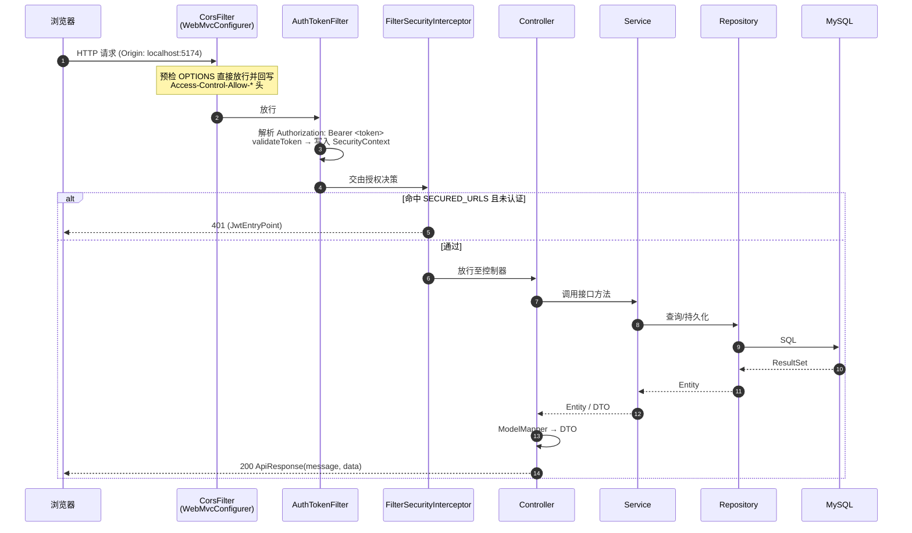
```mermaid
sequenceDiagram
    autonumber
    participant B as 浏览器
    participant CORS as CorsFilter<br/>(WebMvcConfigurer)
    participant JWT as AuthTokenFilter
    participant SEC as FilterSecurityInterceptor
    participant C as Controller
    participant S as Service
    participant R as Repository
    participant DB as MySQL

    B->>CORS: HTTP 请求 (Origin: localhost:5174)
    Note over CORS: 预检 OPTIONS 直接放行并回写<br/>Access-Control-Allow-* 头
    CORS->>JWT: 放行
    JWT->>JWT: 解析 Authorization: Bearer <token><br/>validateToken → 写入 SecurityContext
    JWT->>SEC: 交由授权决策
    alt 命中 SECURED_URLS 且未认证
        SEC-->>B: 401 (JwtEntryPoint)
    else 通过
        SEC->>C: 放行至控制器
        C->>S: 调用接口方法
        S->>R: 查询/持久化
        R->>DB: SQL
        DB-->>R: ResultSet
        R-->>S: Entity
        S-->>C: Entity / DTO
        C->>C: ModelMapper → DTO
        C-->>B: 200 ApiResponse(message, data)
    end
```

---

## 3. 前后端契约

两端约定的是*契约*，不是实现细节。只要契约不变，任何一端都能重构而不影响另一端 —— 这正是前端的筛选/分页/搜索能在完全不碰服务端的情况下做完的原因。

### 3.1 契约的三个组成

| # | 组成 | 内容 | 谁来保证 |
|---|---|---|---|
| ① | **寻址** | 带版本号的前缀 `/api/v1` + REST 资源路径 | 后端 `${api.prefix}` 注入；前端 `api.js` 的 `baseURL` |
| ② | **外壳** | 所有成功响应恒为 `{ message, data }`，前端只需解析一种结构 | 后端 Controller 统一包 `ApiResponse` |
| ③ | **载荷** | `data` 恒为 DTO 或 DTO 数组，实体永不出现 | 后端 ModelMapper；DTO 裁剪见 §6.1 |

三者之外的一切 —— 表结构、懒加载、级联、Service 拆分方式 —— 都是各端的自由。

**信封在哪里拆开**，是一个值得明确的约定：

```js
// store/features/productSlice.js
export const getAllProducts = createAsyncThunk("product/getAllProducts", async () => {
  const response = await api.get("/products/all");
  return response.data.data;   // ← response.data 是 ApiResponse，.data 才是 DTO 数组
});
```

拆解发生在 **thunk 里**，而不是组件里。因此 `extraReducers` 之后的所有前端代码只见 DTO，完全感知不到外壳的存在 —— 将来外壳加字段（比如加 `traceId`），改动只落在 thunk 这一层。

### 3.2 端到端序列图：首屏商品列表加载

这是全栈最长的一条链路，穿过前端三层、后端四层与数据库：

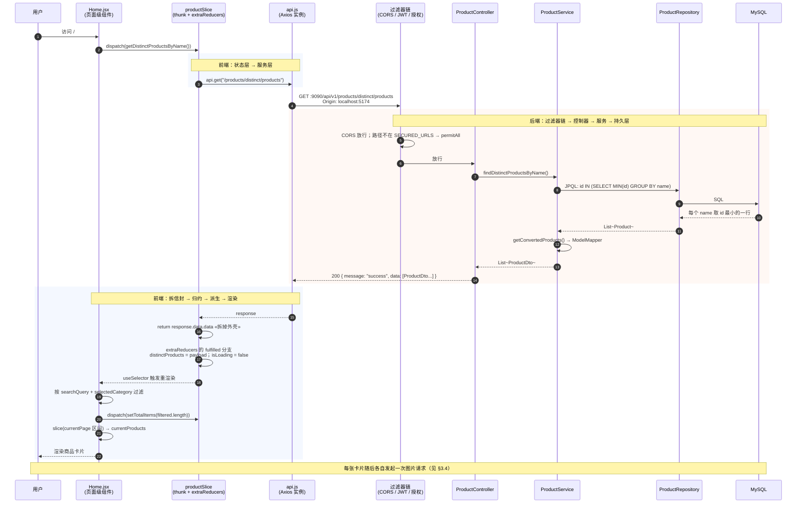
```mermaid
sequenceDiagram
    autonumber
    participant U as 用户
    participant H as Home.jsx<br/>(页面级组件)
    participant SL as productSlice<br/>(thunk + extraReducers)
    participant AX as api.js<br/>(Axios 实例)
    participant F as 过滤器链<br/>(CORS / JWT / 授权)
    participant PC as ProductController
    participant PS as ProductService
    participant PR as ProductRepository
    participant DB as MySQL

    U->>H: 访问 /
    H->>SL: dispatch(getDistinctProductsByName())

    rect rgb(244, 248, 255)
    Note over SL,AX: 前端：状态层 → 服务层
    SL->>AX: api.get("/products/distinct/products")
    end

    AX->>F: GET :9090/api/v1/products/distinct/products<br/>Origin: localhost:5174

    rect rgb(255, 248, 244)
    Note over F,DB: 后端：过滤器链 → 控制器 → 服务 → 持久层
    F->>F: CORS 放行；路径不在 SECURED_URLS → permitAll
    F->>PC: 放行
    PC->>PS: findDistinctProductsByName()
    PS->>PR: JPQL: id IN (SELECT MIN(id) GROUP BY name)
    PR->>DB: SQL
    DB-->>PR: 每个 name 取 id 最小的一行
    PR-->>PS: List~Product~
    PS->>PS: getConvertedProducts() → ModelMapper
    PS-->>PC: List~ProductDto~
    PC-->>AX: 200 { message: "success", data: [ProductDto...] }
    end

    rect rgb(244, 248, 255)
    Note over AX,H: 前端：拆信封 → 归约 → 派生 → 渲染
    AX-->>SL: response
    SL->>SL: return response.data.data «拆掉外壳»
    SL->>SL: extraReducers 的 fulfilled 分支<br/>distinctProducts = payload；isLoading = false
    SL-->>H: useSelector 触发重渲染
    H->>H: 按 searchQuery + selectedCategory 过滤
    H->>SL: dispatch(setTotalItems(filtered.length))
    H->>H: slice(currentPage 区间) → currentProducts
    H-->>U: 渲染商品卡片
    end

    Note over U,DB: 每张卡片随后各自发起一次图片请求（见 §3.4）
```

**这条链路上的三个设计要点**

1. **筛选与分页发生在客户端**。后端返回全量去重商品，过滤、计数、切片全在 `Home.jsx` 的 `useEffect` 里完成。好处是筛选条件变化时零网络往返、交互瞬时；代价是首屏负载随商品总数线性增长（§11.3）。
2. **`setTotalItems` 是一次反向写回**。页面组件算出筛选后的数量，再写回 `paginationSlice`，`Paginator` 才知道该画几个页码。这是四个 slice 之间唯一的间接耦合。
3. **图片不在这条链路里**。商品 DTO 只带 `ImageDto{ id, fileName, downloadUrl }`，二进制由每张卡片单独请求 —— 这是刻意的（避免 JSON 里塞 base64），但当前实现是断的，见 §3.4。

### 3.3 契约漂移复盘

契约的价值只有在它被破坏时才看得见。开发中真实撞到过三次，全部属于"两端对同一件事的假设不一致"：

| # | 现象 | 根因 | 决策 |
|---|---|---|---|
| ① | 所有请求 `ERR_CONNECTION_REFUSED` | 后端 `application.properties` 没写 `server.port`，落到默认 8080；前端硬编码 9090 | 在配置里**显式声明** `server.port=9090`。关键配置不依赖框架默认值或 IDE 隐式设置，否则"换个启动方式行为就变" |
| ② | `/categories/all`、`/products/distinct/products` 返回 404 | 前端调用的是课程预设路径，后端实际路由不同（`/categories` 无 `/all`；去重接口根本不存在） | **以前端为准补后端**，而不是双向改动。已发布的调用方是事实契约，改另一端回归面更小。为此新增了 JPQL 去重查询（§7.1） |
| ③ | `blocked by CORS policy` | 浏览器同源策略；后端未回写 `Access-Control-Allow-Origin` | 在 **Spring Security 感知的层级**配置 CORS。有 Security 时，只在 MVC 层配会被过滤器链先行拦截而失效 |

> 排障顺序上有个可复用的分诊法：`curl` 能通但浏览器报错 → 一定是 CORS 或认证，不是路由；`curl` 也不通 → 先用 `lsof -iTCP -sTCP:LISTEN | grep java` 确认真实监听端口，再查 `@GetMapping` 路径是否存在。

### 3.4 图片子契约（当前已断裂）

图片走的是一条独立的子契约：商品 DTO 里只给引用，二进制另取。

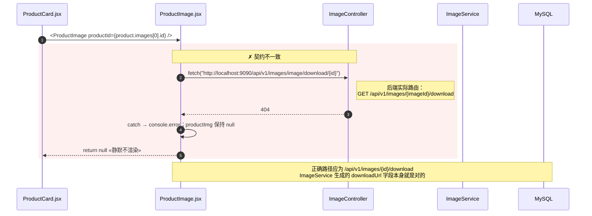
```mermaid
sequenceDiagram
    autonumber
    participant PC as ProductCard.jsx
    participant PI as ProductImage.jsx
    participant IC as ImageController
    participant IS as ImageService
    participant DB as MySQL

    PC->>PI: <ProductImage productId={product.images[0].id} />
    rect rgb(255, 240, 240)
    Note over PI,IC: ✗ 契约不一致
    PI->>IC: fetch("http://localhost:9090/api/v1/images/image/download/{id}")
    Note right of IC: 后端实际路由：<br/>GET /api/v1/images/{imageId}/download
    IC-->>PI: 404
    PI->>PI: catch → console.error；productImg 保持 null
    PI-->>PC: return null «静默不渲染»
    end

    Note over PI,DB: 正确路径应为 /api/v1/images/{id}/download<br/>ImageService 生成的 downloadUrl 字段本身就是对的
```

三处问题叠在一起，使得**商品图片在当前代码下无法显示**：

1. **路径拼错**：前端拼 `/images/image/download/{id}`，后端注册的是 `/images/{imageId}/download`。
2. **绕过服务层接缝**：`ProductImage.jsx` 与 `ImageZoomify.jsx` 用原生 `fetch` 且**硬编码了 `http://localhost:9090`**，没走 `api.js`。正因为绕过了唯一出口，base URL 的单点约束没能拦住这个错误。
3. **失败被静默吞掉**：`catch` 只 `console.error`，组件 `return null`，UI 上不显示任何错误 —— 于是"图片不显示"看起来像没上传图片，而不是像一个 bug。

后端 `ImageService` 在保存时写入的 `downloadUrl` 字段（`"/api/v1/images/" + id + "/download"`）本身是正确的。**最小修复是让前端直接使用 DTO 里的 `downloadUrl`，而不是自己拼路径** —— 这样路径的唯一事实来源回到后端，前端不再有拼错的机会。修复项见 §12。

---

## 4. 前端设计

### 4.1 组件层次与角色划分

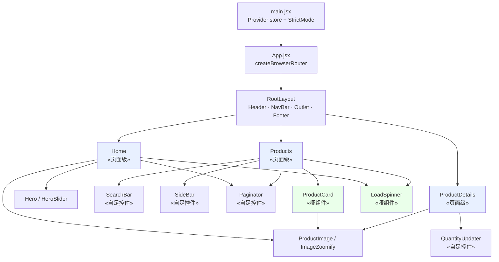
```mermaid
flowchart TB
    MAIN["main.jsx<br/>Provider store + StrictMode"]
    APP["App.jsx<br/>createBrowserRouter"]
    ROOT["RootLayout<br/>Header · NavBar · Outlet · Footer"]

    HOME["Home<br/>«页面级»"]
    PRODUCTS["Products<br/>«页面级»"]
    DETAILS["ProductDetails<br/>«页面级»"]

    HERO["Hero / HeroSlider"]
    SEARCH["SearchBar<br/>«自足控件»"]
    SIDEBAR["SideBar<br/>«自足控件»"]
    PAGER["Paginator<br/>«自足控件»"]
    QTY["QuantityUpdater<br/>«自足控件»"]

    CARD["ProductCard<br/>«哑组件»"]
    SPIN["LoadSpinner<br/>«哑组件»"]
    IMG["ProductImage / ImageZoomify"]

    MAIN --> APP --> ROOT
    ROOT --> HOME
    ROOT --> PRODUCTS
    ROOT --> DETAILS

    HOME --> HERO
    HOME --> PAGER
    HOME --> IMG
    HOME --> SPIN

    PRODUCTS --> SEARCH
    PRODUCTS --> SIDEBAR
    PRODUCTS --> CARD
    PRODUCTS --> PAGER
    PRODUCTS --> SPIN
    CARD --> IMG

    DETAILS --> IMG
    DETAILS --> QTY

    style HOME fill:#e8f0ff
    style PRODUCTS fill:#e8f0ff
    style DETAILS fill:#e8f0ff
    style CARD fill:#eaffea
    style SPIN fill:#eaffea
```

三种角色，区别在于**谁有权知道数据从哪来**：

| 角色 | 组件 | 是否接触 store | 职责 |
|---|---|---|---|
| **页面级（智能）** | `Home` · `Products` · `ProductDetails` | 读多个 slice | 编排：取数、筛选、切分页，把处理好的一段数据往下传 |
| **自足控件** | `SearchBar` · `SideBar` · `Paginator` · `QuantityUpdater` | 各自读写**自己那一块** | 拥有一块独立状态，不需要外部配置即可工作 |
| **展示型（哑）** | `ProductCard` · `LoadSpinner` · `NoProductsAvailable` | 否 | 只接收 props 并渲染 |

**为什么 `ProductCard` 必须保持哑**：如果它内部 `useSelector` 取商品，就被焊死在"商品列表"这一个场景上 —— 以后想在搜索结果或"猜你喜欢"里复用，会发现它自带的数据来源不对。让它只吃 props，`Products.jsx` 负责组装好再喂给它。

### 4.2 路由设计

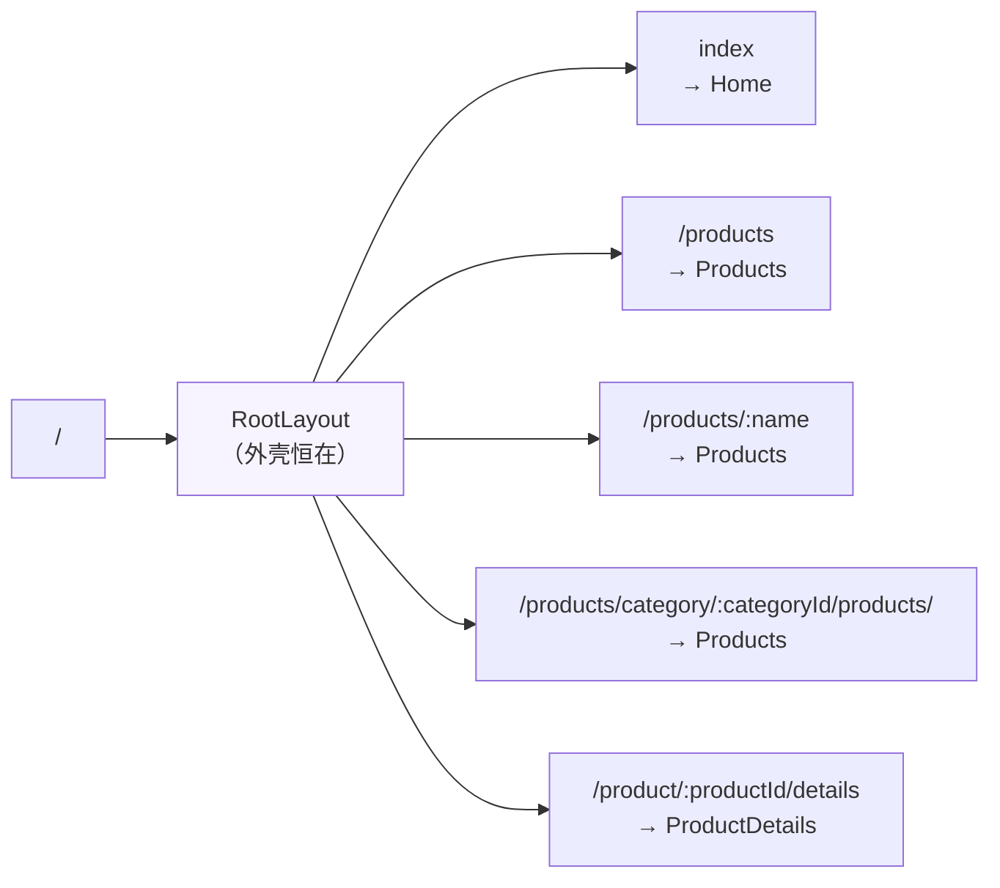
```mermaid
flowchart LR
    R["/"] --> RL["RootLayout<br/>（外壳恒在）"]
    RL --> I["index<br/>→ Home"]
    RL --> P1["/products<br/>→ Products"]
    RL --> P2["/products/:name<br/>→ Products"]
    RL --> P3["/products/category/:categoryId/products/<br/>→ Products"]
    RL --> D["/product/:productId/details<br/>→ ProductDetails"]

    style RL fill:#f8f4ff
```

| 路径 | 组件 | 入口场景 |
|---|---|---|
| `/` | `Home` | 首页，展示按名称去重的商品 |
| `/products` | `Products` | 完整商品列表 |
| `/products/:name` | `Products` | 从首页卡片"Shop now"跳入，`name` 作为初始搜索词 |
| `/products/category/:categoryId/products/` | `Products` | 按分类进入 |
| `/product/:productId/details` | `ProductDetails` | 商品详情 |

**`Products` 被三条路由复用**，靠 `useParams()` 与 `useLocation()` 自行判别当前语境：

```js
const { name } = useParams();          // /products/:name
const { categoryId } = useParams();    // /products/category/:categoryId/products/
const queryParams = new URLSearchParams(location.search);
const initialSearchQuery = queryParams.get("search") || name || "";
```

`categoryId` 存在则拉分类商品，否则拉全部；`name` 或 `?search=` 则写入 `searchSlice` 作为初始搜索词。

**为什么需要真路由，而不是一个 `useState` 控制显示哪个组件**：如果"当前看的是什么"只存在组件状态里，用户就无法把某个商品的链接发给别人（URL 永远不变），浏览器的前进/后退也失效。URL 本身必须承载"我正在看什么"这个信息。

### 4.3 Redux Store 结构

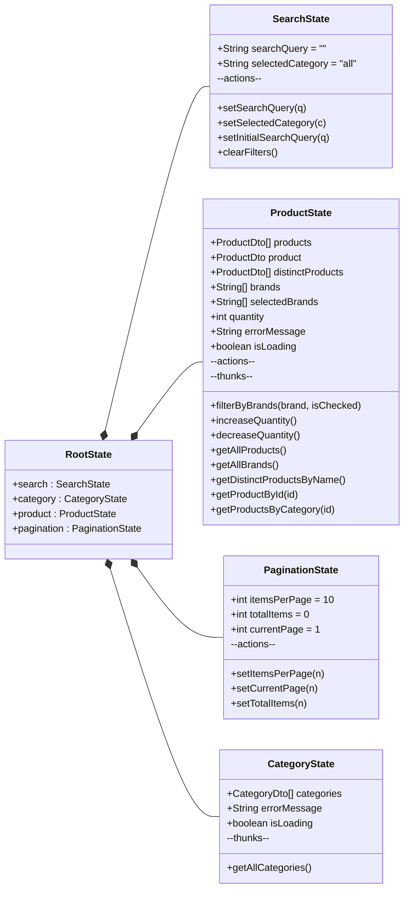
```mermaid
classDiagram
    direction LR

    class RootState {
        +search : SearchState
        +category : CategoryState
        +product : ProductState
        +pagination : PaginationState
    }

    class SearchState {
        +String searchQuery = ""
        +String selectedCategory = "all"
        --actions--
        +setSearchQuery(q)
        +setSelectedCategory(c)
        +setInitialSearchQuery(q)
        +clearFilters()
    }

    class ProductState {
        +ProductDto[] products
        +ProductDto product
        +ProductDto[] distinctProducts
        +String[] brands
        +String[] selectedBrands
        +int quantity
        +String errorMessage
        +boolean isLoading
        --actions--
        +filterByBrands(brand, isChecked)
        +increaseQuantity()
        +decreaseQuantity()
        --thunks--
        +getAllProducts()
        +getAllBrands()
        +getDistinctProductsByName()
        +getProductById(id)
        +getProductsByCategory(id)
    }

    class PaginationState {
        +int itemsPerPage = 10
        +int totalItems = 0
        +int currentPage = 1
        --actions--
        +setItemsPerPage(n)
        +setCurrentPage(n)
        +setTotalItems(n)
    }

    class CategoryState {
        +CategoryDto[] categories
        +String errorMessage
        +boolean isLoading
        --thunks--
        +getAllCategories()
    }

    RootState *-- SearchState
    RootState *-- ProductState
    RootState *-- PaginationState
    RootState *-- CategoryState
```

**为什么拆成四个 slice，而不是一个大对象**：搜索词由 `SearchBar` 改、品牌筛选由 `SideBar` 改、页码由 `Paginator` 改 —— 三件事被三个不同组件独立更新。混在一个对象里，任何小改动都要在一个巨大的 reducer 里找位置。拆开之后"谁改了什么"一目了然，以后加价格区间筛选是**加一个 slice**，而不是在已有的里面动刀。

每个 slice 都**不知道其他 slice 的存在** —— 唯一的例外是 `paginationSlice.totalItems`，它由页面组件在筛选完成后反向写回（§4.5）。

### 4.4 状态流：平级控件如何汇聚成一份列表

这是整个前端设计的核心问题，也是引入 Redux 的**真实理由**：

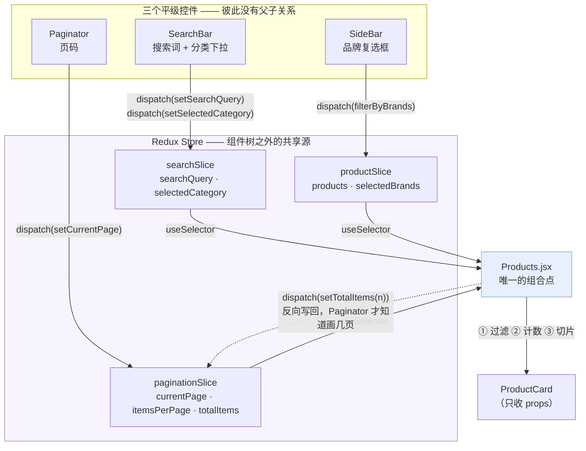
```mermaid
flowchart TB
    subgraph CTRL["三个平级控件 —— 彼此没有父子关系"]
        SB["SearchBar<br/>搜索词 + 分类下拉"]
        SD["SideBar<br/>品牌复选框"]
        PG["Paginator<br/>页码"]
    end

    subgraph STORE["Redux Store —— 组件树之外的共享源"]
        S1["searchSlice<br/>searchQuery · selectedCategory"]
        S2["productSlice<br/>products · selectedBrands"]
        S3["paginationSlice<br/>currentPage · itemsPerPage · totalItems"]
    end

    PAGE["Products.jsx<br/>唯一的组合点"]
    OUT["ProductCard<br/>（只收 props）"]

    SB -->|"dispatch(setSearchQuery)<br/>dispatch(setSelectedCategory)"| S1
    SD -->|"dispatch(filterByBrands)"| S2
    PG -->|"dispatch(setCurrentPage)"| S3

    S1 -->|useSelector| PAGE
    S2 -->|useSelector| PAGE
    S3 -->|useSelector| PAGE

    PAGE -->|"① 过滤 ② 计数 ③ 切片"| OUT
    PAGE -.->|"dispatch(setTotalItems(n))<br/>反向写回，Paginator 才知道画几页"| S3

    style STORE fill:#f8f4ff,stroke:#a8b
    style PAGE fill:#e8f0ff,stroke:#8ab
```

**如果不用 Redux 会怎样**：三个控件是兄弟，不是父子。用 props 就得从 `Products.jsx` 往下传好几层，而 `SideBar` 改了品牌还得*向上*通知 —— props 只能单向往下，双向通信会写得很扭曲。所以不是"状态多所以上 Redux"，而是**"互不相干的组件需要共享同一份数据，之间又没有直接的父子路径"**。

图中那条虚线（`setTotalItems` 反向写回）是这套设计里唯一的间接耦合：`Paginator` 需要知道总页数，但总数只有在筛选完成后才算得出来，而筛选发生在页面组件里。

### 4.5 筛选与分页的组合算法

`Products.jsx` 里三个 `useEffect` 串成一条派生链：

```js
// ① 三个维度求交集
const results = products.filter((product) => {
  const matchesQuery    = product.name.toLowerCase().includes(searchQuery.toLowerCase());
  const matchesCategory = selectedCategory === "all"
                        || product.category.name.toLowerCase().includes(selectedCategory.toLowerCase());
  const matchesBrand    = selectedBrands.length === 0
                        || selectedBrands.some((b) => product.brand.toLowerCase().includes(b.toLowerCase()));
  return matchesQuery && matchesCategory && matchesBrand;
});
setFilteredProducts(results);

// ② 把筛选后的总数写回 store，Paginator 据此渲染页码
dispatch(setTotalItems(filteredProducts.length));

// ③ 按当前页切片
const currentProducts = filteredProducts.slice(
  (currentPage - 1) * itemsPerPage,
  currentPage * itemsPerPage
);
```

三个筛选维度都设计成**"未选择即不过滤"**（`selectedCategory === "all"`、`selectedBrands.length === 0`），所以加第四个维度只需要多一个 `matchesXxx &&`，不用动已有条件的逻辑。

**`Home` 与 `Products` 重复实现了这套逻辑**，差异只有两处：

| | 数据源 | 筛选维度 | 是否有 SideBar |
|---|---|---|---|
| `Home.jsx` | `state.product.distinctProducts` | 搜索词 + 分类 | 否 |
| `Products.jsx` | `state.product.products` | 搜索词 + 分类 + **品牌** | 是 |

约 40 行几乎相同的代码被复制了两份。合理的重构是抽成一个 `useFilteredPagedProducts(source, { withBrand })` 自定义 Hook —— 见 §12。

### 4.6 异步模式：createAsyncThunk 三态

**设计意图**：商品列表、品牌列表、分类、商品详情都要取数。如果每个组件自己写 `useEffect` + fetch + 自己维护 loading/error，这套"发请求-等待-成功-失败"的逻辑会在好几个组件里重复，写法还可能不一致。统一成一个模式后，新接口照模板接入即可。

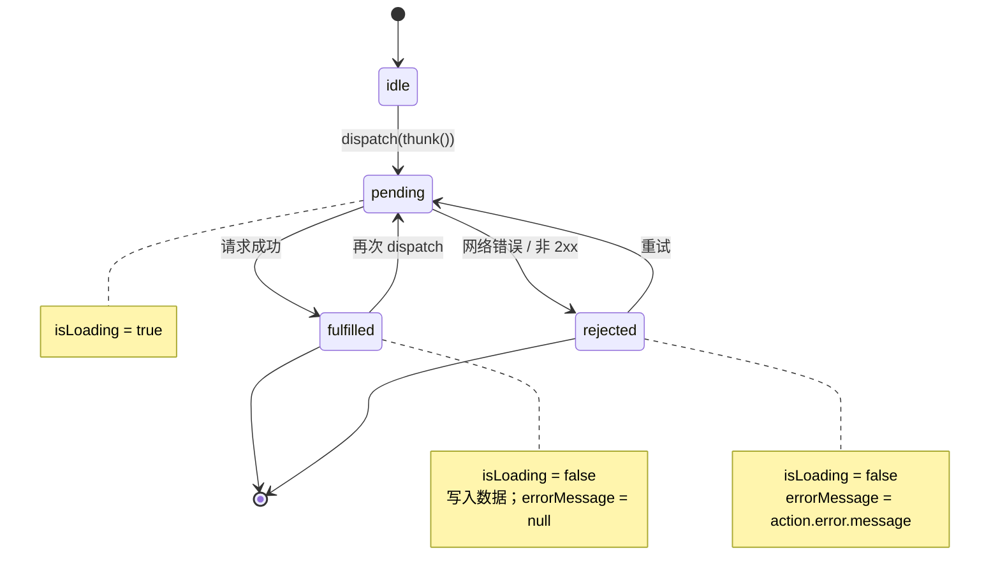
```mermaid
stateDiagram-v2
    [*] --> idle
    idle --> pending : dispatch(thunk())
    pending --> fulfilled : 请求成功
    pending --> rejected : 网络错误 / 非 2xx
    fulfilled --> pending : 再次 dispatch
    rejected --> pending : 重试
    fulfilled --> [*]
    rejected --> [*]

    note right of pending
        isLoading = true
    end note
    note right of fulfilled
        isLoading = false
        写入数据；errorMessage = null
    end note
    note right of rejected
        isLoading = false
        errorMessage = action.error.message
    end note
```

**实现与设计意图存在偏差** —— 只有 `categorySlice` 完整落实了三态：

| Thunk | 所属 slice | `pending` | `fulfilled` | `rejected` |
|---|---|---|---|---|
| `getAllCategories` | categorySlice | ✅ | ✅ | ✅ |
| `getAllProducts` | productSlice | ❌ | ✅ | ✅ |
| `getAllBrands` | productSlice | ❌ | ✅ | ❌ |
| `getDistinctProductsByName` | productSlice | ❌ | ✅ | ❌ |
| `getProductById` | productSlice | ❌ | ✅ | ❌ |
| `getProductsByCategory` | productSlice | ❌ | ✅ | ❌ |

后果是具体的：`productSlice` 的 `isLoading` 初值为 `true`，且**只会被 `fulfilled` 置为 `false`**。因此当后端未启动或接口报错时，`getDistinctProductsByName` 走 `rejected` 分支，没有任何 handler 接住 —— `isLoading` 永远停在 `true`，首页**无限显示 `LoadSpinner`，既不报错也不超时**。这个失败模式看起来像"页面卡住"，而不是像一个可诊断的错误。修复项见 §11.3 与 §12。

### 4.7 服务层：单一网络接缝

```js
// src/component/services/api.js —— 全部内容
import axios from "axios"

export const api = axios.create({
    baseURL: "http://localhost:9090/api/v1",
   // withCredentials: true,  // for authenticated requests
})
```

**设计意图**：没有任何组件直接调 `fetch`/`axios`，所有网络请求都走这一个实例。这是刻意留的接缝 —— base URL 变了，或者所有请求都要带 auth header、要加统一的 401 拦截器与重试，只需要改一个文件。

**当前有两处违例**，且这两处正好就是出问题的地方：

| 文件 | 违例 | 后果 |
|---|---|---|
| `component/utils/ProductImage.jsx` | 原生 `fetch` + 硬编码 `http://localhost:9090` | 绕过 baseURL 单点约束；路径拼错无人拦截（§3.4） |
| `component/common/ImageZoomify.jsx` | 同上（代码几乎逐行重复） | 同上 |

这是一个恰好印证了设计意图的反例：**接缝之所以有价值，正是因为绕过它的地方最先出错**。

另有一个 `component/services/ProductService.js`，导出一个与 `productSlice` 中 thunk 功能重复的 `getDistinctProductsByName`，**全项目无任何引用**，属死代码。

> 注意 `withCredentials: true` 当前是注释掉的。一旦前端接入登录，刷新令牌的 `HttpOnly` Cookie 将不会随请求发送，`/auth/refresh-token` 必然失败 —— 这是接入认证时的第一个待办。

---

## 5. 后端领域模型

### 5.1 UML 类图 — 实体

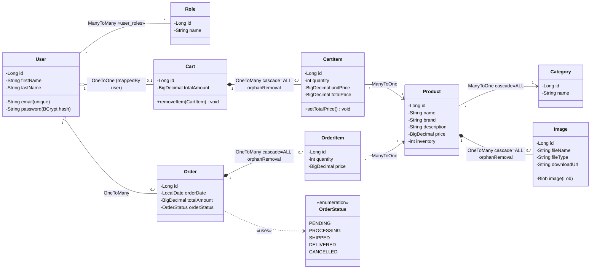
```mermaid
classDiagram
    direction LR

    class User {
        -Long id
        -String firstName
        -String lastName
        -String email  (unique)
        -String password  (BCrypt hash)
    }

    class Role {
        -Long id
        -String name
    }

    class Cart {
        -Long id
        -BigDecimal totalAmount
        +removeItem(CartItem) void
    }

    class CartItem {
        -Long id
        -int quantity
        -BigDecimal unitPrice
        -BigDecimal totalPrice
        +setTotalPrice() void
    }

    class Order {
        -Long id
        -LocalDate orderDate
        -BigDecimal totalAmount
        -OrderStatus orderStatus
    }

    class OrderItem {
        -Long id
        -int quantity
        -BigDecimal price
    }

    class Product {
        -Long id
        -String name
        -String brand
        -String description
        -BigDecimal price
        -int inventory
    }

    class Category {
        -Long id
        -String name
    }

    class Image {
        -Long id
        -String fileName
        -String fileType
        -Blob image  (Lob)
        -String downloadUrl
    }

    class OrderStatus {
        <<enumeration>>
        PENDING
        PROCESSING
        SHIPPED
        DELIVERED
        CANCELLED
    }

    User "1" o-- "0..1" Cart : OneToOne (mappedBy user)
    User "1" o-- "0..*" Order : OneToMany
    User "*" -- "*" Role : ManyToMany «user_roles»
    Cart "1" *-- "0..*" CartItem : OneToMany cascade=ALL orphanRemoval
    Order "1" *-- "0..*" OrderItem : OneToMany cascade=ALL orphanRemoval
    CartItem "*" --> "1" Product : ManyToOne
    OrderItem "*" --> "1" Product : ManyToOne
    Product "*" --> "1" Category : ManyToOne cascade=ALL
    Product "1" *-- "0..*" Image : OneToMany cascade=ALL orphanRemoval
    Order ..> OrderStatus : «uses»
```

### 5.2 关系语义

| 关系 | 类型 | 拥有端 | 级联 | 设计意图 |
|---|---|---|---|---|
| User → Cart | OneToOne | Cart 持有 `user_id` | `ALL` + orphanRemoval | 用户注册时自动建空购物车，生命周期绑定用户 |
| User → Order | OneToMany | Order 持有 `user_id` | `ALL` + orphanRemoval | 订单历史归属用户 |
| User ↔ Role | ManyToMany (EAGER) | `user_roles` 中间表 | `DETACH/MERGE/PERSIST/REFRESH`（**无 REMOVE**） | 删用户不删角色定义；EAGER 是因为鉴权时必须立刻拿到权限 |
| Cart → CartItem | OneToMany | CartItem 持有 `cart_id` | `ALL` + orphanRemoval | 组合关系：购物车没了条目也没意义 |
| Order → OrderItem | OneToMany | OrderItem 持有 `order_id` | `ALL` + orphanRemoval | 同上，且 OrderItem **快照下单时的 price**，与 Product 当前价解耦 |
| Product → Category | ManyToOne | Product 持有 `category_id` | `ALL` ⚠️ | 见 §11 已知问题 |
| Product → Image | OneToMany | Image 持有 `product_id` | `ALL` + orphanRemoval | 图片随商品删除 |
| Category → Product | 反向 OneToMany | — | 无 | 加 `@JsonIgnore` 阻断双向序列化死循环 |

### 5.3 ER 图（数据库表）

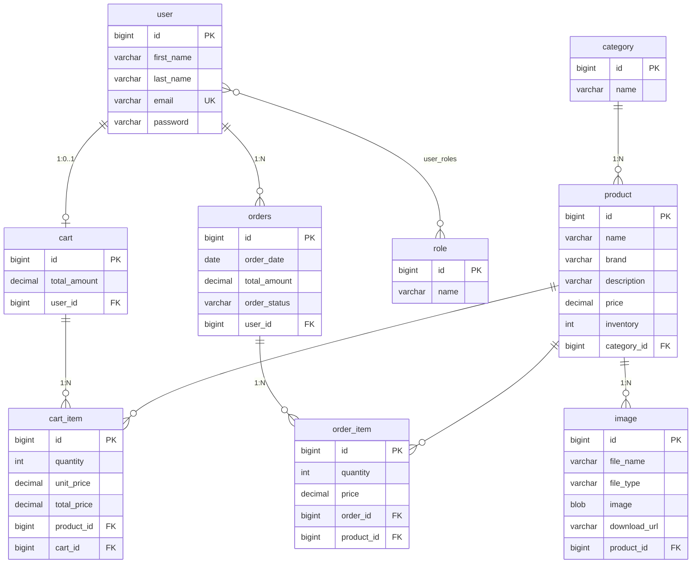
```mermaid
erDiagram
    user ||--o| cart : "1:0..1"
    user ||--o{ orders : "1:N"
    user }o--o{ role : "user_roles"
    cart ||--o{ cart_item : "1:N"
    orders ||--o{ order_item : "1:N"
    product ||--o{ cart_item : ""
    product ||--o{ order_item : ""
    category ||--o{ product : "1:N"
    product ||--o{ image : "1:N"

    user {
        bigint id PK
        varchar first_name
        varchar last_name
        varchar email UK
        varchar password
    }
    role {
        bigint id PK
        varchar name
    }
    cart {
        bigint id PK
        decimal total_amount
        bigint user_id FK
    }
    cart_item {
        bigint id PK
        int quantity
        decimal unit_price
        decimal total_price
        bigint product_id FK
        bigint cart_id FK
    }
    orders {
        bigint id PK
        date order_date
        decimal total_amount
        varchar order_status
        bigint user_id FK
    }
    order_item {
        bigint id PK
        int quantity
        decimal price
        bigint order_id FK
        bigint product_id FK
    }
    product {
        bigint id PK
        varchar name
        varchar brand
        varchar description
        decimal price
        int inventory
        bigint category_id FK
    }
    category {
        bigint id PK
        varchar name
    }
    image {
        bigint id PK
        varchar file_name
        varchar file_type
        blob image
        varchar download_url
        bigint product_id FK
    }
```

> 表名说明：`Order` 显式映射为 `@Table(name = "orders")`，因为 `ORDER` 是 SQL 保留字。

### 5.4 订单状态机

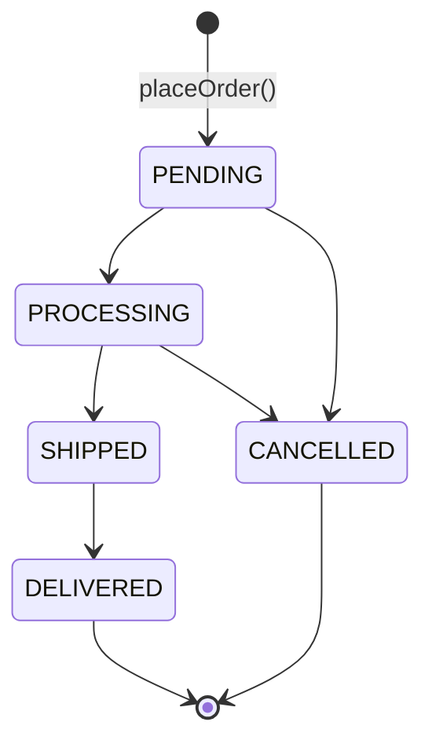
```mermaid
stateDiagram-v2
    [*] --> PENDING : placeOrder()
    PENDING --> PROCESSING
    PENDING --> CANCELLED
    PROCESSING --> SHIPPED
    PROCESSING --> CANCELLED
    SHIPPED --> DELIVERED
    DELIVERED --> [*]
    CANCELLED --> [*]
```

> 当前实现只写入 `PENDING`，其余状态已在 `OrderStatus` 枚举中定义但尚无迁移逻辑（见 §12 路线图）。

---

## 6. API 契约层

### 6.1 DTO 类图（客户端可见的唯一数据形状）

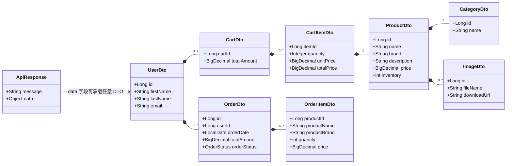
```mermaid
classDiagram
    direction LR

    class ApiResponse {
        +String message
        +Object data
    }

    class UserDto {
        +Long id
        +String firstName
        +String lastName
        +String email
    }
    class CartDto {
        +Long cartId
        +BigDecimal totalAmount
    }
    class CartItemDto {
        +Long itemId
        +Integer quantity
        +BigDecimal unitPrice
        +BigDecimal totalPrice
    }
    class OrderDto {
        +Long id
        +Long userId
        +LocalDate orderDate
        +BigDecimal totalAmount
        +OrderStatus orderStatus
    }
    class OrderItemDto {
        +Long productId
        +String productName
        +String productBrand
        +int quantity
        +BigDecimal price
    }
    class ProductDto {
        +Long id
        +String name
        +String brand
        +String description
        +BigDecimal price
        +int inventory
    }
    class CategoryDto {
        +Long id
        +String name
    }
    class ImageDto {
        +Long id
        +String fileName
        +String downloadUrl
    }

    ApiResponse ..> UserDto : data 字段可承载任意 DTO
    UserDto *-- "0..*" OrderDto
    UserDto *-- "0..1" CartDto
    CartDto *-- "0..*" CartItemDto
    CartItemDto *-- "1" ProductDto
    OrderDto *-- "0..*" OrderItemDto
    ProductDto *-- "1" CategoryDto
    ProductDto *-- "0..*" ImageDto
```

**DTO 相比 Entity 的裁剪**

| 裁剪 | 原因 |
|---|---|
| `UserDto` 无 `password`、无 `roles` | 凭据与权限不外泄 |
| `CategoryDto` 无 `products` | 切断 Product ↔ Category 双向环 |
| `ImageDto` 无 `Blob image`、无 `fileType` | 图片走 `downloadUrl` 二次请求，避免 JSON 里塞 base64 |
| `OrderItemDto` 摊平为 `productName/productBrand` | 前端渲染订单行不需要完整 Product 图 |
| `CartItemDto` / `OrderItemDto` 不含反向引用 | 避免 Cart→Item→Cart 环 |

### 6.2 请求对象（入参）

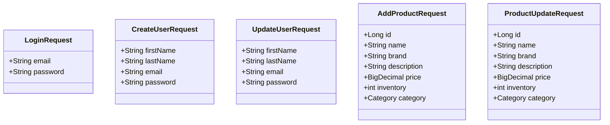
```mermaid
classDiagram
    class LoginRequest {
        +String email
        +String password
    }
    class CreateUserRequest {
        +String firstName
        +String lastName
        +String email
        +String password
    }
    class UpdateUserRequest {
        +String firstName
        +String lastName
        +String email
        +String password
    }
    class AddProductRequest {
        +Long id
        +String name
        +String brand
        +String description
        +BigDecimal price
        +int inventory
        +Category category
    }
    class ProductUpdateRequest {
        +Long id
        +String name
        +String brand
        +String description
        +BigDecimal price
        +int inventory
        +Category category
    }
```

> `UpdateProductRequest` 与 `ProductUpdateRequest` 字段完全重复，前者**无任何引用**，属死代码（见 §11）。

### 6.3 统一响应约定

| 场景 | HTTP | Body |
|---|---|---|
| 成功 | 200 | `{ "message": "Success", "data": <DTO 或 DTO 列表> }` |
| 资源不存在 | 404 | `{ "message": "<异常消息>", "data": null }` |
| 资源冲突（邮箱/商品重复） | 409 | `{ "message": "<异常消息>", "data": null }` |
| 未认证访问受保护路径 | 401 | `JwtEntryPoint` 输出 |
| 其它未捕获异常 | 500 | `{ "message": "Something went wrong: ...", "data": null }` |
| 登录 / 刷新 | 200 | `{ "accessToken": "<JWT>" }`（**不套 ApiResponse**） |
| 图片下载 | 200 | `ByteArrayResource`（二进制流） |

---

## 7. 后端服务层设计


```mermaid
classDiagram
    direction TB

    class IProductService {
        <<interface>>
        +addProduct(AddProductRequest) Product
        +updateProduct(ProductUpdateRequest, Long) Product
        +getProductById(Long) Product
        +deleteProductById(Long) void
        +getAllProducts() List~Product~
        +getProductsByCategoryAndBrand(String, String) List~Product~
        +findDistinctProductsByName() List~Product~
        +getAllDistinctBrands() List~String~
        +convertToDto(Product) ProductDto
    }
    class ProductService
    class ICartService {
        <<interface>>
        +getCart(Long) Cart
        +clearCart(Long) void
        +getTotalPrice(Long) BigDecimal
        +getCartByUserId(Long) Cart
    }
    class CartService
    class ICartItemService {
        <<interface>>
        +addItemToCart(Long, Long, int) void
        +removeItemFromCart(Long, Long) void
        +updateItemQuantity(Long, Long, int) void
        +getCartItem(Long, Long) CartItem
    }
    class CartItemService
    class IOrderService {
        <<interface>>
        +placeOrder(Long) Order
        +getOrder(Long) OrderDto
        +getUserOrders(Long) List~OrderDto~
    }
    class OrderService
    class IUserService {
        <<interface>>
        +getUserById(Long) User
        +createUser(CreateUserRequest) User
        +updateUser(UpdateUserRequest, Long) User
        +deleteUser(Long) void
        +getAuthenticatedUser() User
    }
    class UserService
    class ICategoryService {
        <<interface>>
        +addCategory(Category) Category
        +findCategoryById(Long) Category
        +getAllCategories() List~Category~
    }
    class CategoryService
    class IImageService {
        <<interface>>
        +getImageById(Long) Image
        +saveImages(Long, List~MultipartFile~) List~ImageDto~
        +updateImage(MultipartFile, Long) void
        +deleteImageById(Long) void
    }
    class ImageService

    IProductService <|.. ProductService
    ICartService <|.. CartService
    ICartItemService <|.. CartItemService
    IOrderService <|.. OrderService
    IUserService <|.. UserService
    ICategoryService <|.. CategoryService
    IImageService <|.. ImageService

    OrderService ..> ICartService : 依赖接口
    CartItemService ..> ICartService
    CartItemService ..> IProductService
    ImageService ..> IProductService
    UserService ..> CartRepository : 注册时建购物车
```

**服务间依赖同样走接口**（`OrderService` 依赖 `ICartService` 而非 `CartService`），使任一服务可在单测中被 mock 替换。

### 7.1 自定义查询

`ProductRepository` 大部分依赖 Spring Data 方法名派生查询；两处例外体现了取舍：

```java
// 模糊搜索：方法名派生无法表达 LOWER + LIKE，改用 JPQL
@Query("SELECT p FROM Product p WHERE LOWER(p.name) LIKE LOWER(CONCAT('%', :name, '%'))")
List<Product> findByName(String name);
```

```java
// 按名称去重取每组最小 id —— 首页"每款商品只展示一张卡片"
@Query("SELECT p FROM Product p WHERE p.id IN (SELECT MIN(p2.id) FROM Product p2 GROUP BY p2.name)")
List<Product> findDistinctByName();
```

选用 JPQL 而非 native SQL：面向实体，方言无关，换数据库不需重写。

---

## 8. 安全设计

### 8.1 组件类图

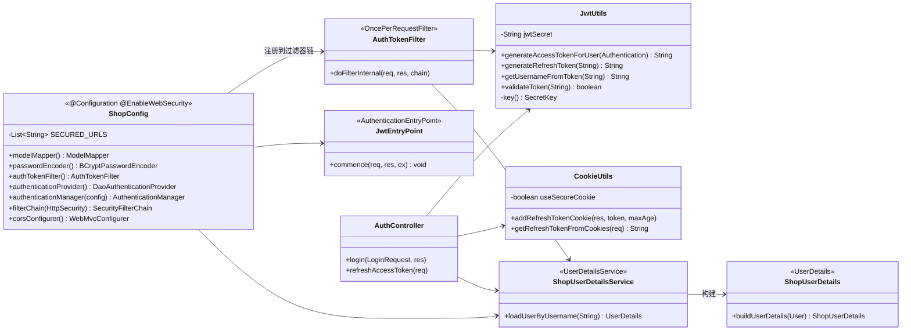
```mermaid
classDiagram
    direction LR

    class ShopConfig {
        <<@Configuration @EnableWebSecurity>>
        -List~String~ SECURED_URLS
        +modelMapper() ModelMapper
        +passwordEncoder() BCryptPasswordEncoder
        +authTokenFilter() AuthTokenFilter
        +authenticationProvider() DaoAuthenticationProvider
        +authenticationManager(config) AuthenticationManager
        +filterChain(HttpSecurity) SecurityFilterChain
        +corsConfigurer() WebMvcConfigurer
    }
    class AuthTokenFilter {
        <<OncePerRequestFilter>>
        +doFilterInternal(req, res, chain)
    }
    class JwtUtils {
        -String jwtSecret
        +generateAccessTokenForUser(Authentication) String
        +generateRefreshToken(String) String
        +getUsernameFromToken(String) String
        +validateToken(String) boolean
        -key() SecretKey
    }
    class JwtEntryPoint {
        <<AuthenticationEntryPoint>>
        +commence(req, res, ex) void
    }
    class ShopUserDetailsService {
        <<UserDetailsService>>
        +loadUserByUsername(String) UserDetails
    }
    class ShopUserDetails {
        <<UserDetails>>
        +buildUserDetails(User) ShopUserDetails
    }
    class CookieUtils {
        -boolean useSecureCookie
        +addRefreshTokenCookie(res, token, maxAge)
        +getRefreshTokenFromCookies(req) String
    }
    class AuthController {
        +login(LoginRequest, res)
        +refreshAccessToken(req)
    }

    ShopConfig --> AuthTokenFilter : 注册到过滤器链
    ShopConfig --> JwtEntryPoint
    ShopConfig --> ShopUserDetailsService
    AuthTokenFilter --> JwtUtils
    AuthTokenFilter --> ShopUserDetailsService
    ShopUserDetailsService --> ShopUserDetails : 构建
    AuthController --> JwtUtils
    AuthController --> CookieUtils
    AuthController --> ShopUserDetailsService
```

### 8.2 双 Token 策略

| Token | 有效期 | 存放位置 | 理由 |
|---|---|---|---|
| **access token** | 2 分钟 | 响应体返回，前端持有在内存 | 短命 → 泄漏窗口小；不落 `localStorage`，规避 XSS 窃取 |
| **refresh token** | 5 分钟 | `Set-Cookie: refreshToken; HttpOnly; Path=/; SameSite; [Secure]` | `HttpOnly` 使前端 JS 无法读取；由浏览器自动携带 |

Cookie 属性随环境切换：`app.useSecureCookie=true` → `Secure; SameSite=None`（跨站 HTTPS）；`false` → `SameSite=Lax`（本地 HTTP 开发）。

### 8.3 登录与刷新序列图

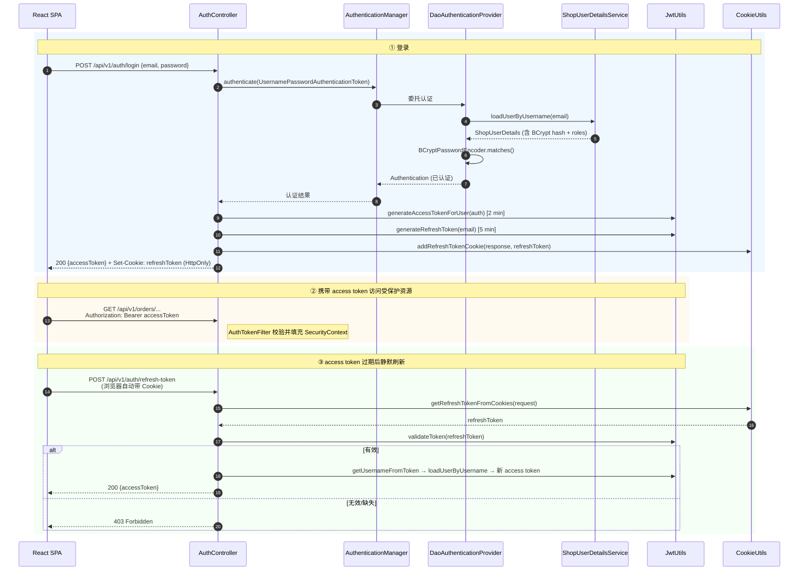
```mermaid
sequenceDiagram
    autonumber
    participant FE as React SPA
    participant AC as AuthController
    participant AM as AuthenticationManager
    participant DAO as DaoAuthenticationProvider
    participant UDS as ShopUserDetailsService
    participant JU as JwtUtils
    participant CU as CookieUtils

    rect rgb(240, 248, 255)
    Note over FE,CU: ① 登录
    FE->>AC: POST /api/v1/auth/login {email, password}
    AC->>AM: authenticate(UsernamePasswordAuthenticationToken)
    AM->>DAO: 委托认证
    DAO->>UDS: loadUserByUsername(email)
    UDS-->>DAO: ShopUserDetails (含 BCrypt hash + roles)
    DAO->>DAO: BCryptPasswordEncoder.matches()
    DAO-->>AM: Authentication (已认证)
    AM-->>AC: 认证结果
    AC->>JU: generateAccessTokenForUser(auth) [2 min]
    AC->>JU: generateRefreshToken(email) [5 min]
    AC->>CU: addRefreshTokenCookie(response, refreshToken)
    AC-->>FE: 200 {accessToken} + Set-Cookie: refreshToken (HttpOnly)
    end

    rect rgb(255, 250, 240)
    Note over FE,JU: ② 携带 access token 访问受保护资源
    FE->>AC: GET /api/v1/orders/... <br/>Authorization: Bearer accessToken
    Note right of AC: AuthTokenFilter 校验并填充 SecurityContext
    end

    rect rgb(245, 255, 245)
    Note over FE,JU: ③ access token 过期后静默刷新
    FE->>AC: POST /api/v1/auth/refresh-token<br/>(浏览器自动带 Cookie)
    AC->>CU: getRefreshTokenFromCookies(request)
    CU-->>AC: refreshToken
    AC->>JU: validateToken(refreshToken)
    alt 有效
        AC->>JU: getUsernameFromToken → loadUserByUsername → 新 access token
        AC-->>FE: 200 {accessToken}
    else 无效/缺失
        AC-->>FE: 403 Forbidden
    end
    end
```

### 8.4 授权矩阵（当前实现）

| 路径 | 保护状态 |
|---|---|
| `/api/v1/carts/**` | 需认证 |
| `/api/v1/cartItems/**` | 需认证 |
| `/api/v1/orders/**` | 需认证 |
| **其余全部**（`/products/**`、`/categories/**`、`/users/**`、`/images/**`、`/auth/**`） | `permitAll()` |

规则在 `ShopConfig.filterChain` 中集中声明一次，新增 Controller 不需要逐方法加注解。⚠️ 当前粒度只有"认证/不认证"，无角色授权与资源归属校验 —— 见 §11。

---

## 9. 核心业务流程（后端）

### 9.1 用户注册（自动建购物车）

```mermaid
sequenceDiagram
    autonumber
    participant FE as 客户端
    participant UC as UserController
    participant US as UserService
    participant UR as UserRepository
    participant CR as CartRepository

    FE->>UC: POST /api/v1/users/add {firstName,lastName,email,password}
    UC->>US: createUser(request)
    US->>UR: existsByEmail(email)
    alt 邮箱已存在
        US-->>UC: throw EntityExistsException
        UC-->>FE: 409 ApiResponse("User with email ... already exists", null)
    else 可注册
        US->>US: passwordEncoder.encode(password) «BCrypt»
        US->>UR: save(user)
        US->>CR: save(new Cart(user))
        Note right of CR: 注册即拥有空购物车，<br/>后续 addItemToCart 无需判空建车
        US-->>UC: User
        UC->>UC: convertUserToDto(user)
        UC-->>FE: 200 ApiResponse("Create User Success!", UserDto)
    end
```

### 9.2 加入购物车（幂等合并）

```mermaid
sequenceDiagram
    autonumber
    participant FE as 客户端
    participant CIC as CartItemController
    participant CIS as CartItemService
    participant CS as CartService
    participant PS as ProductService
    participant CIR as CartItemRepository
    participant CR as CartRepository

    FE->>CIC: POST /cartItems/item/add?cartId=&productId=&quantity=
    CIC->>CIS: addItemToCart(cartId, productId, quantity)
    CIS->>CS: getCart(cartId)
    CIS->>PS: getProductById(productId)
    CIS->>CIS: 在 cart.items 中查找同 productId 的条目
    alt 已存在该商品
        CIS->>CIS: quantity += 新增数量
    else 新商品
        CIS->>CIS: 新建 CartItem，unitPrice ← product.price «下单价快照»
    end
    CIS->>CIS: setTotalPrice() = unitPrice × quantity
    CIS->>CIR: save(cartItem)
    CIS->>CIS: 重算 cart.totalAmount = Σ item.totalPrice
    CIS->>CR: save(cart)
    CIS-->>CIC: void
    CIC-->>FE: 200 ApiResponse("Add Item Success", null)
```

**设计要点**：同一商品重复添加走 **数量累加** 而非新增行，购物车内 `(cart_id, product_id)` 保持唯一语义；`unitPrice` 在加入时从 Product 快照，之后商品调价不影响已在车内的条目。

### 9.3 下单（事务边界）

```mermaid
sequenceDiagram
    autonumber
    participant FE as 客户端
    participant OC as OrderController
    participant OS as OrderService
    participant CS as CartService
    participant PR as ProductRepository
    participant OR as OrderRepository

    FE->>OC: POST /api/v1/orders/order?userId=
    OC->>OS: placeOrder(userId)

    rect rgb(255, 245, 245)
    Note over OS,OR: @Transactional 边界<br/>任一步失败 → 全部回滚
    OS->>CS: getCartByUserId(userId)
    CS-->>OS: Cart（含 items）
    OS->>OS: createOrder(cart)<br/>status=PENDING, orderDate=now
    loop 每个 CartItem
        OS->>OS: product.inventory -= cartItem.quantity
        OS->>PR: save(product) «扣减库存»
        OS->>OS: new OrderItem(order, product, unitPrice, quantity)
    end
    OS->>OS: totalAmount = Σ (price × quantity)
    OS->>OR: save(order) «级联保存 OrderItem»
    OS->>OS: clearCart(cart)：items.clear() + totalAmount=0
    end

    OS-->>OC: Order
    OC->>OC: modelMapper → OrderDto
    OC-->>FE: 200 ApiResponse("Item Order Success!", OrderDto)
```

**设计要点**：

- `@Transactional` 保证「扣库存 + 建订单 + 清购物车」三件事原子完成，避免"库存扣了但订单没建"的中间态；
- `OrderItem.price` 从 `CartItem.unitPrice` 复制，形成**第二次价格快照**，订单金额永久可复算；
- `Order` 对 `OrderItem` 是 `cascade = ALL`，只需 `save(order)` 一次即可持久化整棵对象树。

---

## 10. API 端点清单

前缀统一为 `/api/v1`（由 `${api.prefix}` 注入）。

### Auth
| 方法 | 路径 | 说明 |
|---|---|---|
| POST | `/auth/login` | 登录，返回 accessToken + 写 refreshToken Cookie |
| POST | `/auth/refresh-token` | 用 Cookie 中 refreshToken 换新 accessToken |

### Products
| 方法 | 路径 | 说明 |
|---|---|---|
| GET | `/products/all` | 全部商品 |
| GET | `/products/product/{productId}/product` | 按 ID 查商品 |
| POST | `/products/add` | 新增商品 |
| PUT | `/products/product/{productId}/update` | 更新商品 |
| DELETE | `/products/product/{productId}/delete` | 删除商品 |
| GET | `/products/products/by/brand-and-name?brandName=&productName=` | 品牌 + 名称 |
| GET | `/products/products/by/category-and-brand?category=&brand=` | 分类 + 品牌 |
| GET | `/products/products/{name}/products` | 按名称模糊搜索 |
| GET | `/products/product/by-brand?brand=` | 按品牌 |
| GET | `/products/{category}/products` | 按分类名 |
| GET | `/products/category/{categoryId}/products` | 按分类 ID |
| GET | `/products/distinct/products` | 按名称去重（首页展示用） |
| GET | `/products/distinct/brands` | 全部去重品牌（侧边栏筛选用） |

### Categories
| 方法 | 路径 |
|---|---|
| GET | `/categories` · `/categories/all` |
| GET | `/categories/{categoryId}` · `/categories/by/name?name=` |
| POST | `/categories/add` |
| PUT | `/categories/{categoryId}/update` |
| DELETE | `/categories/{categoryId}/delete` |

### Images
| 方法 | 路径 | 说明 |
|---|---|---|
| POST | `/images/upload?productId=` | multipart 批量上传，返回 ImageDto 列表 |
| GET | `/images/{imageId}/download` | 二进制流下载 |
| PUT | `/images/{imageId}/update` | 替换图片 |
| DELETE | `/images/{imageId}/delete` | 删除 |

### Cart / CartItem 🔒
| 方法 | 路径 |
|---|---|
| GET | `/carts/{cartId}` · `/carts/{cartId}/total-price` |
| DELETE | `/carts/{cartId}/clear` |
| POST | `/cartItems/item/add?cartId=&productId=&quantity=` |
| PUT | `/cartItems/cart/{cartId}/item/{productId}/update` |
| DELETE | `/cartItems/cart/{cartId}/item/{productId}/remove` |

### Orders 🔒
| 方法 | 路径 |
|---|---|
| POST | `/orders/order?userId=` |
| GET | `/orders/{orderId}/order` · `/orders/user/{userId}/order` |

### Users
| 方法 | 路径 |
|---|---|
| GET | `/users/{userId}` |
| POST | `/users/add` |
| PUT | `/users/{userId}/update` |
| DELETE | `/users/{userId}/delete` |

> 🔒 = 命中 `SECURED_URLS`，需 `Authorization: Bearer <accessToken>`。

---

## 11. 设计决策与已知问题

### 11.1 设计决策（ADR 摘要）

| # | 决策 | 备选方案 | 选择理由 |
|---|---|---|---|
| 1 | Controller 返回 DTO，实体不出边界 | 直接返回 `@Entity` | Product↔Category 双向关联直接序列化会无限递归；且实体字段变更会直接破坏前端契约 |
| 2 | 每个 Service 拆 `接口 + 实现` | 只写实现类 | Controller 与服务间依赖接口，业务逻辑可脱离 Spring Web 层做单测；服务间依赖也走接口，便于 mock |
| 3 | 统一 `ApiResponse(message, data)` | 各接口自定义结构 | 前端只需一套解析逻辑 |
| 4 | `@RestControllerAdvice` 集中异常映射 | 每方法 try/catch | 避免"有的返 400、有的漏成 500、错误体格式各异"的漂移 |
| 5 | 过滤器链声明受保护路径 | 每个方法 `@PreAuthorize` | 新增端点不会因忘记加注解而裸奔 |
| 6 | access token 内存 + refresh token HttpOnly Cookie | 两个都塞 `localStorage` | localStorage 可被 XSS 读取；HttpOnly Cookie 对 JS 不可见 |
| 7 | CORS 在 Spring Security 感知的层级配置 | 仅在 Controller 加 `@CrossOrigin` | 有 Security 时，MVC 层单独配的 CORS 会被过滤器链先行拦截而失效 |
| 8 | 价格两次快照（Product→CartItem→OrderItem） | 订单只存 productId，展示时反查当前价 | 商品调价不应改写历史订单金额 |
| 9 | JPQL 而非 native SQL | `nativeQuery = true` | 面向实体、方言无关，可移植 |
| 10 | `Order` 表名显式设为 `orders` | 用默认表名 `order` | `ORDER` 是 SQL 保留字 |
| 11 | Redux 作为组件树外的共享源 | 从 `Products.jsx` 逐层传 props + 回调上抛 | `SearchBar`/`SideBar`/`Paginator` 是兄弟关系，无父子路径；props 只能单向向下，双向通信会写得扭曲 |
| 12 | 四个独立 slice | 一个大 `uiSlice` 装全部 | 三块状态由三个组件独立更新；加新筛选是**加一个 slice**，而不是改巨型 reducer |
| 13 | 统一 `createAsyncThunk` 三态 | 每个组件自写 `useEffect` + fetch + loading | 避免请求生命周期逻辑在多处重复且写法不一（**实际落实不完整**，见 §11.3） |
| 14 | 单一 Axios 实例作为网络接缝 | 组件内直接 `axios`/`fetch` | base URL、auth header、拦截器只需改一处（**当前有两处违例**，见 §4.7） |
| 15 | `ProductCard` 保持哑组件 | 内部 `useSelector` 自取数据 | 数据来源不焊死，可在搜索结果/推荐位等任意场景复用 |
| 16 | 用真路由承载"当前在看什么" | 一个 `useState` 控制显示哪个组件 | URL 可分享、浏览器前进后退可用 |
| 17 | 筛选与分页放在客户端 | 每次改筛选条件都打一次后端 | 交互零网络往返；代价是首屏负载随商品总数线性增长（当前量级可接受） |

### 11.2 已知问题（后端）

| 严重度 | 问题 | 位置 | 影响 |
|---|---|---|---|
| 🔴 高 | **越权访问（IDOR）**：受保护端点只校验"是否登录"，不校验资源归属。已登录用户 A 可用 `GET /carts/{任意 cartId}`、`GET /orders/user/{任意 userId}/order`、`POST /orders/order?userId={他人}` 访问他人数据 | `ShopConfig` + Cart/Order Controller | 任意用户可读写他人购物车与订单 |
| 🔴 高 | **写操作完全无鉴权**：`/products/add`、`/update`、`/delete`、`/categories/*`、`/images/*`、`/users/{id}/delete` 全部 `permitAll()`；`Role` 实体已建但从未参与授权 | `ShopConfig.SECURED_URLS` | 匿名请求即可增删商品、删除任意用户 |
| 🔴 高 | **refresh token 被打进标准输出**：`cookieUtils.logCookies(request)` 用 `System.out.println` 打印所有 Cookie 名与值 | `CookieUtils.logCookies` / `AuthController.refreshAccessToken` | 凭据泄漏到日志 |
| 🟠 中 | **库存可为负、无并发控制**：`createOrderItems` 直接 `inventory -= quantity`，既不校验库存是否充足，也无 `@Version` 乐观锁 | `OrderService` | 超卖；并发下单丢失更新 |
| 🟠 中 | **`Product → Category` 用 `cascade = ALL`**：删除商品会级联删除其分类，进而影响该分类下其它商品 | `Product.category` | 数据意外丢失。应改为不级联或仅 `PERSIST/MERGE` |
| 🟠 中 | **JWT 密钥与数据库口令硬编码在配置文件** | `application.properties` | 应走环境变量 / Secret Manager |
| 🟠 中 | **图片以 `@Lob Blob` 存 MySQL** | `Image.image` | 数据库体积膨胀、备份变慢；应改为对象存储 + 存 URL |
| 🟡 低 | **无服务端分页**：`/products/all` 全量返回，分页在前端 `slice()` 完成 | `ProductController` | 商品量增长后首屏负载线性上升 |
| 🟡 低 | **`CartService.getCart` 中的空操作**：`getTotalAmount()` 取出后原样 `setTotalAmount()` 再 `save()`，无实际效果却触发一次写库 | `CartService.getCart` | 多余的 UPDATE |
| 🟡 低 | **死代码**：`UpdateProductRequest` 无任何引用，与 `ProductUpdateRequest` 完全重复 | `request/` | 维护混淆 |
| 🟡 低 | **重复端点**：`GET /categories` 与 `GET /categories/all` 行为相同（后者为兼容前端既有调用而加） | `CategoryController` | 契约冗余 |
| 🟡 低 | **错误文案与实际不符**：`/auth/refresh-token` 失败时返回 `"Invalid or expired access token"`，实际失效的是 refresh token | `AuthController` | 排障误导 |
| 🟡 低 | **测试仅有上下文加载**：`BuynowdotcomApplicationTests` 一个空壳 | `src/test/` | 无回归保护 |

### 11.3 已知问题（前端）

| 严重度 | 问题 | 位置 | 影响 |
|---|---|---|---|
| 🔴 高 | **图片下载路径与后端路由不匹配**：前端拼 `/images/image/download/{id}`，后端注册的是 `/images/{imageId}/download` | `ProductImage.jsx` · `ImageZoomify.jsx` | 全站商品图片 404；且 `catch` 只 `console.error` 后 `return null`，UI 上完全无提示，看起来像"没上传图片" |
| 🟠 中 | **请求失败无兜底**：`productSlice` 五个 thunk 中四个没有 `rejected` handler，全部没有 `pending`；`isLoading` 初值 `true` 且只会被 `fulfilled` 置 `false` | `productSlice.js` | 后端未启动或接口报错时，首页**无限显示 LoadSpinner**，既不报错也不超时（§4.6） |
| 🟠 中 | **绕过单一网络接缝**：两处组件用原生 `fetch` 并硬编码 `http://localhost:9090` | `ProductImage.jsx` · `ImageZoomify.jsx` | 破坏 `api.js` 的单点约束 —— 上面那条 🔴 正是因此没被拦住 |
| 🟠 中 | **API base URL 硬编码**，未走 `import.meta.env` | `services/api.js` | 部署到任何非本机环境都必须改源码 |
| 🟠 中 | **分页状态跨页面共享且不重置**：`currentPage` 是全局的，`Home` 与 `Products` 共用 | `paginationSlice.js` | 在首页翻到第 3 页后进入商品列表，若结果不足 3 页则显示空列表，需手动点页码才恢复 |
| 🟡 低 | **筛选+分页逻辑重复**：`Home` 与 `Products` 各写了一份约 40 行几乎相同的派生逻辑 | `Home.jsx` · `Products.jsx` | 改一处易漏另一处 |
| 🟡 低 | **`product.quantity` 是全局单值**，与具体商品无关联 | `productSlice.js` | 数量语义错误；一旦支持多商品加购必须重构 |
| 🟡 低 | **同名组件 + 占位桩**：`common/SearchBar.jsx` 只渲染 `<div>SearchBar</div>`，与真正在用的 `search/SearchBar.jsx` 同名 | `common/SearchBar.jsx` | 死代码，且 import 时极易选错 |
| 🟡 低 | **死代码**：`services/ProductService.js` 与 `productSlice` 的 thunk 功能重复，全项目零引用 | `services/` | 维护混淆 |
| 🟡 低 | **加购按钮未接线**：`Add to cart` / `Buy now` 均无 `onClick` | `ProductCard.jsx` · `ProductDetails.jsx` | 后端 API 已就绪，前端集成是下一步工作 |
| 🟡 低 | **导航为占位**：`NavBar` 全部链接为 `to="#"` | `NavBar.jsx` | 顶部导航不可用 |
| 🟡 低 | **`withCredentials` 被注释掉** | `services/api.js` | 一旦接入登录，`HttpOnly` 刷新 Cookie 不会随请求发送，`/auth/refresh-token` 必然失败 |
| 🟡 低 | **零测试** | `frontend/` | 无回归保护 |

---

## 12. 演进路线

### 后端

**P0 — 安全（上线前必须）**

1. 受保护端点改为从 `SecurityContext` 取当前用户（`userService.getAuthenticatedUser()`），不再信任 URL 里的 `cartId` / `userId`；或在 Service 层加归属校验。
2. 启用 `Role` 授权：`/products`、`/categories`、`/images` 的写操作要求 `ROLE_ADMIN`（`@PreAuthorize` 或加入过滤器链规则）。
3. 删除 `logCookies` 调用；引入 SLF4J 并对凭据脱敏。
4. JWT secret / DB 口令外置为环境变量。

**P1 — 正确性**

5. 下单前校验库存充足，不足抛业务异常；`Product` 加 `@Version` 乐观锁。
6. `Product.category` 去掉 `cascade = ALL`。
7. 引入 `@Valid` + Bean Validation 校验入参（邮箱格式、价格非负、数量 > 0）。
8. 补测试：`@DataJpaTest` 覆盖自定义查询，`@WebMvcTest` 覆盖 Controller 契约，`placeOrder` 的事务回滚用例。

**P2 — 可扩展性**

9. `/products/all` 改为 `Pageable` 服务端分页 + 排序，与前端分页对接（见前端 F2）。
10. 图片迁移至对象存储（S3/MinIO），`Image` 仅保留元数据与 URL。
11. 订单状态机落地（`PENDING → PROCESSING → SHIPPED → DELIVERED`）+ 状态迁移接口。
12. 引入 Flyway/Liquibase 管理 schema，替代 `ddl-auto=update`。
13. 接入 springdoc-openapi 自动生成 API 文档，替代手写端点清单。

**P3 — 清理**

14. 删除 `UpdateProductRequest`；合并 `/categories` 与 `/categories/all`。
15. 修正 `CartService.getCart` 的空操作与 refresh 错误文案。

### 前端

**F0 — 可用性（当前就是坏的）**

1. **修复图片加载**：改用 DTO 里后端下发的 `downloadUrl` 字段，不再由前端拼路径 —— 让路径的唯一事实来源回到后端。同时把两处 `fetch` 改回走 `api.js`。
2. **补全异步三态**：给 `productSlice` 所有 thunk 加上 `pending` / `rejected` handler，消除"后端不可用 → 首页无限转圈"。可用 RTK 的 `addMatcher` + `isPending/isRejected` 一次性覆盖，避免逐个 case 重复。
3. **错误要可见**：`rejected` 时用已引入但基本未使用的 `react-toastify` 弹出提示，而不是只写进 `errorMessage` 无人读取。

**F1 — 正确性**

4. 路由切换时重置 `currentPage`（在 `Products` / `Home` 挂载时 `dispatch(setCurrentPage(1))`，或让 `setTotalItems` 在总数变化时顺带钳制页码）。
5. `api.js` 的 base URL 改为 `import.meta.env.VITE_API_BASE_URL`，附 `.env.example`。
6. 打开 `withCredentials: true`（接入登录前置条件）。

**F2 — 结构**

7. 抽出 `useFilteredPagedProducts(source, { withBrand })` 自定义 Hook，消除 `Home` 与 `Products` 的重复。
8. 接线购物车：`Add to cart` → `POST /cartItems/item/add`，配套新增 `cartSlice`；`quantity` 从全局单值改为按商品维度。
9. 后端分页就绪后（后端 P2-9），把客户端 `slice()` 换成服务端分页参数。
10. 删除 `common/SearchBar.jsx` 占位桩与 `services/ProductService.js` 死代码；把自足控件从 `common/` 迁出，让目录名如实反映组件角色。
11. 补测试：Vitest + React Testing Library，优先覆盖筛选/分页派生逻辑与 slice reducer。

### 文档

12. 更新 `CLAUDE.md`、`README.md` 与本文档，使其与实现保持同步 —— 本轮已修正后端 README 中端口 8080、不存在的端点路径、以及 `/users/**` 受保护的错误描述。

---

*文档生成于 2026-09-05，基于 commit `8e963e1`。*
